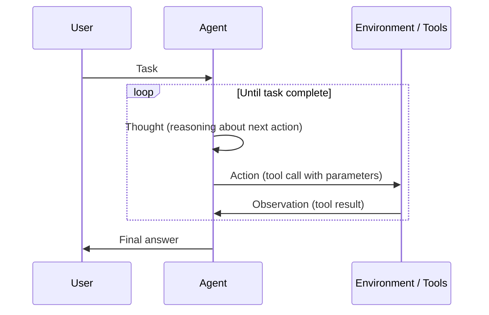
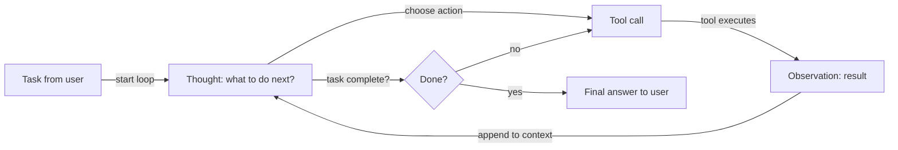

# ReAct (Reasoning + Acting)

## Definición

ReAct es un paradigma donde el modelo alterna **razonamiento** (qué hacer a continuación, por qué) y **acción** (llamadas a herramientas). La observación del entorno se retroalimenta en el siguiente paso de razonamiento, formando un bucle hasta que la tarea se completa. Esta intercalación reduce los errores causados por el uso ciego o repetitivo de herramientas, ya que cada acción va precedida de una justificación explícita.

La contribución central del artículo ReAct es mostrar que combinar trazas de razonamiento y pasos de acción en una sola llamada al LLM supera a ambos por separado: el razonamiento puro (CoT) carece de anclaje factual, y la acción pura (llamada a herramientas sin pensamiento) es propensa a errores y difícil de depurar. Al hacer visibles los pensamientos, ReAct también produce trazas de agente interpretables que los humanos pueden inspeccionar y corregir.

Es el patrón estándar para los [agentes](/docs/agents) que usan herramientas. A menudo se combina con [chain-of-thought](/docs/reasoning-patterns/cot) (razonamiento dentro del paso de pensamiento) y con [RDD](/docs/reasoning-patterns/rdd) cuando las especificaciones recuperadas deben guiar cada decisión.

## Cómo funciona

### Bucle pensamiento–acción–observación



### Flujo de decisiones del agente



El formato del prompt es **Pensamiento → Acción → Observación → Pensamiento → … → Respuesta Final**. El **usuario** da una **tarea**; el **agente** produce un **pensamiento** (razonamiento sobre qué hacer), luego una **acción** (p. ej., llamada a herramienta). El **entorno/herramientas** devuelven una **observación**, que se añade al contexto para el siguiente pensamiento. El modelo decide cuándo llamar a herramientas y cuándo concluir. Los frameworks como LangChain y LlamaIndex implementan agentes de estilo ReAct con registro de herramientas y manejo de mensajes.

## Cuándo usar / Cuándo NO usar

| Escenario | Usar ReAct | No usar ReAct |
|---|---|---|
| Agente que usa múltiples herramientas (búsqueda, calculadora, API) | Sí — el pensamiento antes de la acción reduce el mal uso de herramientas | No — si solo se necesita una herramienta, basta con una llamada a función más simple |
| Se requiere comportamiento de agente depurable | Sí — las trazas de pensamiento son inspeccionables y registrables | No — para pipelines de caja negra donde no se necesitan trazas |
| Investigación de múltiples pasos con contexto en evolución | Sí — cada observación informa el siguiente pensamiento | No — la recuperación y generación de una sola vez es más rápida y barata |
| Tareas de alta fiabilidad (p. ej., ejecución de código) | Sí — el razonamiento antes de actuar captura errores probables | No — para tareas CRUD simples sin ambigüedad |
| Requisitos de muy baja latencia | No — la generación de pensamientos añade tokens por paso | Sí — la llamada directa a función es más rápida cuando el razonamiento es innecesario |

## Comparaciones

| Patrón | Tiene pensamiento explícito | Tiene uso de herramientas | Bucle | Mejor para |
|---|---|---|---|---|
| CoT | Sí | No | No | Tareas de razonamiento estático |
| ReAct | Sí | Sí | Sí | Agentes que usan herramientas |
| Llamada a función (sin pensamiento) | No | Sí | No | Invocaciones de herramientas simples y deterministas |
| RDD | Sí (guiado por especificación) | Sí | Sí | Agentes de cumplimiento y orientados a especificaciones |

## Pros y contras

| Pros | Contras |
|---|---|
| Reduce las llamadas ciegas o repetitivas a herramientas | Tokens extra por paso (sobrecarga de pensamiento) |
| Produce trazas interpretables y depurables | El bucle puede ejecutarse demasiado si los criterios de parada son débiles |
| Funciona bien con LangChain/LlamaIndex de forma nativa | Requiere esquemas de herramientas bien definidos y manejo de errores |
| Maneja naturalmente tareas de múltiples pasos | La calidad del pensamiento depende del modelo subyacente |

## Ejemplos de código

```python
from langchain_openai import ChatOpenAI
from langchain.agents import create_react_agent, AgentExecutor
from langchain_community.tools import DuckDuckGoSearchRun
from langchain import hub

# Load a pre-built ReAct prompt template
prompt = hub.pull("hwchase17/react")

# Define tools
tools = [DuckDuckGoSearchRun()]

# Create ReAct agent
llm = ChatOpenAI(model="gpt-4o-mini", temperature=0)
agent = create_react_agent(llm=llm, tools=tools, prompt=prompt)
executor = AgentExecutor(agent=agent, tools=tools, verbose=True, max_iterations=5)

# Run — the agent will produce Thought/Action/Observation traces
result = executor.invoke({"input": "What is the current population of Tokyo?"})
print(result["output"])
```

## Recursos prácticos

- [ReAct: Synergizing Reasoning and Acting in LLMs (Yao et al.)](https://arxiv.org/abs/2210.03629) — Artículo original ReAct con benchmarks en HotpotQA, Fever y ALFWorld
- [LangChain – ReAct agent](https://python.langchain.com/docs/concepts/agents/) — Agentes de estilo ReAct con registro de herramientas en LangChain
- [Anthropic – Tool use guide](https://docs.anthropic.com/en/docs/build-with-claude/tool-use) — Uso de herramientas nativo de Claude, que sigue patrones de pensamiento-acción al estilo ReAct

## Ver también

- [Agentes](/docs/agents)
- [Patrones de razonamiento](/docs/reasoning-patterns)
- [Chain-of-thought](/docs/reasoning-patterns/cot)
- [RDD](/docs/reasoning-patterns/rdd)
