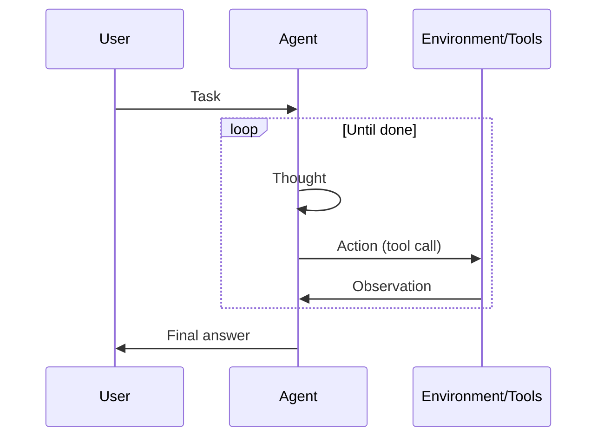

# ReAct (Reasoning + Acting)

## Definición

ReAct es un paradigma donde el modelo alterna **razonamiento** (qué hacer a continuación, por qué) and **acting** (llamadas a herramientas). La observación del entorno feeds back into the next razonamiento step, forming a loop until the task is done.

Es the standard pattern for [agents](/docs/agents) that use tools: each action is preceded by a thought, which reduces blind or repetitive tool use. Often combined with [chain-of-thought](/docs/reasoning-patterns/cot) (razonamiento inside the thought) and with [RDD](/docs/reasoning-patterns/rdd) when specs guide decisións.

## Cómo funciona

Formato del prompt: **Pensamiento → Acción → Observación → Pensamiento → … → Respuesta Final**. El **usuario** da una **tarea**; el **agent** produce a **thought** (razonamiento about what to do), then an **action** (por ej. tool call). The **environment/tools** return an **observation**, which is appended to the context for the next thought. The loop continues until the agent outputs a final answer. The model decides when to call tools and when to conclude, which reduces arbitrary or repetitive actions. The sequence diagram below summarizes this flow; frameworks like LangChain implement ReAct-style agents with tool registration and message handling.

## Casos de uso

ReAct fits agent workflows where each tool call should be preceded by a clear razonamiento step.

- Agents that use tools (search, calculator, API) with explicit razonamiento
- Reducing arbitrary or repetitive llamadas a herramientas by interleaving thought
- Debuggable agent behavior via visible thought–action–observation traces

## Documentación externa

- [ReAct: Synergizing Reasoning and Acting in LLMs (Yao et al.)](https://arxiv.org/abs/2210.03629) — Original ReAct paper
- [LangChain – ReAct agent](https://python.langchain.com/docs/concepts/agents/) — ReAct-style agents in LangChain

## Ver también

- [Agents](/docs/agents)
- [Chain-of-thought](/docs/reasoning-patterns/cot)
- [RDD](/docs/reasoning-patterns/rdd)
