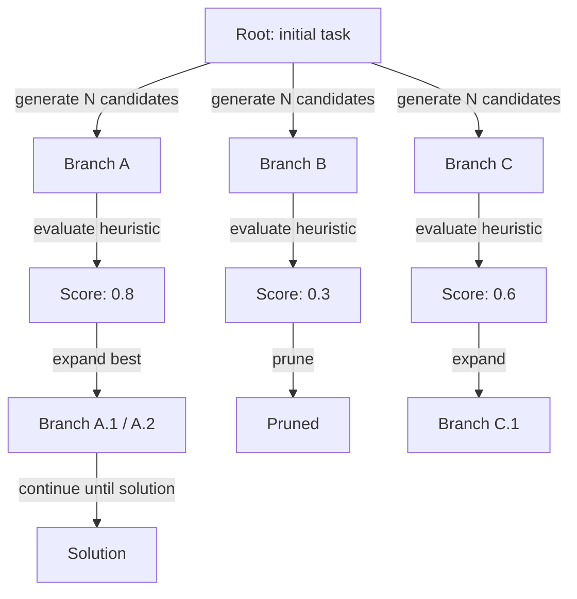
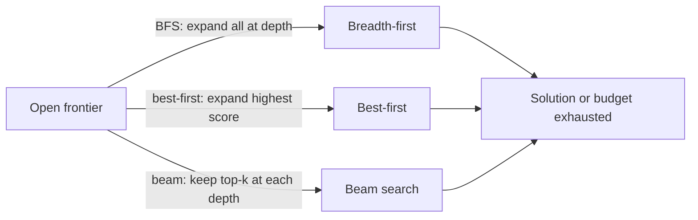

# Tree of thoughts (ToT)

## Definición

Tree of Thoughts (ToT) extiende CoT manteniendo múltiples ramas de razonamiento simultáneamente. En cada paso, el modelo genera varias continuaciones candidatas; una heurística o un modelo de evaluación separado las puntúa, y un algoritmo de búsqueda (mejor primero, beam search o BFS) decide qué ramas expandir más.

La idea clave es que los problemas difíciles — planificación, juego, pruebas complejas — pueden requerir retroceso o exploración de alternativas antes de comprometerse. Un solo camino de [chain-of-thought](/docs/reasoning-patterns/cot) no tiene mecanismo para recuperarse de un paso intermedio deficiente; ToT mantiene explícitamente una frontera de ramas prometedoras y poda las no prometedoras, similar a los algoritmos clásicos de búsqueda en árbol (MCTS, A*) aplicados a la generación de lenguaje.

Úsalo cuando un solo camino de [chain-of-thought](/docs/reasoning-patterns/cot) podría atascarse (p. ej., movimientos de juego, planificación de múltiples pasos) y puedes permitirte múltiples llamadas al LLM. Intercambia cómputo por mejor búsqueda en el espacio de soluciones. Consulta los [patrones de razonamiento](/docs/reasoning-patterns) para el conjunto completo de opciones.

## Cómo funciona

### Expansión y poda del árbol



### Estrategias de búsqueda



Comenzar desde una **raíz** (p. ej., la pregunta o el estado inicial). **Ramificar**: en cada paso, generar varias continuaciones (p. ej., siguientes pasos de razonamiento o movimientos). **Puntuar** cada rama con una heurística o una llamada al modelo separada (p. ej., "¿qué tan prometedora es esta solución parcial en una escala del 1 al 10?"). **Expandir** el mejor nodo o los mejores nodos y repetir; podar las ramas de baja puntuación para limitar el costo. El árbol se construye incrementalmente hasta que se encuentra una solución o se alcanza un límite de profundidad/presupuesto. El factor de ramificación y la profundidad máxima son hiperparámetros clave que controlan el equilibrio costo/calidad.

## Cuándo usar / Cuándo NO usar

| Escenario | Usar ToT | No usar ToT |
|---|---|---|
| Jugar o resolver rompecabezas con muchos movimientos | Sí — explorar ramas es esencial | No — CoT suficiente para rompecabezas de un solo camino |
| Planificación compleja de múltiples pasos con retroceso | Sí — ToT puede recuperarse de callejones sin salida | No — las tareas más simples no necesitan retroceso |
| Generación creativa con muchas opciones válidas | Sí — generar y puntuar múltiples borradores | No — la salida creativa única no lo necesita |
| Inferencia de producción de alto volumen | No — múltiples llamadas al LLM son costosas | Sí — usar CoT o prompting directo en su lugar |
| Restricciones de tiempo real duras | No — la latencia de ToT es alta | Sí — no adecuado para respuestas de menos de un segundo |

## Comparaciones

| Enfoque | Caminos explorados | Puntuación | Costo | Mejor para |
|---|---|---|---|---|
| CoT | 1 | Ninguna | Bajo (1 llamada) | Tareas lineales de múltiples pasos |
| Autoconsistencia | N (paralelo) | Votación mayoritaria | Medio (N llamadas) | Tareas con respuestas verificables |
| ToT | N (secuencial, podado) | Heurística / modelo | Alto (N+ llamadas) | Planificación, búsqueda, creatividad |
| MCTS (clásico) | N (simulación) | Señal de recompensa | Muy alto | IA de juegos con recompensa clara |

## Pros y contras

| Pros | Contras |
|---|---|
| Explora y se recupera de callejones sin salida | Costo muy alto de tokens y API |
| Produce soluciones de mayor calidad en tareas difíciles | Requiere una buena función de puntuación/evaluación |
| Refleja la búsqueda clásica — principista y adaptable | Complejo de implementar en comparación con CoT |
| El factor de ramificación es ajustable para el equilibrio costo/calidad | No todas las tareas se benefician de la búsqueda de múltiples caminos |

## Ejemplos de código

```python
from openai import OpenAI

client = OpenAI()

def generate_thoughts(state: str, n: int = 3) -> list[str]:
    """Generate N candidate next steps from the current state."""
    response = client.chat.completions.create(
        model="gpt-4o-mini",
        messages=[
            {
                "role": "user",
                "content": (
                    f"Current reasoning state:\n{state}\n\n"
                    f"Generate {n} distinct possible next reasoning steps. "
                    "Number each one."
                ),
            }
        ],
    )
    raw = response.choices[0].message.content
    # Simple parse: split on numbered lines
    return [line.strip() for line in raw.split("\n") if line.strip() and line[0].isdigit()]

def score_thought(state: str, thought: str) -> float:
    """Score a thought's promise on a 0-1 scale."""
    response = client.chat.completions.create(
        model="gpt-4o-mini",
        messages=[
            {
                "role": "user",
                "content": (
                    f"Rate how promising this reasoning step is for solving the task "
                    f"(0 = dead end, 1 = very promising).\n\n"
                    f"State: {state}\nThought: {thought}\n\nScore (0.0–1.0):"
                ),
            }
        ],
    )
    try:
        return float(response.choices[0].message.content.strip())
    except ValueError:
        return 0.5

# Simple best-first ToT (depth 2, branching factor 3)
task = "Plan 3 steps to build a minimal RAG chatbot."
candidates = generate_thoughts(task, n=3)
scored = [(thought, score_thought(task, thought)) for thought in candidates]
best = max(scored, key=lambda x: x[1])
print("Best next step:", best[0])
```

## Recursos prácticos

- [Tree of Thoughts (Yao et al.)](https://arxiv.org/abs/2305.10601) — Artículo original de ToT con benchmarks de game-of-24 y escritura creativa
- [LangChain – Agents and planning](https://python.langchain.com/docs/concepts/agents/) — ToT y patrones de planificación relacionados
- [Princeton NLP – ToT repository](https://github.com/princeton-nlp/tree-of-thought-llm) — Implementación de referencia de los autores del artículo

## Ver también

- [Chain-of-thought](/docs/reasoning-patterns/cot)
- [Patrones de razonamiento](/docs/reasoning-patterns)
- [Agentes](/docs/agents)
