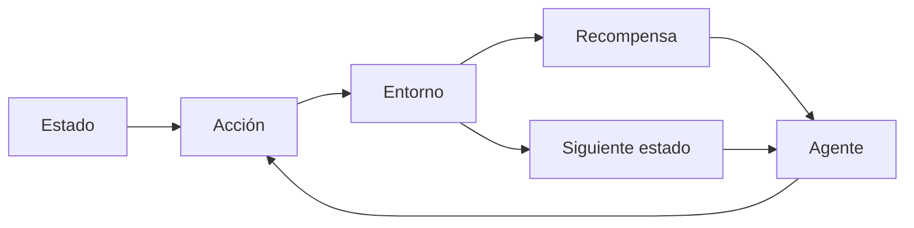

# Aprendizaje por refuerzo (RL)

## Definición

El aprendizaje por refuerzo entrena agentes para maximizar la recompensa acumulada en un entorno. El agente toma acciones, recibe observaciones y recompensas, y mejora su política (como basada en valor, gradiente de política, actor-crítico).

Difiere del aprendizaje [supervisado](/docs/fundamentals/machine-learning) y [no supervisado](/docs/fundamentals/machine-learning) porque la retroalimentación es escasa y retardada (recompensas), y el agente debe explorar. Se usa en juegos, robótica y alineación de [LLMs](/docs/llms) (RLHF). Para estados/acciones de alta dimensionalidad, ver [RL profundo](/docs/drl).

## Cómo funciona

El escenario es generalmente un **MDP**: el **agente** ve un **estado**, elige una **acción**, y el **entorno** devuelve una **recompensa** y un **siguiente estado**. El agente mejora su política (mapeo del estado a la acción) para maximizar la recompensa acumulada. Los métodos **basados en valor** (como Q-learning, DQN) aprenden una función de valor y derivan la política; los métodos de **gradiente de política** (como PPO, SAC) optimizan la política directamente. La exploración (como epsilon-greedy, bono de entropía) es necesaria porque las recompensas solo se observan para las acciones tomadas. Los algoritmos difieren en cómo manejan los datos fuera de la política, las acciones continuas y el escalado a grandes espacios de estados.

## Casos de uso

El aprendizaje por refuerzo aplica donde un agente aprende de recompensas y decisiones secuenciales (juegos, control, alineación).

- Juego de juegos (como Atari, Go, póker) y simulación
- Control de robótica y control continuo (como manipulación)
- Alineación de LLMs (como RLHF) y sistemas de decisión secuencial

## Recursos prácticos

- [Reinforcement Learning (Sutton & Barto)](http://incompleteideas.net/book/the-book-2nd.html) — Libro gratuito en línea
- [Spinning Up in Deep RL (OpenAI)](https://spinningup.openai.com/)

## Ver también

- [RL profundo](/docs/drl)
- [Aprendizaje automático](/docs/fundamentals/machine-learning)
- [Agentes](/docs/agents)
