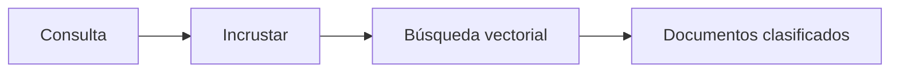

# Búsqueda semántica

## Definición

La búsqueda semántica recupera elementos por significado en lugar de palabras clave exactas. La consulta y los documentos se incrustan; la recuperación devuelve los vectores más similares (como similitud coseno o búsqueda ANN).

Es la columna vertebral de recuperación del [RAG](/docs/rag): ver [embeddings](/docs/rag/embeddings) y [bases de datos vectoriales](/docs/rag/vector-databases) sobre cómo se producen y almacenan los vectores. Úselo cuando los usuarios expresan intención en lenguaje natural y se desea "significado similar" en lugar de coincidencia literal de palabras clave. Se combina bien con palabras clave (búsqueda híbrida) cuando los términos exactos importan.

## Cómo funciona

La **consulta** (y opcionalmente filtros) se envía a un modelo de **embedding** que produce un vector. La **búsqueda vectorial** (como k-NN o k-NN aproximado sobre un índice de vectores de documentos) devuelve los **documentos clasificados** (o IDs de fragmentos) con mayor similitud (como coseno o producto punto). Los modelos de embedding se entrenan para que el texto semánticamente similar se mapee a vectores cercanos; el mismo modelo se usa para consultas y documentos. La indexación puede ser offline (por lotes) o incremental; la escala y la latencia determinan si se necesita un índice aproximado (HNSW, IVF) y una [base de datos vectorial](/docs/rag/vector-databases) dedicada.

## Casos de uso

La búsqueda semántica se usa siempre que se necesite encontrar elementos por significado en lugar de palabras clave exactas (RAG, recomendaciones, deduplicación).

- Recuperación RAG: encontrar fragmentos relevantes para una consulta de usuario
- Búsqueda de recomendación y "elemento similar"
- Detección de duplicados o casi duplicados en conjuntos de documentos

## Recursos prácticos

- [Sentence-BERT](https://www.sbert.net/) — Modelos de recuperación densa
- [LangChain – Almacenes vectoriales](https://python.langchain.com/docs/concepts/vectorstores/)

## Ver también

- [Embeddings](/docs/rag/embeddings)
- [Bases de datos vectoriales](/docs/rag/vector-databases)
- [RAG](/docs/rag)
