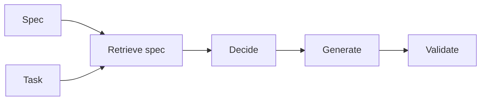

# Desarrollo orientado a especificaciones

## Definición

El desarrollo basado en especificaciones construye sistemas de IA (agentes, pipelines, herramientas) a partir de especificaciones explícitas: requirements, output formats, allowed actions, and constraints. Specs are retrieved and used at runtime (por ej. in RDD) so behavior stays aligned with intent.

Es especially useful for [agents](/docs/agents) and [RDD](/docs/reasoning-patterns/rdd): instead of encodificación all rules in weights or prompts, you maintain specs (por ej. in docs or a knowledge base) and retrieve them at runtime. Fits regulated domains and teams that want behavior to be auditable and updatable sin reentrenar.

## Cómo funciona

You **write specs** (natural language, schemas, or structured rules) and index them for recuperación (por ej. in a vector store or structured repo). At runtime, the **task** (and optionally the current state) is used to **retrieve** relevant spec fragments. The model or agent **decides** (por ej. next step, allowed actions) and **generates** (output, tool call) with the spec in context. **Validate** checks the output against the spec (por ej. schema, rules); if validation fails, you can retry or surface an error. This keeps generation and decisións aligned with the spec without baking everything into [prompt engineering](/docs/llms/prompt-engineering) or [fine-tuning](/docs/llms/fine-tuning).

## Casos de uso

Spec-driven development fits when behavior must stay aligned with retrievable requirements (RDD, compliance, or safety).

- Building agents that retrieve and follow specs (por ej. RDD pattern)
- Enforcing output format and constraints (JSON, allowed actions)
- Regulated or safety-critical flows where behavior must igualar requirements

## Documentación externa

- [LangChain – Structured output](https://python.langchain.com/docs/concepts/output_parsers/) — Enforcing output format from LLMs
- [OpenAI – Structured outputs](https://platform.openai.com/docs/guides/structured-outputs)

## Ver también

- [RDD](/docs/reasoning-patterns/rdd)
- [Agents](/docs/agents)
- [Prompt engineering](/docs/llms/prompt-engineering)
