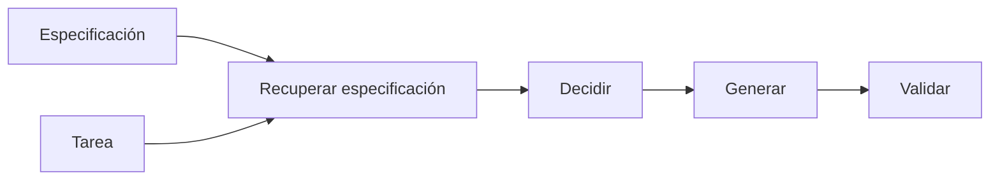

# Desarrollo orientado a especificaciones

## Definición

El desarrollo orientado a especificaciones construye sistemas de IA (agentes, pipelines, herramientas) a partir de especificaciones explícitas: requisitos, formatos de salida, acciones permitidas y restricciones. Las especificaciones se recuperan y usan en tiempo de ejecución (como en RDD) para que el comportamiento permanezca alineado con la intención.

Es especialmente útil para [agentes](/docs/agents) y [RDD](/docs/reasoning-patterns/rdd): en lugar de codificar todas las reglas en pesos o indicaciones, se mantienen especificaciones (como en documentos o una base de conocimiento) y se recuperan en tiempo de ejecución. Es adecuado para dominios regulados y equipos que desean que el comportamiento sea auditable y actualizable sin reentrenamiento.

## Cómo funciona

Se **escriben especificaciones** (lenguaje natural, esquemas o reglas estructuradas) y se indexan para recuperación (como en un almacén vectorial o repositorio estructurado). En tiempo de ejecución, la **tarea** (y opcionalmente el estado actual) se usa para **recuperar** fragmentos de especificación relevantes. El modelo o agente **decide** (como el siguiente paso, acciones permitidas) y **genera** (salida, llamada a herramienta) con la especificación en contexto. **Valida** comprueba la salida contra la especificación (como esquema, reglas); si la validación falla, se puede reintentar o mostrar un error. Esto mantiene la generación y las decisiones alineadas con la especificación sin introducir todo en la [ingeniería de indicaciones](/docs/prompt-engineering) o el [ajuste fino](/docs/llms/fine-tuning).

## Casos de uso

El desarrollo orientado a especificaciones es adecuado cuando el comportamiento debe permanecer alineado con requisitos recuperables (RDD, cumplimiento o seguridad).

- Construir agentes que recuperan y siguen especificaciones (como el patrón RDD)
- Aplicar formato de salida y restricciones (JSON, acciones permitidas)
- Flujos regulados o críticos para la seguridad donde el comportamiento debe coincidir con los requisitos

## Recursos prácticos

- [LangChain – Salida estructurada](https://python.langchain.com/docs/concepts/output_parsers/) — Aplicar formato de salida desde LLMs
- [OpenAI – Salidas estructuradas](https://platform.openai.com/docs/guides/structured-outputs)

## Ver también

- [RDD](/docs/reasoning-patterns/rdd)
- [Agentes](/docs/agents)
- [Ingeniería de indicaciones](/docs/prompt-engineering)
