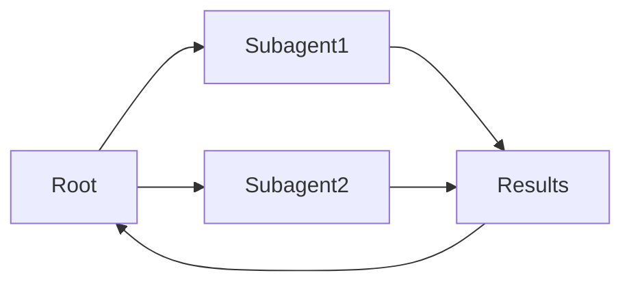

# Subagentes

## Definición

Los **subagentes** son agentes que se ubican dentro de una jerarquía: a parent agent delegates sub-tasks to child agents (subagentes), que a su vez pueden delegar a más subagentes. Esto estructura la complejix work and keeps each agent focused.

Son una forma de implementar sistemas [multi-agente](/docs/agents/multi-agent-systems) con una cadena clara de responsabilidaty. The root [agent](/docs/agents) owns the user-facing goal; subagents handle focused sub-tasks (por ej. [recuperación](/docs/rag), code execution, validation). Often used with [spec-driven development](/docs/spec-driven-development) or [RDD](/docs/reasoning-patterns/rdd) so subagents receive and follow specs.

## Cómo funciona

El agente **raíz** recibe la tarea, la divide en subtareas y las asigna al **Subagente1**, **Subagente2**, etc. (por rol o capacidad). Cada subagente ejecuta su propio bucle (posiblemente con herramientas y un LLM) and returns **results** to the root. The root **aggregates** results (por ej. merges, selects, or passes to another subagent) and either continues the loop or returns to the user. Subagents can be specialized (por ej. recuperación, code, critique) and use the same or different models. Clear contracts (inputs/outputs or tools) and error handling make the hierarchy debuggable and reusable.

## Casos de uso

Subagents ayudan cuando una tarea se divide naturalmente en subtareas enfocadas que pueden delegarse y agregarse.

- Root agent delegating recuperación, generation, and validation to subagents
- Complex workflows (por ej. research, code review) with focused sub-tasks
- Reusing the same subagent in different parent workflows

## Documentación externa

- [From Prototypes to Agents with ADK – Google Codelabs](https://codelabs.developers.google.com/your-first-agent-with-adk#0) — ADK multi-agent systems with hierarchy
- [LangChain – Multi-agent workflows](https://python.langchain.com/docs/concepts/multi_agent/) — Workflow and subagent patterns

## Ventajas y desventajas

| Pros | Cons |
|------|------|
| Clear separation of concerns | Coordination and latency |
| Scalable to complex tasks | Need clear contracts and error handling |
| Reusable subagent capabilities | Debugging across hierarchy can be hard |

## Ver también

- [Agents](/docs/agents)
- [Multi-agent systems](/docs/agents/multi-agent-systems)
- [RDD](/docs/reasoning-patterns/rdd)
- [Spec-driven development](/docs/spec-driven-development)
