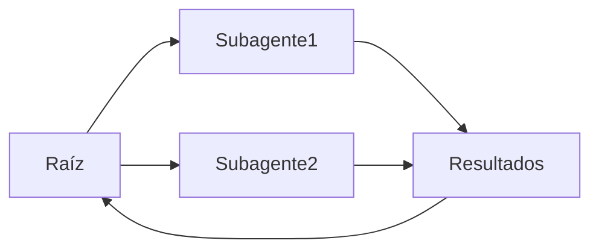

# Subagentes

## Definición

Los **subagentes** son agentes que se ubican dentro de una jerarquía: un agente padre delega subtareas a agentes hijos (subagentes), que a su vez pueden delegar a más subagentes. Esto estructura el trabajo complejo y mantiene a cada agente enfocado.

Son una forma de implementar sistemas [multiagente](/docs/agents/multi-agent-systems) con una cadena clara de responsabilidad. El [agente](/docs/agents) raíz es propietario del objetivo de cara al usuario; los subagentes manejan subtareas enfocadas (como [recuperación](/docs/rag), ejecución de código, validación). A menudo se usan con [desarrollo orientado a especificaciones](/docs/spec-driven-development) o [RDD](/docs/reasoning-patterns/rdd) para que los subagentes reciban y sigan especificaciones.

## Cómo funciona

El agente **raíz** recibe la tarea, la divide en subtareas y las asigna al **Subagente1**, **Subagente2**, etc. (por rol o capacidad). Cada subagente ejecuta su propio bucle (posiblemente con herramientas y un LLM) y devuelve **resultados** a la raíz. La raíz **agrega** los resultados (como fusiona, selecciona o pasa a otro subagente) y continúa el bucle o devuelve al usuario. Los subagentes pueden ser especializados (como recuperación, código, crítica) y usar los mismos o diferentes modelos. Los contratos claros (entradas/salidas o herramientas) y el manejo de errores hacen que la jerarquía sea depurable y reutilizable.

## Casos de uso

Los subagentes ayudan cuando una tarea se divide naturalmente en subtareas enfocadas que pueden delegarse y agregarse.

- Agente raíz que delega recuperación, generación y validación a subagentes
- Flujos de trabajo complejos (como investigación, revisión de código) con subtareas enfocadas
- Reutilización del mismo subagente en diferentes flujos de trabajo padre

## Recursos prácticos

- [From Prototypes to Agents with ADK – Google Codelabs](https://codelabs.developers.google.com/your-first-agent-with-adk#0) — Sistemas multiagente ADK con jerarquía
- [LangChain – Flujos de trabajo multiagente](https://python.langchain.com/docs/concepts/multi_agent/) — Patrones de flujo de trabajo y subagente

## Ventajas y desventajas

| Ventajas | Desventajas |
|------|------|
| Clara separación de responsabilidades | Coordinación y latencia |
| Escalable a tareas complejas | Necesita contratos claros y manejo de errores |
| Capacidades de subagente reutilizables | La depuración a través de la jerarquía puede ser difícil |

## Ver también

- [Agentes](/docs/agents)
- [Sistemas multiagente](/docs/agents/multi-agent-systems)
- [RDD](/docs/reasoning-patterns/rdd)
- [Desarrollo orientado a especificaciones](/docs/spec-driven-development)
