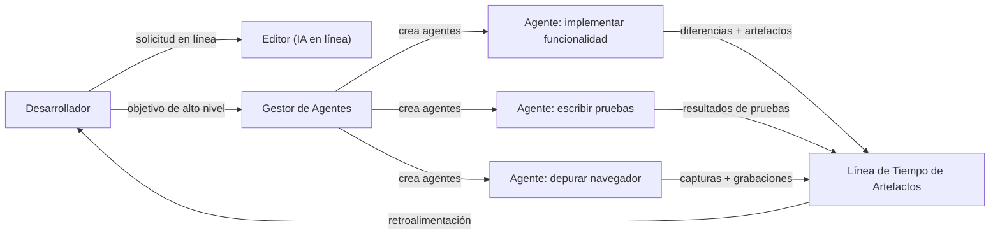
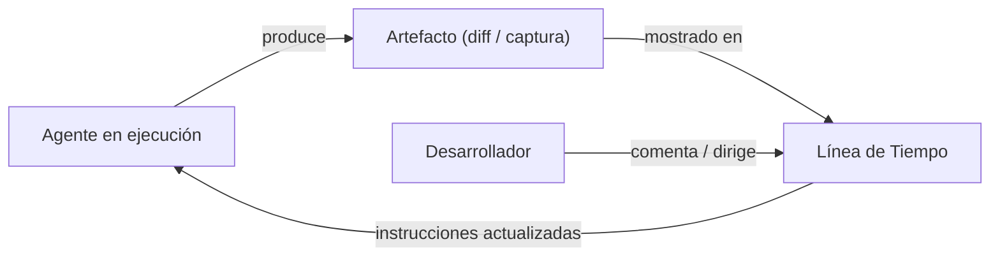

# Antigravity

## Definición

Antigravity es un **IDE centrado en agentes** construido sobre la premisa de que los [agentes](/docs/agents) autónomos impulsados por [LLM](/docs/llms) deben ser ciudadanos de primera clase del entorno de desarrollo, no características agregadas posteriormente. En lugar de mostrar completaciones mientras escribes, Antigravity expone un **Gestor de Agentes** que crea, coordina y supervisa múltiples agentes ejecutándose en paralelo a través de paneles de editor, terminal y navegador. Cada agente puede implementar una funcionalidad, ejecutar una suite de pruebas, depurar un fallo o interactuar con una interfaz web mientras el desarrollador observa y dirige.

Una característica distintiva es la **Línea de Tiempo de Artefactos**: cada acción significativa del agente — planes, diferencias de código, capturas de pantalla, grabaciones del navegador y resultados de pruebas — se captura y muestra en una línea de tiempo cronológica. Este registro de auditoría hace que la ejecución autónoma sea verificable: puedes reproducir lo que sucedió, inspeccionar estados intermedios y comentar artefactos específicos para redirigir los próximos pasos del agente. Este diseño hace que Antigravity sea especialmente adecuado para flujos de trabajo de [desarrollo guiado por especificaciones](/docs/spec-driven-development) donde la trazabilidad y la supervisión humana son importantes.

La plataforma admite modelos de ventana de contexto grande (Gemini y otros), se ejecuta en Windows, macOS y Linux, y proporciona asistencia de IA en línea (similar a Cmd+K de Cursor) y autonomía gestionada en un único entorno. La combinación de registro granular de artefactos y ejecución de agentes en paralelo la posiciona como una plataforma de "vibe coding" donde los desarrolladores especifican la intención a alto nivel y verifican los resultados a través del registro de artefactos.

## Cómo funciona

### Arquitectura de interfaz dual



### Bucle de retroalimentación humano-en-el-bucle



### Características clave

**Gestor de Agentes** — crea y supervisa múltiples agentes simultáneamente. **Línea de Tiempo de Artefactos** — registro cronológico de planes, diferencias, capturas de pantalla y grabaciones. **IA en línea** — asistencia directa en el editor para refactorización y generación. **Bucle de retroalimentación** — comenta artefactos para dirigir agentes en tiempo real. **Multiplataforma** — Windows, macOS, Linux. **Contexto grande** — admite modelos con ventanas de contexto grandes para comprensión a escala de repositorio.

## Cuándo usar / Cuándo NO usar

| Escenario | Usar Antigravity | NO usar Antigravity |
|----------|----------------|------------------------|
| Implementación multi-agente autónoma con supervisión | Sí — Gestor de Agentes + Línea de Tiempo de Artefactos | |
| Flujos de trabajo guiados por especificaciones que requieren registros de auditoría | Sí — cada artefacto es registrado e inspeccionable | |
| Flujos de trabajo paralelos (implementar + probar + depurar simultáneamente) | Sí — creación de agentes en paralelo | |
| Completaciones en línea ligeras con configuración mínima | | [GitHub Copilot](/docs/tools/github-copilot) o [Cursor](/docs/tools/cursor) son más ligeros |
| Integración profunda con issues y PRs de GitHub | | [GitHub Copilot Workspace](/docs/tools/github-copilot) está mejor integrado |
| Desarrollo centrado en terminal o CLI | | [Claude Code](/docs/tools/claude-code) está diseñado específicamente para esto |

## Pros y contras

| Pros | Contras |
|------|------|
| Ejecución de agentes en paralelo a través de editor, terminal y navegador | Plataforma más nueva con una comunidad más pequeña que las herramientas de VS Code |
| La Línea de Tiempo de Artefactos proporciona salidas verificables e inspeccionables | La alta autonomía aumenta el riesgo de cambios grandes no revisados |
| Admite vibe coding a un nivel de abstracción más alto | Requiere familiaridad con patrones de desarrollo centrados en agentes |
| Dirección en tiempo real mediante comentarios en artefactos | La madurez y estabilidad de la plataforma todavía está evolucionando |

## Ejemplos de código

```yaml
# Archivo de dirección de Antigravity — definir comportamiento del agente y estándares del proyecto
project:
  name: my-web-app
  stack: [TypeScript, React, Node.js, PostgreSQL]

agents:
  default_model: gemini-2.0-flash
  context_window: large

standards:
  - "Follow existing file and folder structure conventions"
  - "Add tests for every new function using Vitest"
  - "Document all exported functions with JSDoc"
  - "Never modify database schema without a migration file"

artifacts:
  retain: 30d           # keep artifact timeline for 30 days
  require_approval:     # require human approval before applying
    - schema_changes
    - dependency_additions
```

## Consejos para un uso efectivo

- Comienza con un enunciado de objetivo claro para cada agente — los objetivos vagos producen artefactos vagos.
- Revisa la Línea de Tiempo de Artefactos después de cada ejecución del agente antes de aceptar cambios; usa comentarios para dirigir la siguiente iteración.
- Configura puertas de aprobación en el archivo de dirección para operaciones de alto riesgo (cambios de esquema, nuevas dependencias).
- Ejecuta agentes en ramas aisladas para que la rama principal permanezca estable durante el trabajo paralelo de los agentes.
- Usa la IA en línea para ediciones pequeñas y precisas y reserva el Gestor de Agentes para tareas más grandes y de múltiples pasos.

## Recursos prácticos

- [Antigravity — IDE centrado en agentes](https://www.antigravityai.io/) — Descripción del producto, características y descarga
- [Antigravity IDE](https://antigravityaiide.com/) — Capacidades de la plataforma y documentación

## Ver también

- [Agentes](/docs/agents)
- [Desarrollo guiado por especificaciones](/docs/spec-driven-development)
- [Cursor](/docs/tools/cursor)
- [Kiro](/docs/tools/kiro)
- [Claude Code](/docs/tools/claude-code)
- [LLMs](/docs/llms)
