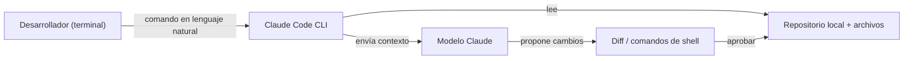
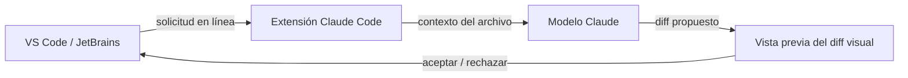

# Claude Code

## Definición

Claude Code es el asistente de codificación impulsado por IA de Anthropic que integra [Claude](/docs/case-studies/claude) en cada capa del flujo de trabajo de desarrollo. A diferencia de las extensiones de editor que agregan IA a un IDE existente, Claude Code está diseñado como una **herramienta multi-entorno**: se ejecuta como CLI en la terminal, como extensión en VS Code y JetBrains, en el navegador, en iOS y en Slack. Esto lo convierte en la opción natural cuando el desarrollo abarca múltiples entornos o cuando los flujos de trabajo centrados en terminal son importantes.

La herramienta le da a Claude acceso directo al sistema de archivos local, comandos del shell y contexto del proyecto. En la terminal, puedes pedirle a Claude que explore un código base, explique la arquitectura, genere código, ejecute pruebas y aplique diferencias — todo sin salir de la línea de comandos. En el IDE, Claude Code muestra ediciones en línea y diferencias visuales idénticas a las de Cursor. El archivo `CLAUDE.md` (o `.claude/CLAUDE.md`) cumple el mismo rol que `.cursorrules`: proporciona instrucciones persistentes a nivel de proyecto que orientan el estilo, las convenciones y el conocimiento del código base de Claude.

Comparado con [Cursor](/docs/tools/cursor), Claude Code está bloqueado al modelo Claude pero agrega profundidad de terminal y acceso móvil/web. Comparado con [GitHub Copilot](/docs/tools/github-copilot), ofrece edición de agente multi-archivo más profunda y flujos de trabajo CLI primero, pero requiere una suscripción a Claude (Pro, Teams o Enterprise) o acceso a la API a través de Amazon Bedrock o Google Vertex AI.

## Cómo funciona

### Flujo de trabajo en terminal



### Flujo de trabajo en IDE



### Características clave

**CLI** — ejecuta `claude` en cualquier terminal para hacer preguntas o aplicar cambios. **Extensión IDE** — ediciones en línea y diferencias en VS Code y JetBrains. **`CLAUDE.md`** — instrucciones persistentes del proyecto para orientar a Claude. **Subagentes** — tareas en segundo plano ejecutándose de forma autónoma mediante el SDK de Agentes de Anthropic. **MCP** — Protocolo de Contexto de Modelo para uso de herramientas (bases de datos, APIs). **Skills** — programas de prompts reutilizables para tareas recurrentes.

## Cuándo usar / Cuándo NO usar

| Escenario | Usar Claude Code | NO usar Claude Code |
|----------|----------------|------------------------|
| Desarrollo centrado en terminal y flujos de trabajo CLI | Sí — agente CLI diseñado específicamente | |
| Uso multi-entorno (terminal, IDE, web, móvil) | Sí — una única herramienta en todos los entornos | |
| Refactorización profunda de múltiples archivos con diferencias | Sí — terminal + IDE admiten esto | |
| IA en línea para JetBrains o VS Code | Sí — extensiones oficiales disponibles | |
| Permanecer en una configuración de VS Code existente con menos fricción | | [GitHub Copilot](/docs/tools/github-copilot) tiene menor coste de cambio |
| Neovim u otros IDEs que no son VS Code / JetBrains | | [GitHub Copilot](/docs/tools/github-copilot) cubre más editores |
| Selección de backend multi-modelo | | [Cursor](/docs/tools/cursor) te permite cambiar entre Claude, GPT-4o y modelos locales |

## Comparaciones

| Característica | Claude Code | Cursor | GitHub Copilot |
|---------|------------|--------|---------------|
| Interfaz principal | Terminal + extensión IDE | Fork de VS Code | Extensión IDE |
| Terminal / CLI | Sí (principal) | No | No |
| Soporte IDE | VS Code, JetBrains | Solo VS Code | VS Code, JetBrains, Neovim |
| Modelo | Claude (Anthropic) | Múltiples (Claude, GPT-4o) | OpenAI / GitHub |
| Reglas de proyecto | `CLAUDE.md` | `.cursorrules` | Ninguna |
| Profundidad de agente | Alta (subagentes, SDK) | Composer | Copilot Workspace (vista previa) |
| Acceso | Suscripción o Bedrock/Vertex | Suscripción | Suscripción |

## Pros y contras

| Pros | Contras |
|------|------|
| CLI primero habilita scripting y automatización sin cabeza | Bloqueado al modelo Claude; sin selección multi-modelo |
| Multi-entorno (terminal, IDE, web, iOS, Slack) | Requiere suscripción a Claude o acceso a la API |
| `CLAUDE.md` proporciona contexto persistente del proyecto | Ecosistema menos maduro vs extensiones de VS Code |
| Los subagentes habilitan tareas autónomas en segundo plano | Curva de aprendizaje CLI para desarrolladores nuevos en flujos de trabajo de terminal |

## Ejemplos de código

```bash
# Flujo de trabajo en terminal: explorar un código base y aplicar un cambio
claude "Explain the authentication flow in this project"

# Generar y aplicar una refactorización
claude "Refactor the UserService class to use dependency injection"

# Ejecutar con un contexto CLAUDE.md ya cargado
# Ejemplo de CLAUDE.md:
# This is a Python FastAPI project using PostgreSQL and SQLAlchemy.
# Follow PEP 8, use type hints everywhere, and write tests with pytest.
# The database session is managed via get_db() in app/database.py.
claude "Add an endpoint to list users with pagination"
```

## Consejos para un uso efectivo

- Escribe un `CLAUDE.md` en la raíz del repositorio describiendo la pila, convenciones y archivos clave — Claude lo lee al inicio de cada sesión.
- Usa `claude --dangerously-skip-permissions` solo en entornos CI con sandbox, nunca en máquinas de producción.
- Para bases de código grandes, menciona explícitamente las rutas de archivos en tu solicitud (`"En src/auth/service.ts, refactoriza..."`) para enfocar el contexto.
- Combina Claude Code en terminal con la extensión IDE: explora y planifica en la terminal, aplica diferencias visualmente en VS Code.
- Usa subagentes para tareas en segundo plano (p. ej. ejecutar pruebas, generar documentación) mientras continúas con otro trabajo.

## Recursos prácticos

- [Anthropic — Claude Code](https://www.anthropic.com/claude-code) — Descripción del producto y características destacadas
- [Claude Code — Inicio rápido](https://docs.anthropic.com/en/docs/claude-code/quickstart) — Instalación, configuración y primeros comandos
- [Claude Code — Integraciones IDE](https://docs.anthropic.com/en/docs/claude-code/ide-integrations) — Configuración de VS Code y JetBrains
- [Claude Code — CLAUDE.md](https://docs.anthropic.com/en/docs/claude-code/memory) — Instrucciones a nivel de proyecto y memoria
- [Anthropic Agent SDK](https://docs.anthropic.com/en/docs/agents) — Construir subagentes y flujos de trabajo autónomos
- [Repositorio de Skills](https://github.com/EmersonBraun/skills) — Colección curada de skills de IA reutilizables para Claude Code y otros asistentes de codificación de IA

## Ver también

- [Claude](/docs/case-studies/claude)
- [Cursor](/docs/tools/cursor)
- [GitHub Copilot](/docs/tools/github-copilot)
- [Agentes](/docs/agents)
- [Desarrollo guiado por especificaciones](/docs/spec-driven-development)
- [LLMs](/docs/llms)
