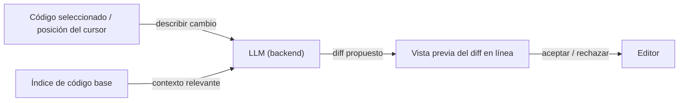

# Cursor

## Definición

Cursor es un editor de código impulsado por IA que hace un fork de VS Code e integra [LLMs](/docs/llms) directamente en cada parte de la experiencia de edición. A diferencia de las extensiones que agregan IA a un editor existente, Cursor controla toda la superficie del editor, lo que le permite construir características como vistas previas de diferencias multi-archivo, búsqueda semántica en toda la base de código y chat con contexto completo del proyecto que son difíciles de replicar solo con APIs de extensión.

El editor admite múltiples backends de modelos (Claude 3.5/3.7, GPT-4o, modelos locales vía Ollama) y permite a los usuarios definir instrucciones a nivel de proyecto a través de archivos `.cursorrules`, orientando el estilo, las convenciones y los supuestos de herramientas del modelo. El contexto se gestiona a través de un índice de código base basado en embeddings que pone los archivos relevantes a disposición del modelo sin selección manual, habilitando flujos de trabajo más cercanos a la programación en pareja que al autocompletado en línea.

Comparado con [GitHub Copilot](/docs/tools/github-copilot), Cursor ofrece un contexto de proyecto más profundo, ediciones basadas en diferencias en línea y un panel de chat completo; comparado con [Claude Code](/docs/tools/claude-code), es una experiencia centrada en GUI en el editor en lugar de la terminal. Las tres herramientas usan [LLMs](/docs/llms) para la generación de código, pero difieren en interfaz, gestión de contexto y profundidad del agente.

## Cómo funciona

### Edición en línea (Cmd+K)



### Panel de chat (Cmd+L)


### Características clave

**Índice de código base** — incrusta el repositorio para búsqueda semántica. **Composer** — ediciones de estilo agente en múltiples archivos. **Completado con Tab** — completado de siguiente línea y bloque consciente del contexto. **`.cursorrules`** — instrucciones persistentes del proyecto para el modelo. **Soporte MCP** — uso de herramientas vía el Protocolo de Contexto de Modelo.

## Cuándo usar / Cuándo NO usar

| Escenario | Usar Cursor | NO usar Cursor |
|----------|-----------|-------------------|
| Codificación en editor con contexto completo del proyecto | Sí — la indexación del código base proporciona contexto profundo | |
| Refactorización de múltiples archivos con diferencias visuales | Sí — Composer y vistas de diferencias | |
| Programación en pareja con explicaciones en chat | Sí — panel de chat persistente | |
| Entornos centrados en terminal o sin cabeza | | Usa el CLI de [Claude Code](/docs/tools/claude-code) en su lugar |
| Completado agnóstico al IDE en JetBrains o Neovim | | Usa [GitHub Copilot](/docs/tools/github-copilot) para mayor cobertura de IDE |
| Extensión ligera sobre VS Code existente | | Los complementos Copilot o Codeium tienen menos sobrecarga |

## Comparaciones

| Característica | Cursor | GitHub Copilot | Claude Code |
|---------|--------|---------------|-------------|
| Interfaz base | Fork completo de VS Code | Extensión IDE | Terminal + extensión IDE |
| Contexto del proyecto | Índice de código base (embeddings) | Solo archivos abiertos | Repositorio completo vía CLI |
| Ediciones multi-archivo | Sí (Composer) | Limitado | Sí (terminal + IDE) |
| Capacidades de agente | Composer, MCP | Copilot Workspace | Agentes Claude |
| Elección de modelo | Múltiples (Claude, GPT-4o, local) | OpenAI / GitHub | Claude (Anthropic) |
| Reglas / configuración | Archivo `.cursorrules` | Sin reglas de proyecto | `CLAUDE.md` |
| Precios | Suscripción (nivel gratuito hobby) | Suscripción | Suscripción (Pro+) |

## Pros y contras

| Pros | Contras |
|------|------|
| Contexto de proyecto profundo vía indexación del código base | Requiere cambiar desde la configuración existente de VS Code |
| Admite múltiples backends LLM | La indexación del código base puede exponer código a servidores de terceros |
| Las reglas a nivel de proyecto orientan el comportamiento del modelo | Alto uso de recursos comparado con extensiones ligeras |
| Las vistas previas de diferencias visuales hacen que las ediciones sean revisables | Los límites de contexto siguen aplicándose; los repositorios muy grandes necesitan inclusión selectiva |

## Ejemplos de código

```jsonc
// .cursorrules — instrucciones del proyecto para el modelo
{
  "rules": [
    "This is a TypeScript/React project using Tailwind CSS.",
    "Prefer functional components and hooks over class components.",
    "Always add JSDoc comments to exported functions.",
    "Use the existing `api/` client for all HTTP calls; do not use fetch directly.",
    "Tests are written with Vitest; always add a test for new utility functions."
  ]
}
```

## Consejos para un uso efectivo

- Mantén `.cursorrules` corto y específico — las reglas largas diluyen la atención del modelo.
- Usa menciones `@file` o `@folder` en el chat para anclar el contexto relevante.
- Para repositorios grandes, excluye los archivos generados (`node_modules`, `dist`, `.next`) del índice del código base para reducir el ruido.
- Acepta las sugerencias de Composer incrementalmente — revisa cada diferencia antes de aceptar el siguiente cambio.
- Combina Cursor con un linter y comprobador de tipos para que el modelo obtenga retroalimentación inmediata sobre la calidad del código generado.

## Recursos prácticos

- [Cursor — Documentación](https://docs.cursor.com/) — Guías oficiales incluyendo configuración, características y `.cursorrules`
- [Cursor — Modelos](https://docs.cursor.com/settings/models) — Configurar backends LLM y claves API
- [Cursor — MCP](https://docs.cursor.com/context/mcp) — Integraciones de herramientas del Protocolo de Contexto de Modelo
- [Registro de cambios de Cursor](https://cursor.com/changelog) — Lanzamientos de características y actualizaciones

## Ver también

- [Agentes](/docs/agents)
- [GitHub Copilot](/docs/tools/github-copilot)
- [Claude Code](/docs/tools/claude-code)
- [Desarrollo guiado por especificaciones](/docs/spec-driven-development)
- [LLMs](/docs/llms)
