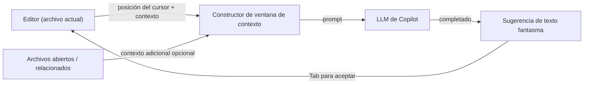

# GitHub Copilot

## Definición

GitHub Copilot es un asistente de codificación impulsado por IA desarrollado por GitHub y Microsoft, potenciado por [modelos de lenguaje grande](/docs/llms) entrenados en grandes cantidades de código público. Se integra en los editores existentes como una extensión ligera y muestra asistencia de IA principalmente a través de **completados en línea**: mientras el desarrollador escribe, Copilot sugiere la siguiente línea o bloque como texto fantasma que se puede aceptar con una sola tecla.

Más allá del autocompletado en línea, Copilot Chat agrega una interfaz conversacional dentro del IDE para hacer preguntas, generar código a partir de lenguaje natural, explicar código desconocido y escribir pruebas. Copilot Workspace (vista previa) extiende esto a flujos de trabajo de issue a código donde Copilot propone un plan e implementación para un issue de GitHub. La herramienta es agnóstica al IDE, con extensiones para VS Code, IDEs de JetBrains, Visual Studio, Neovim y el editor web de GitHub.

Comparado con [Cursor](/docs/tools/cursor), Copilot es una extensión más ligera que funciona dentro de tu IDE existente en lugar de reemplazarlo, y se centra en el contexto a nivel de archivo o selección en lugar de la indexación completa del código base. Comparado con [Claude Code](/docs/tools/claude-code), Copilot carece de un flujo de trabajo centrado en terminal y edición profunda de agente multi-archivo. La elección correcta depende de si prefieres quedarte en tu editor actual (Copilot), migrar a un editor de IA profundamente integrado (Cursor) o combinar trabajo de terminal e IDE (Claude Code).

## Cómo funciona

### Completado en línea



### Copilot Chat


### Características clave

**Texto fantasma** — completados en línea activados al escribir. **Copilot Chat** — ayuda conversacional con explicaciones de código y generación de pruebas. **Copilot Edits** — aplicar cambios multi-archivo desde una instrucción de chat. **Copilot Workspace** — planificar e implementar desde un issue de GitHub. **Soporte IDE** — VS Code, JetBrains, Visual Studio, Neovim.

## Cuándo usar / Cuándo NO usar

| Escenario | Usar GitHub Copilot | NO usar GitHub Copilot |
|----------|--------------------|--------------------------|
| Completado en línea sin cambiar de editor | Sí — extensión ligera para cualquier IDE admitido | |
| Generar código repetitivo y boilerplate | Sí — destaca en completados basados en patrones | |
| Entornos JetBrains, Neovim o Visual Studio | Sí — amplia cobertura de IDE | |
| Contexto profundo en todo el proyecto y refactorización | | [Cursor](/docs/tools/cursor) o [Claude Code](/docs/tools/claude-code) lo manejan mejor |
| Flujos de trabajo centrados en terminal o basados en CLI | | [Claude Code](/docs/tools/claude-code) está diseñado específicamente para esto |
| Elegir el backend LLM (p. ej. modelos Claude) | | [Cursor](/docs/tools/cursor) permite la selección de backend multi-modelo |

## Comparaciones

| Característica | GitHub Copilot | Cursor | Claude Code |
|---------|---------------|--------|-------------|
| Interfaz base | Extensión IDE | Fork de VS Code | Terminal + extensión IDE |
| Soporte IDE | VS Code, JetBrains, Neovim, etc. | Solo VS Code | VS Code, JetBrains, terminal |
| Contexto a nivel de proyecto | Archivos abiertos (limitado) | Índice de código base | Repositorio completo vía CLI |
| Ediciones multi-archivo | Copilot Edits (limitado) | Composer | Sí |
| Modelo | OpenAI / GitHub | Múltiples (Claude, GPT-4o) | Claude (Anthropic) |
| Integración con GitHub | Profunda (issues, PRs) | Mínima | Vía comandos git de CLI |
| Precios | Suscripción (gratuito para estudiantes) | Suscripción (hobby gratuito) | Suscripción (Pro+) |

## Pros y contras

| Pros | Contras |
|------|------|
| Funciona en editores existentes sin cambiar | Contexto limitado en todo el proyecto vs Cursor |
| Amplia cobertura de lenguajes y frameworks | Sin reglas de proyecto personalizadas ni archivos de dirección |
| Integración profunda con GitHub (issues, PRs) | Menos control sobre la selección de modelos |
| Baja fricción — el texto fantasma completa mientras escribes | La calidad del completado varía según el lenguaje y la tarea |

## Ejemplos de código

```python
# Copilot aprende del contexto — escribe un docstring y deja que Copilot complete la función

def calculate_compound_interest(principal: float, rate: float, periods: int) -> float:
    """
    Calculate compound interest.

    Args:
        principal: Initial amount
        rate: Annual interest rate as a decimal (e.g., 0.05 for 5%)
        periods: Number of compounding periods

    Returns:
        Final amount after compound interest
    """
    # Copilot sugerirá: return principal * (1 + rate) ** periods
    return principal * (1 + rate) ** periods
```

## Consejos para un uso efectivo

- Escribe comentarios y docstrings descriptivos antes del cuerpo de la función — Copilot los usa como señales de intención.
- Acepta completados parciales con `Ctrl+Right` (palabra por palabra) en lugar de aceptar ciegamente una sugerencia completa de múltiples líneas.
- Usa el comando `/explain` de Copilot Chat en código desconocido antes de modificarlo.
- Habilita Copilot en `.github/copilot-instructions.md` (vista previa) para agregar contexto ligero del proyecto.
- Revisa cuidadosamente las pruebas generadas — Copilot puede producir pruebas sintácticamente válidas pero semánticamente incorrectas.

## Recursos prácticos

- [Documentación de GitHub Copilot](https://docs.github.com/en/copilot) — Configuración, uso y guías específicas por IDE
- [GitHub Copilot — Primeros pasos](https://docs.github.com/en/copilot/getting-started-with-github-copilot) — Instalación y primeros pasos
- [GitHub Copilot Chat](https://docs.github.com/en/copilot/github-copilot-chat) — Uso de la interfaz de chat
- [GitHub Copilot Workspace](https://githubnext.com/projects/copilot-workspace) — Agente de issue a código (vista previa)

## Ver también

- [Cursor](/docs/tools/cursor)
- [Claude Code](/docs/tools/claude-code)
- [Agentes](/docs/agents)
- [LLMs](/docs/llms)
