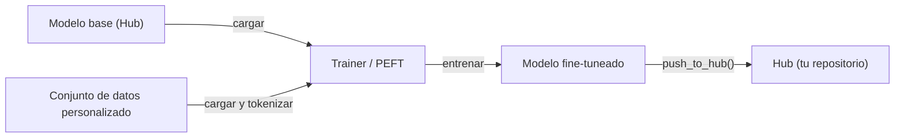

# Hugging Face

## Definición

Hugging Face es la plataforma central de código abierto para el aprendizaje automático: aloja el **Hub** (más de 500.000 modelos públicos y 50.000 conjuntos de datos), proporciona la biblioteca `transformers` para cargar y ejecutar modelos preentrenados, y ofrece herramientas para [fine-tuning](/docs/llms/fine-tuning), evaluación y despliegue. Cubre modelos de [NLP](/docs/nlp), visión por computadora, voz y [multimodales](/docs/multimodal-ai) a través de una API unificada, lo que hace práctico cambiar entre tareas y arquitecturas sin aprender nuevas interfaces.

La biblioteca `transformers` se ejecuta en [PyTorch](/docs/frameworks/pytorch), TensorFlow y JAX. Una llamada `from_pretrained("nombre-modelo")` descarga automáticamente los pesos del modelo, los tokenizadores y la configuración desde el Hub. La misma abstracción funciona para [BERT](/docs/transformers/bert), decodificadores estilo [GPT](/docs/transformers/gpt), modelos de difusión, vision transformers y modelos de voz tipo whisper. `datasets` proporciona streaming eficiente y preprocesamiento de grandes conjuntos de datos, y `accelerate` añade entrenamiento distribuido y precisión mixta con mínimos cambios de código.

Hugging Face también se integra con el ecosistema más amplio de IA: los modelos alojados en el Hub pueden usarse directamente en [LangChain](/docs/tools/langchain) y [LlamaIndex](/docs/tools/llamaindex) como backends de inferencia, y la biblioteca `peft` permite el [fine-tuning](/docs/llms/fine-tuning) eficiente en parámetros (LoRA, QLoRA) para que los [LLM](/docs/llms) puedan adaptarse con hardware de consumo. Spaces proporciona alojamiento de demos con configuración cero usando Gradio o Streamlit, conectando la investigación con el acceso público.

## Cómo funciona

### Carga e inferencia


### Flujo de trabajo de fine-tuning



### Bibliotecas clave

**`transformers`** — carga de modelos, inferencia, tokenización. **`datasets`** — carga y preprocesamiento eficiente de datos. **`accelerate`** — entrenamiento distribuido y precisión mixta. **`peft`** — fine-tuning eficiente en parámetros con LoRA y QLoRA. **`evaluate`** — métricas (BLEU, ROUGE, precisión). **`diffusers`** — pipelines de modelos de difusión.

## Cuándo usar / Cuándo NO usar

| Escenario | Usar Hugging Face | NO usar Hugging Face |
|----------|-----------------|------------------------|
| Cargar y ejecutar un modelo NLP o de visión preentrenado | Sí — `from_pretrained` proporciona una API unificada | |
| Fine-tuning de un LLM en un conjunto de datos personalizado | Sí — Trainer + PEFT (LoRA/QLoRA) | |
| Compartir modelos y conjuntos de datos con la comunidad | Sí — Hub con tarjetas de modelo y versionado | |
| Serving de producción con alto rendimiento | | Usar vLLM, TGI o TorchServe para inferencia optimizada |
| Despliegue en edge en tiempo real | | TFLite o ONNX Runtime son más adecuados |
| Entrenamiento desde cero de un modelo propietario grande | | Las herramientas del proveedor de cloud (pods TPU, SLURM) pueden ser preferibles |

## Pros y contras

| Pros | Contras |
|------|------|
| API unificada sobre cientos de arquitecturas | Gran huella de dependencias para casos de uso simples |
| El Hub proporciona tarjetas de modelo, versionado y descubribilidad | Algunos modelos son de calidad investigación con soporte limitado |
| PEFT permite fine-tuning con hardware limitado | El rendimiento de inferencia no está optimizado vs servidores especializados |
| Comunidad activa y actualizaciones frecuentes | Los cambios frecuentes de API pueden romper el código existente |

## Ejemplos de código

```python
# Cargar un modelo de clasificación de texto preentrenado y ejecutar inferencia
from transformers import pipeline

classifier = pipeline("sentiment-analysis", model="distilbert-base-uncased-finetuned-sst-2-english")
result = classifier("Hugging Face makes NLP accessible to everyone.")
print(result)  # [{'label': 'POSITIVE', 'score': 0.9998}]

# Fine-tuning con PEFT (LoRA) en un conjunto de datos personalizado
from transformers import AutoModelForCausalLM, AutoTokenizer, TrainingArguments, Trainer
from peft import get_peft_model, LoraConfig, TaskType
import datasets

model_name = "meta-llama/Llama-3.2-1B"
tokenizer = AutoTokenizer.from_pretrained(model_name)
base_model = AutoModelForCausalLM.from_pretrained(model_name)

lora_config = LoraConfig(task_type=TaskType.CAUSAL_LM, r=8, lora_alpha=32)
model = get_peft_model(base_model, lora_config)
model.print_trainable_parameters()  # muestra solo ~0.1% de params son entrenables
```

## Comparaciones

| Característica | Hugging Face Transformers | API directa (OpenAI, Anthropic) |
|---------|--------------------------|-------------------------------|
| Acceso a modelos | Modelos de código abierto del Hub | Modelos de frontera propietarios |
| Costo | Gratis para ejecutar (pagar por tu hardware) | Costo de API por token |
| Control | Acceso completo a pesos e internos | Caja negra, control limitado |
| Fine-tuning | Primera clase (Trainer, PEFT) | Limitado (API de fine-tuning OpenAI) |
| Despliegue | Autogestionado (vLLM, TGI, TFLite) | Gestionado por el proveedor |
| Mejor para | Investigación, fine-tuning personalizado, privacidad | Integración de producción rápida |

## Recursos prácticos

- [Documentación Hugging Face](https://huggingface.co/docs) — Documentación completa de la plataforma incluyendo Hub, Transformers y Spaces
- [Biblioteca Transformers](https://huggingface.co/docs/transformers) — Referencia de API, pipelines y tarjetas de modelo
- [Curso NLP de Hugging Face](https://huggingface.co/learn/nlp-course/) — Curso gratuito de extremo a extremo sobre Transformers y fine-tuning
- [Documentación PEFT](https://huggingface.co/docs/peft) — LoRA, QLoRA y otros métodos eficientes en parámetros
- [Hub de Hugging Face](https://huggingface.co/models) — Explorar y filtrar más de 500k modelos por tarea, idioma y licencia

## Ver también

- [Transformers](/docs/transformers)
- [LLMs](/docs/llms)
- [Fine-tuning](/docs/llms/fine-tuning)
- [RAG](/docs/rag)
- [Frameworks](/docs/frameworks/pytorch)
