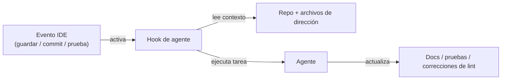

# Kiro

## Definición

Kiro es un **IDE impulsado por IA** de Amazon Web Services que operacionaliza el [desarrollo guiado por especificaciones](/docs/spec-driven-development) como un flujo de trabajo de primera clase. En lugar de proporcionar completado de IA de forma libre, Kiro estructura la asistencia de IA en torno a una progresión deliberada: el prompt de un desarrollador se expande en **requisitos** estructurados, **diseños de sistema** y un desglose de **tareas de implementación**. Este proceso mantiene la intención explícita y auditable, reduciendo la ambigüedad que viene con los enfoques de vibe-coding donde un único prompt impulsa la generación sin restricciones.

La capacidad distintiva son los **hooks de agentes**: [agentes](/docs/agents) autónomos activados por eventos en el flujo de trabajo de desarrollo (guardados de archivos, commits de git, ejecuciones de pruebas) que realizan tareas de mantenimiento como actualizar documentación, regenerar pruebas o verificar el código contra reglas de estilo. Este modelo basado en eventos significa que las puertas de calidad están automatizadas en lugar de invocadas manualmente. **Autopilot** extiende los hooks a tareas de múltiples pasos más largas que se ejecutan con puntos de control del desarrollador, adecuadas para funcionalidades más grandes o refactorizaciones.

Kiro está construido sobre una base compatible con VS Code (registro de extensiones Open VSX, temas y atajos de teclado familiares) e integra el **Protocolo de Contexto de Modelo (MCP)** para conectar agentes a fuentes de datos externas — bases de datos, APIs de documentación y herramientas internas. Un **CLI de Kiro** muestra los mismos flujos de trabajo guiados por especificaciones y de agentes en la terminal. La combinación hace que Kiro sea una opción natural para equipos que quieren estructura y trazabilidad al pasar del prototipo a la producción.

## Cómo funciona

### Flujo de trabajo guiado por especificaciones


### Hooks de agentes (basados en eventos)



### Características clave

**Pipeline de especificaciones** — prompt → requisitos → diseño → tareas. **Hooks de agentes** — agentes activados por eventos para docs, pruebas y optimización. **Autopilot** — ejecuciones de agentes de múltiples pasos con puntos de control. **Archivos de dirección** — configuración a nivel de proyecto para el comportamiento del agente. **Integración MCP** — conectar a APIs externas, bases de datos y docs. **CLI de Kiro** — acceso en terminal a flujos de trabajo guiados por especificaciones y de agentes. **Compatible con VS Code** — extensiones Open VSX, configuraciones familiares.

## Cuándo usar / Cuándo NO usar

| Escenario | Usar Kiro | NO usar Kiro |
|----------|---------|-----------------|
| Desarrollo guiado por especificaciones con requisitos estructurados | Sí — flujo de trabajo principal | |
| Automatizar docs, pruebas y lint al guardar archivos | Sí — los hooks de agentes están diseñados específicamente para esto | |
| Del prototipo a la producción con trazabilidad | Sí — rastro de especificaciones explícito desde el prompt hasta las tareas | |
| Completados en línea rápidos y texto fantasma | | [GitHub Copilot](/docs/tools/github-copilot) o [Cursor](/docs/tools/cursor) son más ligeros |
| Entornos que no son VS Code (JetBrains, Neovim) | | Kiro está basado en VS Code; usa Copilot para mayor cobertura de IDE |
| Flujos de trabajo centrados en terminal impulsados por Claude | | [Claude Code](/docs/tools/claude-code) encaja mejor |

## Pros y contras

| Pros | Contras |
|------|------|
| Convierte prompts en especificaciones estructuradas, reduciendo la ambigüedad | El flujo de trabajo más estructurado puede sentirse pesado para tareas pequeñas |
| Los hooks de agentes automatizan las verificaciones de calidad repetitivas | Plataforma más nueva; ecosistema más pequeño que las extensiones de VS Code |
| La integración MCP conecta agentes a fuentes de datos reales | Respaldado por AWS, lo que puede generar preguntas sobre residencia de datos |
| Compatible con VS Code, reduciendo la fricción de migración | Los puntos de control de Autopilot requieren disponibilidad del desarrollador |

## Ejemplos de código

```yaml
# .kiro/steering.yaml — configurar comportamiento del agente y estándares del proyecto
project:
  name: my-api-service
  stack: [Python, FastAPI, PostgreSQL, pytest]

hooks:
  on_save:
    - task: update_docstrings
      scope: changed_files
    - task: lint_and_format
      tools: [ruff, black]

  on_commit:
    - task: generate_missing_tests
      coverage_threshold: 80

  on_test_fail:
    - task: analyze_failure
      suggest_fix: true

autopilot:
  require_approval_on:
    - database_migrations
    - new_dependencies
    - public_api_changes

mcp:
  connections:
    - name: internal_docs
      url: https://docs.internal.example.com/mcp
    - name: postgres_dev
      url: postgresql://localhost:5432/dev
```

## Consejos para un uso efectivo

- Revisa los requisitos generados y el diseño del sistema antes de ejecutar las tareas — las correcciones en la etapa de especificación son más baratas que en el código.
- Configura los hooks de agentes de forma conservadora al principio (una o dos tareas) y amplía a medida que ganas confianza en la calidad de salida del agente.
- Usa archivos de dirección para codificar las convenciones del equipo para que todos los agentes y ejecuciones de Autopilot sigan estándares consistentes.
- Conecta tu documentación interna vía MCP para que los agentes de Kiro tengan acceso al contexto propietario.
- Confirma los archivos de dirección y artefactos de especificaciones en el control de versiones para rastrear cómo evolucionan los requisitos con el tiempo.

## Recursos prácticos

- [Kiro — IDE de IA](https://kiro.dev/) — Descripción del producto, características y precios
- [Kiro — Documentación](https://kiro.dev/docs/chat) — Guías para chat, hooks y archivos de dirección
- [Kiro — Hooks de agentes](https://kiro.dev/docs/hooks) — Configuración de agentes basada en eventos
- [Protocolo de Contexto de Modelo](https://modelcontextprotocol.io/) — Especificación MCP para conectar agentes a herramientas externas

## Ver también

- [Desarrollo guiado por especificaciones](/docs/spec-driven-development)
- [Agentes](/docs/agents)
- [Cursor](/docs/tools/cursor)
- [LLMs](/docs/llms)
