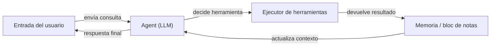

# LangChain

## Definición

LangChain es un framework de código abierto para crear aplicaciones impulsadas por [modelos de lenguaje grandes](/docs/llms). Proporciona abstracciones componibles para prompts, chains, agents y retrieval, permitiendo a los desarrolladores conectar proveedores de modelos, almacenes de memoria, herramientas y cargadores de documentos con un mínimo de código repetitivo. El framework incluye integraciones preconstruidas para docenas de proveedores de LLM (OpenAI, Anthropic, Mistral, local vía Ollama) y almacenes de vectores (Pinecone, Chroma, FAISS).

En su núcleo, LangChain gira en torno al concepto de **chains**: secuencias de pasos donde la salida de un paso alimenta el siguiente. Los **Agents** extienden las chains dando al LLM un bucle de razonamiento: decide qué herramienta llamar, recibe el resultado y continúa hasta producir una respuesta final. LangSmith, la plataforma de observabilidad complementaria, proporciona rastreo, evaluación y gestión de conjuntos de datos para aplicaciones LangChain en producción.

Complementa a [LlamaIndex](/docs/tools/llamaindex) (que enfatiza la indexación de datos y la calidad del retrieval) centrándose en la orquestación componible y los bucles de agentes. Use LangChain cuando necesite encadenamiento flexible, flujos de trabajo de [ingeniería de prompts](/docs/prompt-engineering) de varios pasos, o [agents con herramientas](/docs/agents), y quiera un gran ecosistema de integraciones listas para usar.

## Cómo funciona

### Componentes

LangChain descompone una aplicación LLM en componentes modulares: **LLMs / modelos de chat** (el backend de inferencia), **plantillas de prompt** (construcción estructurada de entrada), **parsers de salida** (extracción estructurada), **retrievers** (obtener documentos relevantes de una [base de datos vectorial](/docs/rag/vector-databases)) y **herramientas** (APIs externas, búsqueda, ejecución de código).

### Chains y LCEL

El **LangChain Expression Language (LCEL)** compone componentes con una sintaxis de pipe (`prompt | llm | parser`). La chain resultante es lazy, streamable y procesable en lotes. Una chain RAG simple: recuperar documentos → formatear en un prompt → llamar al LLM → parsear la respuesta.

### Agents



### Observabilidad con LangSmith

LangSmith envuelve chains y agents con registro de trazas, habilitando análisis de latencia, pruebas de prompts y evaluación basada en conjuntos de datos sin modificar el código de la aplicación.

## Cuándo usar / Cuándo NO usar

| Escenario | Usar LangChain | NO usar LangChain |
|----------|--------------|----------------------|
| Crear agents que llamen múltiples APIs y herramientas | Sí — las abstracciones de agentes e integraciones de herramientas son de primera clase | |
| RAG sobre documentos propios con configuración rápida | Sí — muchos cargadores e integraciones de retrievers | |
| RAG de producción con chunking profundo y ajuste de retrieval | | Preferir [LlamaIndex](/docs/tools/llamaindex) para control detallado |
| Completados de un solo turno sin retrieval ni herramientas | | El overhead es innecesario; llamar a la API directamente |
| Rastreo y evaluación de llamadas LLM en producción | Sí — integración con LangSmith | |
| Presupuesto de latencia ajustado y dependencias mínimas | | El overhead del framework puede añadir latencia; considerar un cliente ligero |

## Comparaciones

| Característica | LangChain | LlamaIndex |
|---------|-----------|------------|
| Enfoque principal | Orquestación, chains, agents | Indexación y retrieval de datos |
| Soporte de agents | Primera clase (llamada a herramientas, LCEL) | Vía query engines como herramientas |
| Control de RAG | Alto nivel, muchas integraciones | Chunking detallado, parsers de nodos |
| Observabilidad | LangSmith (rastreo, evals) | Vía integraciones |
| Curva de aprendizaje | Moderada | Moderada |
| Mejor para | Flujos de trabajo de varios pasos, agents | RAG profundo sobre grandes corpus de documentos |

## Pros y contras

| Pros | Contras |
|------|------|
| Gran ecosistema de integraciones (100+ LLMs, stores, herramientas) | Las abstracciones pueden ocultar errores y dificultar el debugging |
| LCEL hace que las chains sean componibles y streameables | La superficie de la API cambia frecuentemente entre versiones |
| LangSmith proporciona rastreo y evaluaciones de grado productivo | Puede añadir latencia y overhead de dependencias para casos de uso simples |
| Comunidad sólida y documentación | Múltiples formas de hacer lo mismo pueden ser confusas |

## Ejemplos de código

```python
# Chain RAG mínima usando LangChain Expression Language (LCEL)
from langchain_openai import ChatOpenAI, OpenAIEmbeddings
from langchain_community.vectorstores import FAISS
from langchain_core.prompts import ChatPromptTemplate
from langchain_core.output_parsers import StrOutputParser
from langchain_core.runnables import RunnablePassthrough

# 1. Construir un almacén de vectores a partir de documentos
texts = ["LangChain composes LLM pipelines.", "LCEL uses pipe syntax."]
vectorstore = FAISS.from_texts(texts, embedding=OpenAIEmbeddings())
retriever = vectorstore.as_retriever()

# 2. Definir prompt
prompt = ChatPromptTemplate.from_template(
    "Answer based on context:\n{context}\n\nQuestion: {question}"
)

# 3. Componer chain con LCEL
chain = (
    {"context": retriever, "question": RunnablePassthrough()}
    | prompt
    | ChatOpenAI(model="gpt-4o-mini")
    | StrOutputParser()
)

print(chain.invoke("What does LCEL use?"))
# -> "LCEL uses pipe syntax."
```

## Consejos para un uso efectivo

- Usar LCEL (sintaxis de pipe) en lugar del `LLMChain` heredado para todo el código nuevo — es streameable, procesable en lotes y más fácil de depurar.
- Instrumentar cada chain y agent con rastreo de LangSmith desde el primer día; añadir rastreo retroactivamente es más difícil.
- Mantener las descripciones de herramientas cortas y precisas — la capacidad del agent para seleccionar la herramienta correcta depende de la calidad de la descripción.
- Usar `RunnablePassthrough` y `RunnableParallel` para pasar datos a través de la chain sin transformarlos.
- Para RAG de producción, añadir reranking (p.ej. Cohere rerank) entre el retriever y el LLM para mejorar la calidad de las respuestas.

## Recursos prácticos

- [Documentación de LangChain](https://python.langchain.com/docs/) — Referencia completa de API, guías y tutoriales
- [LangChain — Agents](https://python.langchain.com/docs/concepts/agents/) — Conceptos de agents y cómo crear agents que llamen herramientas
- [LangChain — RAG](https://python.langchain.com/docs/use_cases/question_answering/) — Casos de uso de preguntas y respuestas y retrieval
- [LangSmith](https://smith.langchain.com/) — Rastreo, evaluación y gestión de conjuntos de datos
- [Descripción general de LCEL](https://python.langchain.com/docs/expression_language/) — Componer chains con sintaxis de pipe

## Ver también

- [RAG](/docs/rag)
- [Agents](/docs/agents)
- [LlamaIndex](/docs/tools/llamaindex)
