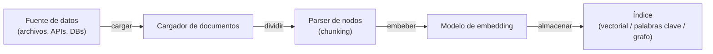

# LlamaIndex

## Definición

LlamaIndex (anteriormente GPT Index) es un framework de datos que conecta los [grandes modelos de lenguaje](/docs/llms) con sus propias fuentes de datos. Su objetivo principal es ingerir, indexar y consultar documentos, bases de datos y APIs para que los LLM puedan responder preguntas basadas en información privada o específica del dominio. Proporciona un alto grado de control sobre cada etapa de la [generación aumentada por recuperación](/docs/rag): carga de datos, análisis de nodos (chunking), selección de embeddings, construcción de índices, estrategia de recuperación, reranking y síntesis de respuestas.

Donde [LangChain](/docs/tools/langchain) enfatiza la orquestación componible y los bucles de agentes, LlamaIndex está optimizado para la **capa de datos**: puede intercambiar estrategias de chunking, algoritmos de recuperación y enfoques de síntesis sin reconstruir el pipeline. Incluye motores de consulta, motores de chat y descomposición de sub-preguntas. Múltiples tipos de índices (vectorial, resumen, grafo de conocimiento, palabras clave) se pueden combinar en una única consulta para recuperación híbrida.

LlamaIndex también admite [agentes](/docs/agents): los motores de consulta pueden registrarse como herramientas, y los bucles de razonamiento de agentes (ReAct, llamada de función OpenAI) pueden seleccionar qué motor consultar. Un conjunto de evaluación (fidelidad, relevancia, precisión del contexto) ayuda a diagnosticar la calidad del RAG y guía el ajuste de chunking o recuperación para producción.

## Cómo funciona

### Pipeline de ingestión



### Pipeline de consulta


### Abstracciones clave

Los **Nodos** son la unidad de recuperación — fragmentos de un documento con metadatos. El **Índice** almacena nodos y soporta búsqueda vectorial, por palabras clave o basada en grafos. El **Motor de consulta** envuelve índice + retriever + sintetizador en un único callable. El **Motor de chat** mantiene el historial de conversación. El **Motor de sub-preguntas** descompone consultas complejas en más simples distribuidas a través de múltiples índices.

## Cuándo usar / Cuándo NO usar

| Escenario | Usar LlamaIndex | NO usar LlamaIndex |
|----------|---------------|----------------------|
| RAG sobre grandes corpus de documentos con control de chunking | Sí — parsers de nodos detallados y múltiples tipos de índice | |
| Conectar LLMs a bases de datos internas y APIs | Sí — conectores de datos para SQL, Notion, Slack, S3, etc. | |
| Evaluar fidelidad y relevancia del retrieval | Sí — módulos de evaluación integrados | |
| Flujos de trabajo de agentes de varios pasos con muchas APIs externas | | Preferir [LangChain](/docs/tools/langchain) para herramientas de agentes más ricas |
| Completaciones simples de un solo turno sin recuperación | | El overhead es innecesario; llamar a la API LLM directamente |
| Pipeline de producción que necesita rastreo LangSmith | | Integrar con LangChain o usar una herramienta de rastreo dedicada |

## Comparaciones

| Característica | LlamaIndex | LangChain |
|---------|------------|-----------|
| Enfoque principal | Indexación y recuperación de datos (RAG) | Orquestación, chains, agentes |
| Control de chunking | Parsers de nodos detallados | Divisores de texto de alto nivel |
| Tipos de índice | Vectorial, palabras clave, grafo, resumen, híbrido | Principalmente vectorial vía retrievers |
| Evaluación | Integrada (fidelidad, relevancia) | Vía LangSmith |
| Soporte de agentes | Motores de consulta como herramientas, ReAct | Agente LCEL de primera clase |
| Mejor para | RAG profundo sobre grandes corpus | Orquestación de agentes de varios pasos |

## Pros y contras

| Pros | Contras |
|------|------|
| Control detallado sobre cada etapa del RAG | Curva de aprendizaje más pronunciada que los wrappers LLM simples |
| Múltiples tipos de índice incluidos grafos de conocimiento | Menos integraciones no-RAG comparado con LangChain |
| Suite de evaluación integrada para RAG de producción | Algunas abstracciones añaden verbosidad |
| Pipelines componibles que intercambian componentes fácilmente | La documentación puede quedar atrás de los lanzamientos rápidos |

## Ejemplos de código

```python
# Pipeline RAG simple con LlamaIndex
from llama_index.core import VectorStoreIndex, SimpleDirectoryReader
from llama_index.llms.openai import OpenAI
from llama_index.core import Settings

# Configurar LLM y modelo de embedding
Settings.llm = OpenAI(model="gpt-4o-mini")

# 1. Cargar documentos desde un directorio
documents = SimpleDirectoryReader("./data").load_data()

# 2. Construir un índice vectorial (embebe y almacena nodos automáticamente)
index = VectorStoreIndex.from_documents(documents)

# 3. Crear un motor de consulta con recuperación top-k
query_engine = index.as_query_engine(similarity_top_k=3)

# 4. Consultar
response = query_engine.query("What are the main topics covered?")
print(response)
```

## Consejos para un uso efectivo

- Elegir el tamaño de chunk según los documentos: 256–512 tokens funciona bien para Q&A factual; 1024+ para tareas de resumen.
- Usar un reranker (p.ej. `SentenceTransformerRerank`) para mejorar la precisión del retrieval sin cambiar el índice.
- Combinar un índice vectorial para búsqueda semántica con un índice de palabras clave para recuperación de coincidencia exacta usando un `QueryFusionRetriever`.
- Ejecutar el conjunto de evaluación integrado periódicamente durante el desarrollo para detectar regresiones en la calidad del retrieval.
- Usar `IngestionPipeline` con un `RedisDocumentStore` para ingestión incremental para que los documentos no sean re-embebidos en cada ejecución.

## Recursos prácticos

- [Documentación LlamaIndex](https://docs.llamaindex.ai/) — Guías completas, referencia de API y tutoriales
- [LlamaIndex — Guía RAG](https://docs.llamaindex.ai/en/stable/module_guides/deploying/rag/) — Pipelines de ingestión, indexación y consulta
- [LlamaIndex — Agentes](https://docs.llamaindex.ai/en/stable/module_guides/deploying/agents/) — Construir agentes con motores de consulta como herramientas
- [LlamaIndex — Evaluación](https://docs.llamaindex.ai/en/stable/module_guides/evaluating/) — Métricas de fidelidad, relevancia y precisión de contexto
- [LlamaHub](https://llamahub.ai/) — Conectores de datos comunitarios, herramientas e integraciones

## Ver también

- [RAG](/docs/rag)
- [LangChain](/docs/tools/langchain)
- [Bases de datos vectoriales](/docs/rag/vector-databases)
