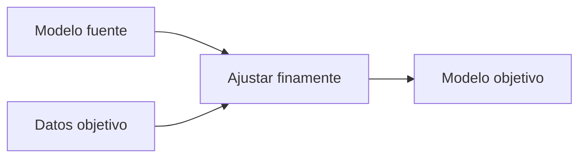

# Aprendizaje por transferencia

## Definición

El aprendizaje por transferencia reutiliza el conocimiento de una tarea o dominio fuente para mejorar el aprendizaje en una tarea objetivo con datos limitados. Los modelos preentrenados (como ImageNet, BERT) se ajustan finamente en tareas posteriores.

Es estándar en [NLP](/docs/nlp) (como BERT, GPT) y [visión](/docs/cv) (como backbones de ImageNet). Cuando el objetivo tiene pocos datos etiquetados, comenzar desde un **modelo fuente** y [ajustar finamente](/docs/llms/fine-tuning) con **datos objetivo** es mucho más eficiente en datos que entrenar desde cero. Ver [few-shot](/docs/few-shot-learning) y [zero-shot](/docs/zero-shot-learning) para el extremo de muy pocos o ningún ejemplo objetivo.

## Cómo funciona

Obtenga un **modelo fuente** (preentrenado en un gran conjunto de datos, como ImageNet o texto web). Tome **datos objetivo** (los ejemplos etiquetados de su tarea) y **ajuste finamente**: actualice el modelo (todos los parámetros o solo un subconjunto, como adaptador, cabeza) para minimizar la pérdida en la tarea objetivo. El resultado es un **modelo objetivo**. El **ajuste fino completo** actualiza todos los pesos; el **adaptador** o el **ajuste de indicaciones** actualiza un pequeño número de parámetros para ahorrar cómputo y preservar el conocimiento fuente. Funciona mejor cuando la fuente y el objetivo comparten representaciones útiles (como la misma modalidad, dominios relacionados).

## Casos de uso

El aprendizaje por transferencia es estándar cuando se tienen datos objetivo limitados y un modelo preentrenado relacionado para adaptar.

- Ajustar finamente BERT o GPT en tareas NLP específicas del dominio
- Adaptar modelos preentrenados en ImageNet a imágenes médicas o satelitales
- Reutilizar representaciones preentrenadas cuando los datos objetivo son limitados

## Recursos prácticos

- [Hugging Face – Aprendizaje por transferencia](https://huggingface.co/course/chapter1/4?fw=pt)
- [TensorFlow – Aprendizaje por transferencia](https://www.tensorflow.org/tutorials/images/transfer_learning)

## Ver también

- [Ajuste fino](/docs/llms/fine-tuning)
- [Aprendizaje few-shot](/docs/few-shot-learning)
