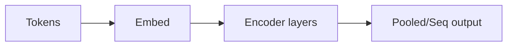

# BERT

## Definición

BERT es un modelo **encoder** de transformer preentrenado con modelado de lenguaje enmascarado (MLM) y predicción de siguiente oración. Produce embeddings contextuales que se afinan para tareas de NLP posteriores.

A diferencia de los decoders estilo [GPT](/docs/transformers/gpt), BERT usa contexto **bidireccional** (izquierda y derecha de cada token), lo que ayuda en tareas de comprensión (p. ej., clasificación [NLP](/docs/nlp), NER, QA) en lugar de generación abierta. Se usa frecuentemente como encoder congelado o afinado en pipelines de [RAG](/docs/rag) y búsqueda.

## Cómo funciona

Los **tokens** se tokenizan y embeben (embeddings de token + posición). Las **capas de encoder** aplican auto-atención bidireccional y FFNs; la representación de cada token es influenciada por todos los demás tokens. La salida puede ser **pooled** (p. ej., [CLS] para tareas a nivel de oración) o **secuencial** (un vector por token para NER, QA). Preentrenamiento: enmascarar tokens aleatoriamente y predecirlos (MLM), y predecir si dos oraciones son consecutivas (NSP). El **afinamiento** añade una cabeza de tarea (p. ej., clasificador lineal) y actualiza el modelo (o solo la cabeza) con datos etiquetados.

## Casos de uso

Los modelos estilo BERT destacan cuando necesitas representaciones contextuales ricas para comprensión (clasificación, NER, QA) en lugar de generación.

- Reconocimiento de entidades nombradas y extracción de relaciones
- Búsqueda y recuperación (igualaring semántico, ranking de relevancia)
- Respuesta a preguntas e inferencia de lenguaje natural

## Documentación externa

- [BERT: Pre-training of Deep Bidirectional Transformers (Devlin et al.)](https://arxiv.org/abs/1810.04805)
- [Hugging Face – BERT](https://huggingface.co/docs/transformers/model_doc/bert)

## Ver también

- [Transformers](/docs/transformers)
- [GPT](/docs/transformers/gpt)
- [NLP](/docs/nlp)
