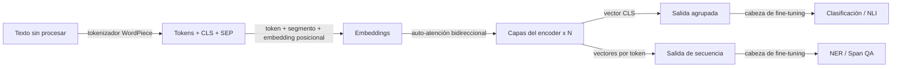

# BERT

## Definición

BERT es un modelo transformer de **encoder** preentrenado con modelado de lenguaje enmascarado (MLM) y predicción de la siguiente oración. Produce embeddings contextuales que se ajustan finamente para tareas de NLP posteriores.

A diferencia de los decoders de estilo [GPT](/docs/transformers/gpt), BERT usa contexto **bidireccional** (izquierda y derecha de cada token), lo que ayuda para las tareas de comprensión (p. ej. clasificación de [NLP](/docs/nlp), NER, QA) en lugar de la generación de extremo abierto. A menudo se usa como encoder congelado o con fine-tuning en pipelines de [RAG](/docs/rag) y búsqueda.

El objetivo de preentrenamiento de BERT es elegantemente simple: enmascarar aleatoriamente el 15% de los tokens en una entrada y entrenar al modelo para predecirlos usando el contexto circundante completo. Esto obliga al encoder a desarrollar representaciones ricas y dependientes del contexto para cada token en lugar de memorizar estadísticas superficiales. En el tiempo de fine-tuning, se agrega una pequeña cabeza de tarea (una o dos capas lineales) sobre el encoder preentrenado y se entrena con datos etiquetados — a menudo logrando un rendimiento sólido con solo unos pocos miles de ejemplos. Variantes como RoBERTa (receta de entrenamiento mejorada), DistilBERT (destilado para velocidad) y DeBERTa (atención desvinculada) han mejorado el original mientras preservan el paradigma solo-encoder.

## Cómo funciona



### Tokenización y embedding

Los **tokens** son producidos por el tokenizador WordPiece, que agrega un token especial [CLS] al inicio y [SEP] entre/después de los segmentos. El embedding de cada token es la suma de su embedding de token, embedding de segmento y embedding posicional.

### Encoder bidireccional

Las **capas del encoder** aplican auto-atención bidireccional: a diferencia de los modelos causales, cada token puede atender a todos los demás tokens en ambas direcciones. Esto produce representaciones que son profundamente conscientes del contexto. Apilar 12 o 24 capas de este tipo (BERT-Base / BERT-Large) produce representaciones universales potentes.

### Salida y fine-tuning

La salida puede ser **agrupada** (el vector [CLS] para tareas a nivel de oración) o la **secuencia** completa (un vector por token para NER, QA). El **fine-tuning** agrega una cabeza de tarea (p. ej. clasificador lineal) y actualiza todo el modelo o solo la cabeza en datos etiquetados.

## Cuándo usar / Cuándo NO usar

| Escenario | ¿Usar BERT? | Notas |
|---|---|---|
| Clasificación de texto (sentimiento, intención) | Sí | El token [CLS] + cabeza lineal es muy efectivo |
| Reconocimiento de entidades nombradas (NER) | Sí | Las salidas por token se adaptan al etiquetado de spans |
| Búsqueda semántica / recuperación | Sí | Variantes de fine-tuning o bi-encoder (p. ej. Sentence-BERT) |
| Generación de texto de extremo abierto | No | Usar decoder de estilo GPT en su lugar |
| Documentos muy largos (> 512 tokens) | Con precaución | Usar Longformer o estrategias de fragmentación |
| Tareas de generación sin ejemplos | No | BERT requiere fine-tuning para la generación |

## Comparaciones

| Aspecto | BERT (solo encoder) | GPT (solo decoder) |
|---|---|---|
| Dirección del contexto | Bidireccional | Unidireccional (causal) |
| Fortaleza principal | Comprensión / clasificación | Generación |
| Objetivo de preentrenamiento | MLM enmascarado + NSP | Predicción del siguiente token |
| Estilo de fine-tuning | Agregar pequeña cabeza de tarea | Prompting o fine-tuning supervisado |
| Capacidad de generación | Pobre (no diseñado para ello) | Excelente |
| Calidad de embedding (recuperación) | Excelente (con bi-encoder) | Moderada sin fine-tuning |

## Pros y contras

| Pros | Contras |
|---|---|
| Representaciones contextuales sólidas | No puede generar texto autorregresivamente |
| Fine-tuning eficiente en conjuntos de datos pequeños | Máximo 512 tokens (arquitectura base) |
| Variantes preentrenadas ampliamente disponibles | Requiere datos etiquetados para la mayoría de las tareas |
| Patrones de atención interpretables | Más débil que los modelos de clase GPT-4 en razonamiento complejo |

## Ejemplos de código

```python
# Fine-tuning BERT for text classification with Hugging Face Transformers
from transformers import AutoTokenizer, AutoModelForSequenceClassification, Trainer, TrainingArguments
from datasets import Dataset
import torch

# Minimal synthetic dataset for demonstration
texts  = ["I love this product!", "Terrible experience.", "It was okay I guess.", "Absolutely fantastic!"]
labels = [1, 0, 0, 1]  # 1 = positive, 0 = negative

tokenizer = AutoTokenizer.from_pretrained("bert-base-uncased")

def tokenize(batch):
    return tokenizer(batch["text"], truncation=True, padding="max_length", max_length=64)

dataset = Dataset.from_dict({"text": texts, "label": labels})
dataset = dataset.map(tokenize, batched=True)
dataset.set_format("torch", columns=["input_ids", "attention_mask", "label"])

model = AutoModelForSequenceClassification.from_pretrained("bert-base-uncased", num_labels=2)

training_args = TrainingArguments(
    output_dir="./bert-sentiment",
    num_train_epochs=3,
    per_device_train_batch_size=2,
    logging_steps=5,
    save_strategy="no",
)

trainer = Trainer(model=model, args=training_args, train_dataset=dataset)
trainer.train()
print("Fine-tuning complete.")
```

## Recursos prácticos

- [BERT: Pre-entrenamiento de Transformers Bidireccionales Profundos (Devlin et al.)](https://arxiv.org/abs/1810.04805) — Artículo original
- [Hugging Face – BERT](https://huggingface.co/docs/transformers/model_doc/bert) — Referencia de la API y tarjetas de modelos
- [Sentence-BERT](https://www.sbert.net/) — Variante de BERT optimizada para similitud semántica y recuperación densa

## Ver también

- [Transformers](/docs/transformers)
- [GPT](/docs/transformers/gpt)
- [NLP](/docs/nlp)
