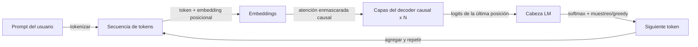

# GPT

## Definición

GPT se refiere a modelos transformer solo-decoder entrenados para predecir el siguiente token (autorregresivo). Escalar estos modelos ha llevado a los modelos de lenguaje grandes (LLMs) actuales capaces de tareas de pocos ejemplos y sin ejemplos.

El diseño solo-decoder es adecuado para la **generación**: en cada paso el modelo condiciona en los tokens anteriores y predice el siguiente. Los [LLMs](/docs/llms) construidos sobre esta idea se ajustan con instrucciones y se alinean (p. ej. RLHF) para chat y uso de herramientas. Para tareas solo de comprensión, los encoders de estilo [BERT](/docs/transformers/bert) pueden ser más eficientes en parámetros.

La línea de modelos GPT (GPT-1, GPT-2, GPT-3, GPT-4) demostró que escalar un objetivo simple de predicción del siguiente token en corpus cada vez más grandes produce modelos con capacidades emergentes: razonamiento, generación de código, aritmética de múltiples pasos y resolución de tareas de pocos ejemplos sin ningún entrenamiento específico de la tarea. Las etapas de ajuste de instrucciones y RLHF que siguen al preentrenamiento base transforman un predictor de siguiente token sin procesar en un asistente que sigue instrucciones en lenguaje natural de forma confiable, mantiene el contexto de la conversación y rechaza solicitudes dañinas. Los despliegues modernos de la familia GPT se acceden a través de APIs y admiten características como llamadas a funciones, entradas visuales y streaming.

## Cómo funciona



### Enmascaramiento causal

Los **tokens** se incrustan y se alimentan en **capas del decoder causal**: cada posición solo puede atender a sí misma y a las posiciones anteriores (auto-atención enmascarada vía una máscara triangular superior). Esto evita que el modelo "vea" el futuro durante el entrenamiento y la inferencia.

### Cabeza de modelado del lenguaje

El **siguiente token** se predice desde la representación de la última posición vía una capa lineal sobre el vocabulario, seguida de softmax. El **entrenamiento** maximiza la log-verosimilitud del siguiente token dado todos los tokens anteriores (forzamiento del profesor). La pérdida se promedia sobre todas las posiciones, por lo que cada token en la secuencia contribuye una señal de gradiente.

### Inferencia y muestreo

La **inferencia** genera autorregresivamente: muestrea o elige con greedy el siguiente token, lo agrega y repite hasta que se cumple una condición de parada (token EOS o longitud máxima). Los parámetros de muestreo (temperatura, top-k, top-p) controlan la diversidad vs. el determinismo. La [ingeniería de prompts](/docs/prompt-engineering) y el [fine-tuning](/docs/llms/fine-tuning) moldean el comportamiento de la tarea sobre este mecanismo.

## Cuándo usar / Cuándo NO usar

| Escenario | ¿Usar estilo GPT? | Notas |
|---|---|---|
| Generación de texto, resumen, diálogo | Sí | El ajuste natural para la generación autorregresiva |
| Clasificación de pocos ejemplos vía prompting | Sí | GPT lo maneja bien con pocos ejemplos |
| Búsqueda semántica / recuperación densa | Con precaución | Los bi-encoders (estilo BERT) son más eficientes |
| Clasificación a nivel de token o NER | Con precaución | Los modelos encoder son más eficientes en parámetros |
| Razonamiento de contexto largo (>8K tokens) | Sí | Los modelos GPT modernos admiten contextos muy largos |
| Presupuesto estricto / implementación edge | No | Los modelos GPT son grandes; usar alternativas destiladas |

## Comparaciones

| Aspecto | GPT (solo decoder) | BERT (solo encoder) |
|---|---|---|
| Dirección del contexto | Unidireccional (causal) | Bidireccional |
| Fortaleza principal | Generación | Comprensión / clasificación |
| Objetivo de preentrenamiento | Predicción del siguiente token | MLM enmascarado + NSP |
| Capacidad sin ejemplos | Alta | Baja |
| Calidad de embedding (recuperación) | Moderada sin fine-tuning | Excelente (bi-encoder) |
| Acceso API | OpenAI, Anthropic, Mistral, etc. | Hub de HuggingFace |

## Pros y contras

| Pros | Contras |
|---|---|
| Fuerte generación sin ejemplos y de pocos ejemplos | Costoso de ejecutar (gran número de parámetros) |
| Modelo unificado para diversas tareas | Propenso a las alucinaciones |
| Seguimiento de instrucciones vía prompts | Sin contexto bidireccional explícito |
| Fácilmente extendible con herramientas y RAG | La salida debe validarse / fundamentarse |

## Ejemplos de código

```python
# Chat completion with OpenAI API + streaming
from openai import OpenAI

client = OpenAI()  # reads OPENAI_API_KEY from environment

response = client.chat.completions.create(
    model="gpt-4o-mini",
    messages=[
        {"role": "system", "content": "You are a concise technical assistant."},
        {"role": "user",   "content": "Explain the difference between GPT and BERT in two sentences."},
    ],
    temperature=0.3,
    max_tokens=200,
    stream=True,
)

print("Response: ", end="", flush=True)
for chunk in response:
    delta = chunk.choices[0].delta
    if delta.content:
        print(delta.content, end="", flush=True)
print()  # newline at end
```

## Recursos prácticos

- [Mejorando la comprensión del lenguaje por preentrenamiento generativo (OpenAI)](https://cdn.openai.com/research-covers/language-unsupervised/language_understanding_paper.pdf) — Artículo original GPT-1
- [Hugging Face – GPT-2](https://huggingface.co/docs/transformers/model_doc/gpt2) — Documentación del modelo y pesos alojados
- [Referencia de la API de OpenAI](https://platform.openai.com/docs/api-reference/chat) — Referencia completa para el endpoint de completaciones de chat

## Ver también

- [Transformers](/docs/transformers)
- [LLMs](/docs/llms)
- [Ingeniería de prompts](/docs/prompt-engineering)
