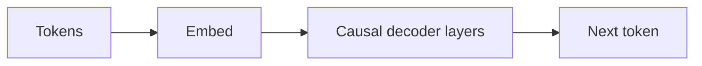

# GPT

## Definición

GPT se refiere a modelos transformer solo-decoder entrenados para predecir el siguiente token (autorregresivo). Escalar estos modelos ha llevado a los grandes modelos de lenguaje (LLMs) actuales capaces de tareas few-shot y zero-shot.

El diseño solo-decoder es ideal para la **generación**: en cada paso el modelo se condiciona en tokens anteriores y predice el siguiente. Los [LLMs](/docs/llms) basados en esta idea se afinan con instrucciones y se alinean (p. ej., RLHF) para chat y uso de herramientas. Para tareas de solo comprensión, los encoders estilo [BERT](/docs/transformers/bert) pueden ser más eficientes en parámetros.

## Cómo funciona

Los **tokens** se embeben y se alimentan en **capas causales de decoder**: cada posición solo puede atender a sí misma y a posiciones anteriores (auto-atención enmascarada), por lo que el modelo no puede "ver" el futuro. El **siguiente token** se predice a partir de la representación de la última posición (generalmente con una capa lineal y softmax sobre el vocabulario). El **entrenamiento** maximiza la probabilidad del siguiente token dado el contexto anterior (teacher forcing). La **inferencia** genera autorregresivamente: se muestrea o se elige ávidamente el siguiente token, se añade y se repite hasta una condición de parada. [Prompt engineering](/docs/llms/prompt-engineering) y [afinamiento](/docs/llms/fine-tuning) moldean cómo el modelo usa este mecanismo para tareas.

## Casos de uso

Los modelos solo-decoder son la base del chat, código y cualquier tarea que se beneficie de generación autorregresiva o prompting few-shot.

- Generación de texto y código (completado, resumen, diálogo)
- Clasificación few-shot y zero-shot mediante prompts
- Asistentes y chatbots basados en modelos afinados con instrucciones

## Documentación externa

- [Improving Language Understanding by Generative Pre-Training (OpenAI)](https://cdn.openai.com/research-covers/language-unsupervised/language_understanding_paper.pdf)
- [Hugging Face – GPT-2](https://huggingface.co/docs/transformers/model_doc/gpt2)

## Ver también

- [Transformers](/docs/transformers)
- [LLMs](/docs/llms)
- [Prompt engineering](/docs/llms/prompt-engineering)
