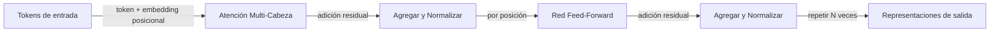

# Transformers

## Definición

Los Transformers son arquitecturas neuronales basadas en la **auto-atención**: cada token atiende a todos los demás para computar representaciones contextuales. Evitan la recurrencia y habilitan la paralelización, escalando a secuencias muy largas y modelos grandes (BERT, GPT, etc.).

Sustentan los [LLMs](/docs/llms) modernos y se han extendido a modelos [multimodales](/docs/multimodal-ai) y de [visión](/docs/cv). Las variantes solo-encoder ([BERT](/docs/transformers/bert)) y solo-decoder ([GPT](/docs/transformers/gpt)) son las más comunes hoy; el diseño encoder-decoder sigue usándose para tareas de secuencia a secuencia.

El artículo "Attention Is All You Need" (2017) introdujo el transformer eliminando completamente el bucle recurrente y reemplazándolo con atención de producto punto escalado. Esto hizo que el entrenamiento fuera completamente paralelizable, permitiendo entrenar modelos en conjuntos de datos mucho más grandes que los predecesores basados en RNN. Las codificaciones posicionales reemplazan el ordenamiento implícito de la recurrencia; las conexiones residuales y la normalización de capas estabilizan el flujo de gradientes a través de muchas capas. Estas opciones de diseño, combinadas con la subcapa feed-forward para el cómputo por posición, forman el bloque constructivo fundamental que ha escalado a cientos de miles de millones de parámetros.

## Cómo funciona



### Mecanismo de auto-atención

**Atención:** La entrada se proyecta en matrices Query (Q), Key (K) y Value (V). Los pesos de atención se calculan como softmax(QK^T / sqrt(d_k)), luego se aplican a V. La salida de cada token es una combinación ponderada de los valores de todos los tokens — capturando contexto global en un paso.

### Atención multi-cabeza

**Atención multi-cabeza:** Múltiples cabezas de atención se ejecutan en paralelo, cada una aprendiendo diferentes patrones relacionales (sintaxis, correferencia, semántica). Sus salidas se concatenan y proyectan, dando al modelo mayor capacidad representacional que una sola cabeza de atención.

### Encoder vs. decoder

**Solo-encoder (p. ej. BERT):** Todos los tokens atienden a todos los demás (bidireccional). Mejor para tareas de comprensión. **Solo-decoder (p. ej. GPT):** El enmascaramiento causal asegura que cada posición solo atienda a los tokens pasados, habilitando la generación autorregresiva. **Encoder-decoder:** Usado para tareas como la traducción donde la secuencia de entrada se codifica completamente antes de decodificar la salida.

## Cuándo usar / Cuándo NO usar

| Escenario | ¿Usar transformers? | Notas |
|---|---|---|
| Clasificación NLP, NER, QA | Sí | Solo-encoder (estilo BERT) es el predeterminado |
| Generación de texto, chat, código | Sí | Solo-decoder (estilo GPT) es el estándar |
| Inferencia edge de bajos recursos | Con precaución | Se recomiendan variantes destiladas o cuantizadas |
| Secuencias cortas con localidad clara | Con precaución | Las CNNs o RNNs pueden ser más eficientes |
| Secuencia a secuencia (traducción) | Sí | Los transformers encoder-decoder destacan aquí |
| Tareas de visión | Sí | Los parches de Vision Transformer (ViT) funcionan bien |

## Comparaciones

| Aspecto | RNN / LSTM | CNN | Transformer |
|---|---|---|---|
| Dependencias de largo alcance | Moderadas | Pobres | Excelentes |
| Entrenamiento paralelizable | No | Sí | Sí |
| Ventana de contexto | Limitada por el desenrollado | Campo receptivo fijo | Configurable (hasta 1M+ tokens) |
| Coste de memoria en inferencia | Bajo (estado fijo) | Bajo | Alto (caché KV crece con el contexto) |
| NLP estado-del-arte | No | No | Sí |

## Pros y contras

| Pros | Contras |
|---|---|
| Paralelizable, escalable | Alto cómputo y memoria |
| Sólido en dependencias de largo alcance | Requiere grandes datos |
| Arquitectura unificada para muchas tareas | Desafíos de interpretabilidad |
| Modelos preentrenados ampliamente disponibles | Coste de atención cuadrático con la longitud de la secuencia |

## Ejemplos de código

```python
# Self-attention from scratch with PyTorch
import torch
import torch.nn as nn
import torch.nn.functional as F
import math

class MultiHeadSelfAttention(nn.Module):
    def __init__(self, d_model: int, num_heads: int):
        super().__init__()
        assert d_model % num_heads == 0
        self.d_k = d_model // num_heads
        self.num_heads = num_heads
        self.W_qkv = nn.Linear(d_model, 3 * d_model, bias=False)
        self.W_o   = nn.Linear(d_model, d_model, bias=False)

    def forward(self, x: torch.Tensor, causal: bool = False) -> torch.Tensor:
        B, T, C = x.shape
        qkv = self.W_qkv(x).split(C, dim=2)
        q, k, v = [t.view(B, T, self.num_heads, self.d_k).transpose(1, 2) for t in qkv]
        scale  = math.sqrt(self.d_k)
        scores = (q @ k.transpose(-2, -1)) / scale         # (B, heads, T, T)
        if causal:
            mask = torch.tril(torch.ones(T, T, device=x.device)).bool()
            scores = scores.masked_fill(~mask, float('-inf'))
        weights = F.softmax(scores, dim=-1)
        out = (weights @ v).transpose(1, 2).contiguous().view(B, T, C)
        return self.W_o(out)

# Test with a dummy batch
attn  = MultiHeadSelfAttention(d_model=64, num_heads=4)
x     = torch.randn(2, 10, 64)   # batch=2, seq_len=10, d_model=64
print(attn(x).shape)             # (2, 10, 64)
```

## Recursos prácticos

- [Attention Is All You Need (Vaswani et al.)](https://arxiv.org/abs/1706.03762) — Artículo original del transformer
- [Hugging Face – Resumen de los modelos](https://huggingface.co/docs/transformers/model_summary) — Descripción general de las familias de modelos transformer
- [El Transformer Ilustrado](https://jalammar.github.io/illustrated-transformer/) — Mejor explicación visual de la arquitectura

## Ver también

- [BERT](/docs/transformers/bert)
- [GPT](/docs/transformers/gpt)
- [LLMs](/docs/llms)
