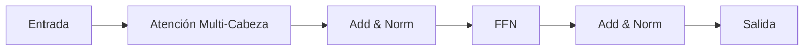

# Transformers

## Definición

Los Transformers son arquitecturas neuronales basadas en **auto-atención**: cada token atiende a todos los demás para calcular representaciones contextuales. Evitan la recurrencia y permiten la paralelización, escalando a secuencias muy largas y modelos grandes (BERT, GPT, etc.).

Sustentan los [LLMs](/docs/llms) modernos y se han extendido a modelos [multimodales](/docs/multimodal-ai) y de [visión](/docs/cv). Las variantes solo-encoder ([BERT](/docs/transformers/bert)) y solo-decoder ([GPT](/docs/transformers/gpt)) son las más comunes hoy; el diseño encoder-decoder se sigue usando para tareas de secuencia a secuencia.

## Cómo funciona

- **Atención:** Query, Key, Value se calculan a partir de las entradas; los pesos de atención combinan valores.
- **Atención multi-cabeza:** Múltiples cabezas de atención capturan diferentes relaciones.
- **Encoder-decoder o solo-decoder:** El encoder (p. ej., BERT) ve la secuencia completa; el decoder (p. ej., GPT) usa enmascaramiento causal para generación autorregresiva.

El diagrama muestra un bloque: la entrada pasa por atención multi-cabeza (con add y norm), luego una red feed-forward (FFN), luego add y norm de nuevo. Los stacks de encoder usan atención bidireccional; los stacks de decoder usan atención causal (enmascarada) para que cada posición solo vea tokens anteriores. Las conexiones residuales y la normalización de capa estabilizan el entrenamiento. Apilar muchos bloques y escalar ancho y profundidad produce los grandes modelos usados para [NLP](/docs/nlp) y más allá.

## Casos de uso

Los Transformers sustentan la mayoría de los sistemas modernos de NLP y multimodales; las variantes solo-encoder, solo-decoder y encoder-decoder se adaptan a diferentes tareas.

- Estilo BERT: reconocimiento de entidades nombradas, relevancia de búsqueda, respuesta a preguntas
- Estilo GPT: generación de texto, completado de código, chat y diálogo
- Transformers multimodales para tareas de visión-lenguaje

## Ventajas y desventajas

| Ventajas | Desventajas |
|----------|-------------|
| Paralelizable, escalable | Alto costo computacional y de memoria |
| Fuerte en dependencias de largo alcance | Requiere grandes volúmenes de datos |
| Arquitectura unificada para muchas tareas | Desafíos de interpretabilidad |

## Documentación externa

- [Attention Is All You Need (Vaswani et al.)](https://arxiv.org/abs/1706.03762) — Paper original del Transformer
- [Hugging Face – Resumen de modelos](https://huggingface.co/docs/transformers/model_summary) — Familias de modelos Transformer
- [The Illustrated Transformer](https://jalammar.github.io/illustrated-transformer/) — Explicación visual de la arquitectura

## Ver también

- [BERT](/docs/transformers/bert)
- [GPT](/docs/transformers/gpt)
- [LLMs](/docs/llms)
