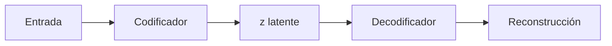

# Autocodificadores variacionales (VAE)

## Definición

Los VAEs aprenden un espacio latente entrenando un codificador-decodificador con un objetivo variacional (reparametrizado). Soportan la generación e interpolación suave en el espacio latente.

Se diferencian de las [GANs](/docs/gans) (adversariales) y la [difusión](/docs/diffusion-models) (eliminación de ruido): el espacio latente está regularizado (KL hacia un prior) para que sea suave e interpretable. La generación puede ser más borrosa que las GANs/difusión, pero los VAEs son útiles para el aprendizaje de representaciones, la detección de anomalías y cuando se desea un espacio latente de baja dimensionalidad.

## Cómo funciona

La **entrada** se pasa a un **codificador** que produce parámetros de una distribución latente (como media y log-varianza para Gaussiana). Se muestrea un vector **z** (truco de reparametrización: z = media + std * epsilon) y se alimenta al **decodificador**, que **reconstruye** la entrada. La **pérdida** = pérdida de reconstrucción (como MSE o entropía cruzada) + divergencia KL del latente al prior (como normal estándar). El término KL regulariza el espacio latente; el término de reconstrucción lo mantiene informativo. En el momento de la generación, muestree z del prior y ejecute el decodificador.

## Casos de uso

Los VAEs son adecuados para tareas que necesitan un espacio latente continuo: generación suave, detección de anomalías o representaciones aprendidas.

- Modelado generativo con interpolación latente suave
- Detección de anomalías mediante error de reconstrucción
- Representaciones aprendidas para tareas posteriores

## Recursos prácticos

- [Auto-Encoding Variational Bayes (Kingma & Welling)](https://arxiv.org/abs/1312.6114)
- [PyTorch – Tutorial VAE](https://github.com/pytorch/examples/tree/main/vae)

## Ver también

- [GANs](/docs/gans)
- [Modelos de difusión](/docs/diffusion-models)
