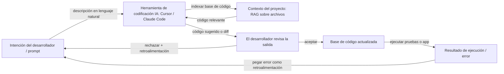

# Vibe Coding

## Definición

Vibe coding es un estilo de desarrollo de software donde se trabaja **iterativamente con asistencia de IA**: se describe la intención en lenguaje natural, se obtiene código o ediciones de un [LLM](/docs/llms) o herramienta de codificación, y luego se refina mediante retroalimentación y contexto en lugar de escribir cada línea desde cero. El "vibe" es el flujo suelto y exploratorio — se dirige por intención y sensación, y el modelo rellena los detalles de implementación. El enfoque está en reducir la fricción: las ideas pasan de pensamiento a código funcional en minutos en lugar de horas, con el desarrollador actuando como director y revisor en lugar de mecanógrafo.

Vibe coding contrasta con los enfoques totalmente orientados a especificaciones o de planificar-luego-codificar (p. ej. [desarrollo guiado por especificaciones](/docs/spec-driven-development)): a menudo se empieza con una idea aproximada y se deja que la [ingeniería de prompts](/docs/prompt-engineering), los [agentes](/docs/agents) y las herramientas (p. ej. [Cursor](/docs/tools/cursor), [Claude Code](/docs/tools/claude-code)) sugieran y editen código. El rol del desarrollador cambia de escribir sintaxis a describir objetivos, evaluar resultados y dirigir hacia la corrección. Es más productivo cuando el desarrollador conserva suficiente comprensión de la base de código para detectar errores — vibe coding no elimina la necesidad del juicio de ingeniería, sino que cambia dónde se aplica ese juicio.

La práctica está habilitada por una nueva generación de herramientas de codificación de IA que proporcionan contexto a nivel de proyecto: bases de código indexadas, ediciones de múltiples archivos, acceso a terminal y bucles agénticos que pueden escribir, ejecutar y corregir código de forma autónoma. Herramientas como Cursor, Windsurf y Claude Code van más allá del autocompletado para actuar como agentes colaborativos que entienden el proyecto completo. La recuperación al estilo [RAG](/docs/rag) mantiene las sugerencias ancladas en su base de código real en lugar de ejemplos genéricos. El resultado es particularmente útil para prototipos, scripts, código repetitivo, pruebas y refactorizaciones — tareas donde la intención es fácil de expresar pero la implementación es tediosa de escribir.

## Cómo funciona

### El bucle de intención-retroalimentación

El núcleo de vibe coding es un bucle rápido: expresar una intención, revisar la salida, proporcionar retroalimentación, repetir. A diferencia del desarrollo en cascada, no hay requisito de especificar completamente los requisitos antes de comenzar. Se puede explorar pidiendo al modelo que "pruebe algunos enfoques" y eligiendo el que se sienta correcto. Las sugerencias del modelo se convierten en andamiajes que se refinan en lugar de artefactos completados que se aceptan en su totalidad.

### Contexto y herramientas



### Modos agénticos y autónomos

Las herramientas modernas soportan vibe coding agéntico: la IA puede ejecutar comandos de terminal, leer la salida de errores y autocorregirse durante múltiples iteraciones sin intervención del desarrollador. Esto es útil para tareas repetitivas (generar suites de pruebas, migrar APIs), pero requiere que el desarrollador establezca límites claros y revise el diff final — los bucles agénticos pueden realizar cambios en cascada difíciles de desenredar.

## Cuándo usar / Cuándo NO usar

| Usar cuando | Evitar cuando |
|-------------|--------------|
| Prototipado o scripting donde la velocidad importa más que la arquitectura | Sistemas críticos para la seguridad o altamente regulados donde el código no revisado es inaceptable |
| Generar código repetitivo, pruebas o migraciones donde la intención es fácil de expresar | La base de código es tan compleja que el modelo carece del contexto suficiente para evitar errores sutiles |
| Aprender o explorar una base de código o biblioteca desconocida | Se necesita comprender completamente cada línea de código producida (p. ej. para revisión de seguridad) |
| Iterar rápidamente en diseño de UI o API para validar ideas | La mantenibilidad a largo plazo requiere patrones consistentes y decisiones de arquitectura deliberadas |

## Comparaciones

| Enfoque | Punto de partida | Especificación requerida | Mejor para |
|---------|-----------------|--------------------------|-----------|
| Vibe coding | Intención aproximada | No | Prototipos, scripts, exploración |
| Desarrollo guiado por especificaciones | Especificación explícita | Sí | Sistemas regulados, agentes, cumplimiento |
| TDD (prueba primero) | Casos de prueba | Parcialmente | Características de producción con criterios de aceptación claros |
| Programación en pareja (humano + humano) | Contexto compartido | Varía | Problemas complejos que requieren razonamiento profundo |

## Pros y contras

| Pros | Contras |
|------|---------|
| Iteración rápida y menos escritura | Puede oscurecer la comprensión si nunca se lee el código |
| Bueno para exploración y aprendizaje | Puede producir código frágil o sobreajustado sin revisión |
| Poca fricción para tareas pequeñas y prototipos | Difícil de escalar a sistemas grandes y consistentes sin especificaciones |
| Funciona bien con [agentes](/docs/agents) e integraciones de IDE | Depende en gran medida de la calidad del modelo, la ventana de contexto y la integración de herramientas |
| Reduce la energía de activación para comenzar una nueva tarea | Los bucles agénticos pueden realizar cambios en cascada no deseados |

## Ejemplos de código

### Sesión de vibe coding de ejemplo con Claude Code (shell)

```bash
# Iniciar Claude Code en el directorio de su proyecto
claude

# Describir lo que quiere — no es necesario especificar la implementación exacta
> Añade un middleware de limitación de velocidad a la aplicación Express.
>  Usa una ventana deslizante de 100 solicitudes por minuto por IP.
>  Devuelve 429 con un encabezado Retry-After cuando se supere el límite.

# Claude Code:
# 1. Leerá la configuración Express existente
# 2. Instalará la biblioteca apropiada (p. ej. express-rate-limit)
# 3. Escribirá e insertará el middleware
# 4. Actualizará las importaciones

# Revisar el diff y luego iterar
> En realidad usa Redis para el almacén de límites de velocidad para que funcione en múltiples instancias.

# Aceptar el diff final y ejecutar pruebas
> Ejecuta la suite de pruebas existente y corrige cualquier fallo.
```

## Recursos prácticos

- [Documentación de Claude Code](https://docs.anthropic.com/en/docs/claude-code/overview) — Agente de codificación IA basado en terminal de Anthropic
- [Documentación de Cursor](https://docs.cursor.com/) — IDE de primera IA con sugerencias conscientes de la base de código y edición agéntica
- [Kiro – Spec-driven y Autopilot](https://kiro.dev/) — Herramienta que equilibra especificaciones estructuradas con flujo de desarrollo impulsado por IA
- [Andrej Karpathy – Vibe coding (Twitter/X)](https://x.com/karpathy/status/1886192184808149165) — Acuñación y descripción del término por su creador
- [Windsurf (Codeium)](https://codeium.com/windsurf) — IDE agéntico con Cascade, un flujo de codificación agéntico multifichero

## Ver también

- [Desarrollo guiado por especificaciones](/docs/spec-driven-development) — Enfoque más estructurado, especificación primero
- [Agentes](/docs/agents) — IA que puede escribir y editar código
- [Cursor](/docs/tools/cursor) — IDE diseñado para codificación asistida por IA
- [Ingeniería de prompts](/docs/prompt-engineering)
