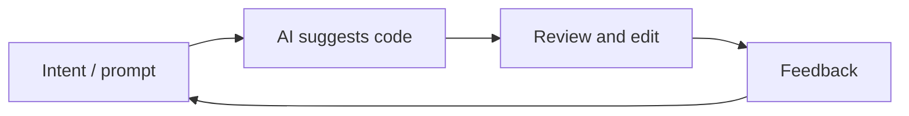

# Vibe Coding

## Definición

Vibe codificación es un estilo de desarrollo de software donde trabajas **iterativamente con asistencia de IA**: se describe la intención en lenguaje natural, get code or edits from an [LLM](/docs/llms) or codificación tool, then refine by feedback and context rather than writing every line from scratch. The “vibe” is the loose, exploratory flow—you steer by intent and feel, and the model fills in implementation details.

It contrasts with fully spec-first or plan-then-code approaches (por ej. [spec-driven development](/docs/spec-driven-development)): you often start with a rough idea and let [prompt engineering](/docs/llms/prompt-engineering), [agents](/docs/agents), and tools (por ej. [Cursor](/docs/tools/cursor), [Claude Code](/docs/tools/claude-code)) suggest and edit code. Useful for prototypes, scripting, and tasks where speed and iteration matter more than upfront diseño.

## Cómo funciona

You give the **model** (or IDE tool) **context**: open files, cursor position, or a short prompt (“add a test for this”, “refactor to use async”). The **model** returns suggested code or diffs; you **accept, edit, or reject** and optionally add **feedback** (“use a different library”, “make it shorter”). The loop repeats until the result igualares what you want. Tools often provide project-aware context (indexed codebase, [RAG](/docs/rag)-style recuperación) so suggestions stay relevant. Success depends on clear intent, good tooling, and knowing when to take over or refine the output.

## Casos de uso

Vibe codificación encaja cuando quieres avanzar rápido con asistencia de IA y estás de acuerdo con iterar en el bucle en lugar de definir la especificación primero.

- Prototyping and scripting (por ej. one-off scripts, small tools)
- Boilerplate, tests, and refactors where the intent is easy to state
- Learning or exploring a codebase by asking the AI to implement or explain
- Combinación con [agentes](/docs/agents) o [agentes autónomos](/docs/autonomous-agents) que escriben y editan código a partir de descriptions

## Ventajas y desventajas

| Pros | Cons |
|------|------|
| Fast iteration and less typing | Can obscure understanding if you never read the code |
| Good for exploration and learning | May produce brittle or overfitted code without review |
| Low friction for small tasks | Hard to scale to large, consistent systems without specs |
| Works well with [agents](/docs/agents) and IDEs | Depends on model quality and context |

## Documentación externa

- [Antigravity – Vibe codificación](https://www.antigravityai.io/) — Agent-first IDE that emphasizes vibe codificación
- [Kiro – Spec-driven and Autopilot](https://kiro.dev/) — Balancing structure with AI-driven flow

## Ver también

- [Spec-driven development](/docs/spec-driven-development) — More structured, spec-first approach
- [Agents](/docs/agents) — AI that can write and edit code
- [Cursor](/docs/tools/cursor) — IDE built for AI-assisted codificación
- [Prompt engineering](/docs/llms/prompt-engineering)
