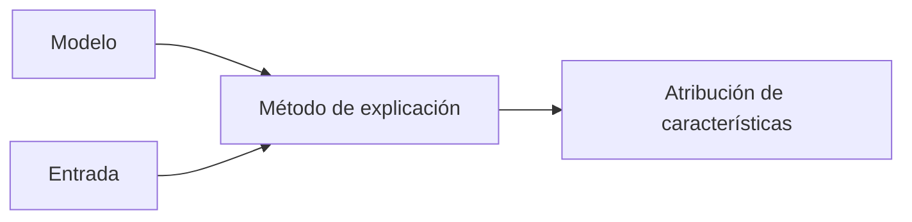

# IA explicable (XAI)

## Definición

La IA explicable busca hacer comprensible el comportamiento del modelo: qué entradas o características motivaron una decisión, o qué "piensa" el modelo en términos humanos. Esto apoya la confianza, la depuración y el cumplimiento.

Apoya la [seguridad de la IA](/docs/ai-safety) (auditoría) y el [sesgo en la IA](/docs/bias-in-ai) (comprensión de resultados injustos). Requerido o recomendado en dominios regulados (como crédito, contratación, atención médica). Compensación: las explicaciones post-hoc (SHAP, LIME) son flexibles pero pueden ser aproximadas; los modelos inherentemente interpretables están limitados en expresividad.

## Cómo funciona

La **atribución de características** (como SHAP, LIME) asigna puntuaciones de importancia a las características de entrada para una predicción dada. La **visualización de atención** muestra qué tokens o regiones atendió el modelo. Las **explicaciones en lenguaje natural** (como de un LLM o un módulo dedicado) describen la decisión con palabras. Los modelos **inherentemente interpretables** (como modelos lineales, árboles de decisión, listas de reglas) son interpretables por diseño. La elección depende del tipo de modelo y el caso de uso: los métodos post-hoc funcionan con cajas negras pero pueden no reflejar el mecanismo verdadero; los modelos interpretables son más fieles pero menos flexibles. Evalúe las explicaciones por fidelidad (¿coinciden con el modelo?) y utilidad (¿ayudan a los usuarios o auditores?). Integre con auditorías de [evaluación](/docs/evaluation-metrics) y [sesgo](/docs/bias-in-ai) donde sea necesario.

## Casos de uso

La explicabilidad importa cuando los usuarios o reguladores necesitan entender por qué un modelo tomó una decisión dada (cumplimiento, confianza, depuración).

- Explicar decisiones de crédito, contratación o médicas para cumplimiento y usuarios
- Depuración y mejora del comportamiento del modelo mediante atribuciones
- Construir confianza y transparencia en aplicaciones de alto riesgo

## Recursos prácticos

- [Interpretable Machine Learning (Molnar)](https://interpretable.ml/) — Libro gratuito en línea
- [Documentación de SHAP](https://shap.readthedocs.io/)

## Ver también

- [Seguridad de la IA](/docs/ai-safety)
- [Sesgo en la IA](/docs/bias-in-ai)
