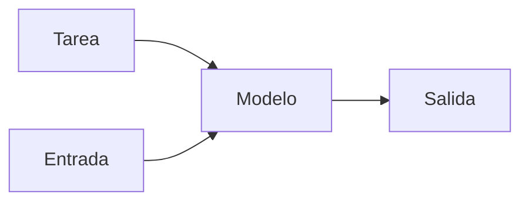

# Aprendizaje zero-shot

## Definición

El aprendizaje zero-shot resuelve una tarea sin ejemplos etiquetados para esa tarea. Los LLMs hacen esto mediante indicaciones; los modelos de visión pueden hacerlo con clasificadores condicionados en texto (como CLIP).

No se usan ejemplos de [ajuste fino](/docs/llms/fine-tuning) o [few-shot](/docs/few-shot-learning); la tarea se especifica solo por descripción o asignando a un espacio compartido (como texto). Los [LLMs](/docs/llms) son excelentes en zero-shot para muchas tareas de NLP; CLIP y modelos similares permiten la clasificación de imágenes zero-shot desde texto. La calidad depende de cuán bien el preentrenamiento cubrió la tarea o tareas similares.

## Cómo funciona

La **tarea** se describe en lenguaje natural (como [indicación](/docs/prompt-engineering): "Clasifica el sentimiento como positivo o negativo") o mediante una representación compartida (como vectores de atributos, embeddings de texto). La **entrada** (como una oración o imagen) se alimenta al **modelo** junto con la descripción de la tarea. El **modelo** produce una **salida** (como etiqueta, resumen) usando solo lo que aprendió en el preentrenamiento — sin actualizaciones de gradiente en la tarea objetivo. Para CLIP: la imagen y el texto se incrustan en un espacio compartido; la clasificación zero-shot se hace comparando el embedding de la imagen con los embeddings de nombres de clases. Para LLMs: la indicación establece la tarea y el formato; el modelo completa en consecuencia.

## Casos de uso

El aprendizaje zero-shot es adecuado cuando se desea ejecutar una tarea sin entrenamiento específico de la tarea — solo una descripción de la tarea (como indicación o nombres de clases).

- Tareas de LLM mediante indicaciones (como clasificación, resumen) sin ajuste fino
- Clasificación de imágenes estilo CLIP desde descripciones de texto
- Nuevas categorías o idiomas sin ejemplos etiquetados

## Recursos prácticos

- [Learning Transferable Visual Models (CLIP) (Radford et al.)](https://arxiv.org/abs/2103.00020)
- [OpenAI – Clasificación zero-shot](https://platform.openai.com/docs/guides/classification)

## Ver también

- [Aprendizaje few-shot](/docs/few-shot-learning)
- [Ingeniería de indicaciones](/docs/prompt-engineering)
- [LLMs](/docs/llms)
