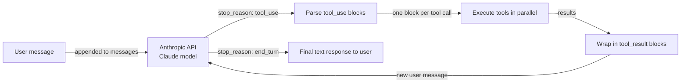

# Anthropic Tool Use

## Définition

**Anthropic Tool Use** (parfois appelé « function calling ») est le mécanisme natif de Claude pour interagir avec des systèmes externes de manière structurée et fiable. Au lieu de demander à Claude de produire du texte que vous analysez ensuite pour trouver un nom de fonction et des arguments, vous décrivez vos outils sous forme de schémas JSON dans la requête API et Claude renvoie un bloc structuré `tool_use` avec le nom exact de l'outil et un objet JSON d'arguments validés. Votre code exécute l'outil, enveloppe le résultat dans un bloc `tool_result`, et le renvoie à Claude comme tour suivant dans la conversation — une boucle qui se poursuit jusqu'à ce que Claude produise une réponse textuelle finale.

La philosophie de conception est un minimalisme intentionnel : Anthropic Tool Use est une capacité de l'API du modèle, pas un framework. Il n'y a pas de couche d'orchestration, pas de mémoire intégrée, pas de boucle d'agent — vous les écrivez vous-même. Cela donne un contrôle maximal et une surcharge d'abstraction minimale. Pour les cas d'utilisation d'outils simples à moyens, le résultat est propre, lisible et facile à déboguer. Pour les systèmes multi-agents complexes, vous combineriez généralement Anthropic Tool Use avec un framework comme LangGraph ou un orchestrateur personnalisé.

Les modèles Claude ont été spécifiquement entraînés sur l'utilisation d'outils, ce qui signifie qu'ils affichent de bonnes performances pour décider *quand* appeler un outil (sans appel inutile), *comment* remplir correctement les arguments à partir du langage naturel, et *comment* gérer gracieusement les demandes ambiguës ou sous-spécifiées en demandant des éclaircissements plutôt qu'en hallusinant des arguments. Les appels d'outils parallèles (plusieurs blocs `tool_use` dans une seule réponse) et l'utilisation d'outils multi-tours (plusieurs cycles d'appels d'outils avant une réponse finale) sont tous deux pris en charge nativement.

## Comment ça fonctionne

### Définitions d'outils : schéma JSON

Chaque outil est décrit comme un objet JSON avec trois champs obligatoires : `name` (un identifiant de chaîne), `description` (une explication en langage naturel de ce que fait l'outil et quand l'utiliser — c'est le champ le plus important pour orienter la décision de Claude), et `input_schema` (un objet JSON Schema définissant les arguments attendus). Le `input_schema` suit le standard JSON Schema draft, prenant en charge les types string, number, boolean, array, object, les champs obligatoires, les valeurs enum et les schémas imbriqués. Claude lit les descriptions d'outils pour décider quel outil appeler ; des descriptions plus précises conduisent à une sélection d'outil plus précise.

### Types de messages tool_use et tool_result

Quand Claude décide d'utiliser un outil, il renvoie une réponse avec `stop_reason: "tool_use"` et un tableau `content` qui contient un ou plusieurs blocs `tool_use`. Chaque bloc a un `id` (une chaîne unique comme `"toulu_01abc..."`), un `name` (correspondant à l'une de vos définitions d'outils), et un `input` (un objet JSON avec les arguments validés). Votre application extrait ces blocs, exécute chaque appel d'outil, et construit un nouveau message avec `role: "user"` dont le contenu est une liste de blocs `tool_result` — un par appel d'outil, correspondant par `tool_use_id`. Le bloc `tool_result` porte la sortie sous forme de chaîne ou de tableau de contenu structuré. Cet aller-retour continue jusqu'à ce que Claude retourne `stop_reason: "end_turn"` avec une réponse en texte brut.

### Appels d'outils parallèles

Claude peut émettre plusieurs blocs `tool_use` dans une seule réponse quand il détermine que plusieurs outils peuvent être appelés simultanément — par exemple, rechercher dans deux bases de données différentes ou récupérer la météo pour trois villes à la fois. Votre application doit détecter plusieurs blocs `tool_use` et les exécuter en parallèle (par exemple avec `asyncio.gather` ou un pool de threads) avant de construire la réponse `tool_result`. Les appels parallèles réduisent considérablement la latence totale par rapport aux cycles séquentiels à un seul appel, et Claude a été entraîné à utiliser cette capacité quand cela a du sens.

### Utilisation d'outils multi-tours

Les tâches complexes nécessitent souvent plusieurs cycles d'appels d'outils avant que Claude puisse produire une réponse finale : rechercher une entité, puis récupérer ses détails, puis calculer quelque chose à partir de ces détails. Chaque cycle ajoute un message assistant (avec des blocs `tool_use`) et un message utilisateur (avec des blocs `tool_result`) à l'historique de conversation. L'historique de conversation est toujours envoyé en intégralité à chaque appel API, donnant à Claude un contexte complet sur ce qui a été essayé et quels en ont été les résultats. Cette conception sans état signifie que vous êtes responsable de la maintenance et de l'élagage de la liste de messages — il n'y a pas de gestion de mémoire ou d'état intégrée.



## Quand utiliser / Quand NE PAS utiliser

| Utiliser quand | Éviter quand |
|---|---|
| Vous voulez un contrôle direct sur la boucle d'appel d'outils sans surcharge de framework | Vous avez besoin d'une couche de coordination multi-agent — Anthropic Tool Use est mono-agent |
| Vous avez besoin de l'intégration la plus étroite avec les fonctionnalités spécifiques à Claude (streaming, extended thinking) | Vous avez besoin des commodités du framework comme la mémoire automatique, les bibliothèques d'outils intégrées ou la gestion des rôles |
| Votre cas d'utilisation a 1 à 10 outils et un flux de conversation bien défini | Votre ensemble d'outils est très grand et vous avez besoin d'une sélection d'outils sémantique à grande échelle |
| Vous construisez un système de production et voulez un minimum de dépendances | Vous voulez un prototypage rapide avec des intégrations prêtes à l'emploi (utilisez LangChain ou CrewAI à la place) |
| Vous avez besoin d'une portabilité maximale — juste le SDK Anthropic et votre propre code | Votre équipe préfère la configuration déclarative d'agents à l'écriture de code d'orchestration |

## Comparaisons

| Critère | Anthropic Tool Use | OpenAI Function Calling |
|---|---|---|
| **Format de schéma** | JSON Schema avec les champs `name`, `description`, `input_schema` | JSON Schema avec les champs `name`, `description`, `parameters` — structure presque identique |
| **Streaming des appels d'outils** | Pris en charge : les événements `input_json_delta` diffusent les tokens d'arguments en temps réel | Pris en charge : streaming des arguments `function_call` via des événements delta |
| **Appels d'outils parallèles** | Pris en charge : plusieurs blocs `tool_use` dans une seule réponse | Pris en charge : plusieurs entrées `tool_calls` dans une seule réponse |
| **Fiabilité / précision des arguments** | Forte : les modèles Claude sont spécifiquement entraînés pour une utilisation précise des outils | Forte : les modèles de classe GPT-4 ont un appel de fonctions robuste |
| **Prise en charge des modèles** | Famille Claude 3 et au-dessus (Haiku, Sonnet, Opus) | GPT-3.5-turbo, GPT-4, GPT-4o et au-dessus |
| **Format du résultat d'outil** | Bloc de contenu `tool_result` avec référence `tool_use_id` | Message de rôle `tool` avec référence `tool_call_id` |
| **Fonctionnalités étendues** | Outils d'utilisation d'ordinateur (bêta), outils de documents | Interpréteur de code, recherche de fichiers (API Assistants) |

## Exemples de code

```python
import anthropic
import json
from typing import Any

# Initialize the Anthropic client
client = anthropic.Anthropic()  # reads ANTHROPIC_API_KEY from environment

# --- Tool definitions using JSON Schema ---
# The 'description' field is critical: Claude uses it to decide when to call each tool.
# The 'input_schema' defines the expected arguments with types and required fields.

tools = [
    {
        "name": "get_weather",
        "description": (
            "Get current weather information for a specific city. "
            "Use this when the user asks about weather conditions, temperature, or forecasts."
        ),
        "input_schema": {
            "type": "object",
            "properties": {
                "city": {
                    "type": "string",
                    "description": "The city name, e.g. 'London' or 'New York'",
                },
                "units": {
                    "type": "string",
                    "enum": ["celsius", "fahrenheit"],
                    "description": "Temperature unit. Defaults to celsius.",
                },
            },
            "required": ["city"],
        },
    },
    {
        "name": "search_knowledge_base",
        "description": (
            "Search an internal knowledge base for information on AI topics. "
            "Use this when the user asks a factual question about AI frameworks, models, or concepts."
        ),
        "input_schema": {
            "type": "object",
            "properties": {
                "query": {
                    "type": "string",
                    "description": "The search query string",
                },
                "max_results": {
                    "type": "integer",
                    "description": "Maximum number of results to return. Default: 3.",
                    "minimum": 1,
                    "maximum": 10,
                },
            },
            "required": ["query"],
        },
    },
    {
        "name": "create_summary",
        "description": (
            "Create a structured summary of provided content. "
            "Use this to format research findings or information into a clean summary."
        ),
        "input_schema": {
            "type": "object",
            "properties": {
                "content": {
                    "type": "string",
                    "description": "The content to summarize",
                },
                "format": {
                    "type": "string",
                    "enum": ["bullet_points", "paragraph", "table"],
                    "description": "Output format for the summary",
                },
            },
            "required": ["content", "format"],
        },
    },
]

# --- Tool execution functions ---
# In production, these would call real APIs. Here they return simulated results.

def get_weather(city: str, units: str = "celsius") -> dict:
    """Simulated weather API call."""
    return {
        "city": city,
        "temperature": 22 if units == "celsius" else 72,
        "units": units,
        "condition": "partly cloudy",
        "humidity": "65%",
    }

def search_knowledge_base(query: str, max_results: int = 3) -> list[dict]:
    """Simulated knowledge base search."""
    return [
        {"title": f"Result {i+1} for '{query}'", "snippet": f"Relevant information about {query}..."}
        for i in range(min(max_results, 3))
    ]

def create_summary(content: str, format: str) -> str:
    """Simulated summary creation."""
    if format == "bullet_points":
        return f"• Key point from: {content[:50]}...\n• Additional insight\n• Conclusion"
    return f"Summary: {content[:100]}..."

def execute_tool(tool_name: str, tool_input: dict) -> Any:
    """Dispatch tool calls to the appropriate function."""
    if tool_name == "get_weather":
        return get_weather(**tool_input)
    elif tool_name == "search_knowledge_base":
        return search_knowledge_base(**tool_input)
    elif tool_name == "create_summary":
        return create_summary(**tool_input)
    else:
        return {"error": f"Unknown tool: {tool_name}"}

# --- Multi-turn tool use loop ---

def run_agent(user_message: str) -> str:
    """
    Run a multi-turn tool use loop until Claude produces a final answer.
    Returns the final text response.
    """
    messages = [{"role": "user", "content": user_message}]

    while True:
        response = client.messages.create(
            model="claude-opus-4-5",
            max_tokens=4096,
            tools=tools,
            messages=messages,
            system=(
                "You are a helpful AI assistant with access to weather data, "
                "a knowledge base, and a summary tool. "
                "Use tools when needed to answer questions accurately."
            ),
        )

        # Append the assistant's response to the conversation history
        messages.append({"role": "assistant", "content": response.content})

        # Check if we're done
        if response.stop_reason == "end_turn":
            # Extract the final text from the response content
            for block in response.content:
                if hasattr(block, "text"):
                    return block.text
            return "No text response found."

        # Handle tool use: execute all tool_use blocks
        if response.stop_reason == "tool_use":
            tool_results = []

            for block in response.content:
                if block.type == "tool_use":
                    print(f"  Calling tool: {block.name}({json.dumps(block.input)})")

                    # Execute the tool and get the result
                    result = execute_tool(block.name, block.input)

                    # Wrap result in a tool_result block
                    # The tool_use_id links this result to the specific tool call
                    tool_results.append({
                        "type": "tool_result",
                        "tool_use_id": block.id,
                        "content": json.dumps(result),  # serialize to string
                    })

            # Add tool results as a user message to continue the conversation
            messages.append({"role": "user", "content": tool_results})

        else:
            # Unexpected stop reason — return what we have
            break

    return "Agent loop ended unexpectedly."

# --- Run examples ---

print("Example 1: Weather + Knowledge base (potential parallel calls)")
answer = run_agent(
    "What is the weather in Paris right now, and also search for information about LangGraph?"
)
print("Answer:", answer)

print("\nExample 2: Multi-turn tool use")
answer = run_agent(
    "Search for information about CrewAI and then create a bullet-point summary of the results."
)
print("Answer:", answer)
```

## Ressources pratiques

- [Documentation Anthropic Tool Use](https://docs.anthropic.com/en/docs/build-with-claude/tool-use) — Guide officiel couvrant les définitions d'outils, le flux de messages, les appels parallèles et les bonnes pratiques pour les descriptions d'outils.
- [Référence du SDK Python Anthropic](https://github.com/anthropics/anthropic-sdk-python) — SDK complet avec des objets de réponse typés, la prise en charge asynchrone et le streaming pour l'utilisation d'outils.
- [Anthropic cookbook : exemples d'utilisation d'outils](https://github.com/anthropics/anthropic-cookbook/tree/main/tool_use) — Notebooks pratiques démontrant des modèles à un seul et plusieurs outils, des appels parallèles et l'utilisation d'ordinateur.
- [Documentation OpenAI Function Calling](https://platform.openai.com/docs/guides/function-calling) — Référence utile pour comparer les deux approches ; les concepts se correspondent étroitement malgré les différences de nommage.

## Voir aussi

- [Vue d'ensemble des frameworks d'agents](/docs/agents/frameworks-overview)
- [Agents IA](/docs/agents)
- [Systèmes multi-agents](/docs/agents/multi-agent-systems)
- [ReAct](/docs/reasoning-patterns/react)
