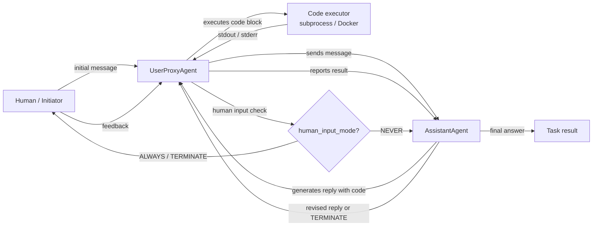

# AutoGen

## Définition

AutoGen est un framework open-source développé par Microsoft Research pour construire des **systèmes d'IA multi-agents conversationnels**. Son idée centrale est simple : les agents communiquent en échangeant des messages dans une conversation structurée, et le framework gère le routage, la gestion des tours et la logique de terminaison. Contrairement aux frameworks basés sur les rôles comme CrewAI qui définissent les agents comme des personas avec des tâches, les agents AutoGen sont définis principalement par leur **comportement conversationnel** — comment ils répondent aux messages, s'ils peuvent exécuter du code, et quand ils transfèrent le contrôle à un autre agent ou à un humain.

La primitive la plus importante du framework est le `ConversableAgent` — une classe de base qui peut jouer n'importe quel rôle selon sa configuration. Deux spécialisations couvrent les modèles les plus courants : `AssistantAgent` (alimenté par un LLM, répond avec des plans et du code) et `UserProxyAgent` (optionnellement alimenté par un humain ou un exécuteur de code, exécute du code localement et renvoie les résultats). Ce modèle à deux agents est puissant dès le départ : vous obtenez une boucle d'écriture de code où l'assistant propose des solutions et le proxy exécute et rapporte les résultats, sans aucun échafaudage supplémentaire requis.

AutoGen prend également en charge les **group chats**, où trois agents ou plus prennent tour à tour la parole dans une conversation partagée gérée par un `GroupChatManager`. Cela permet des modèles comme des panels d'experts, des boucles de débat et des pipelines modulaires où chaque agent gère une étape spécifique. La supervision humaine est une fonctionnalité de premier plan : le `UserProxyAgent` peut mettre en pause et demander une entrée humaine à tout moment, le rendant bien adapté aux flux de recherche et d'expérimentation où vous voulez inspecter ou rediriger l'agent en cours d'exécution.

## Comment ça fonctionne

### ConversableAgent : le bloc de construction universel

`ConversableAgent` est la classe de base de tous les agents AutoGen. Il contient un message système, une configuration LLM optionnelle, une liste de fonctions enregistrées (outils) et un ensemble de règles pour savoir quand terminer une conversation (`is_termination_msg`). Chaque agent a une méthode `generate_reply` qui décide quel message envoyer ensuite en fonction de l'historique de conversation. Les agents peuvent être des agents proxy humains (ils font une pause et demandent une entrée), des agents LLM (ils génèrent des réponses avec un LLM) ou des agents exécuteurs (ils exécutent du code sans appels LLM). Cette flexibilité signifie qu'une seule classe de base couvre tout le spectre des agents entièrement automatisés aux agents entièrement manuels.

### AssistantAgent et UserProxyAgent

`AssistantAgent` est un `ConversableAgent` préconfiguré comme un assistant IA utile : il a un message système par défaut qui l'encourage à proposer des blocs de code Python pour les tâches nécessitant du calcul. `UserProxyAgent` est préconfiguré pour exécuter des blocs de code dans un conteneur Docker local ou un sous-processus, rapporter les résultats et éventuellement demander une entrée humaine quand il ne peut pas continuer automatiquement. Ensemble, ils forment la boucle canonique à deux agents AutoGen : l'assistant suggère du code, le proxy l'exécute, la sortie revient à l'assistant, et la boucle continue jusqu'à ce que la tâche soit terminée ou qu'une condition de terminaison se déclenche. Ce modèle est particulièrement puissant pour l'analyse de données, l'automatisation de scripts et l'expérimentation en machine learning.

### Group chats et GroupChatManager

Pour les flux de travail avec trois agents ou plus, AutoGen fournit `GroupChat` et `GroupChatManager`. `GroupChat` contient la liste des agents participants et l'historique de messages partagé. `GroupChatManager` est lui-même un `ConversableAgent` qui agit comme modérateur : après chaque message, il sélectionne le prochain orateur (soit par une règle round-robin, une fonction de sélection personnalisée, ou une stratégie de sélection basée sur LLM). Les group chats permettent des modèles de panels d'experts où un chercheur, un codeur et un réviseur prennent tour à tour la parole, ou des pipelines multi-étapes où chaque agent gère une phase. Le gestionnaire peut également terminer la conversation quand une condition globale est remplie.

### Exécution de code et supervision humaine

La couche d'exécution de code d'AutoGen est configurable : les agents peuvent exécuter du code localement (sous-processus), dans un conteneur Docker (isolé) ou via un exécuteur personnalisé. Le `UserProxyAgent` détecte les blocs de code dans les messages de l'assistant et les exécute automatiquement quand `human_input_mode="NEVER"`. Définir `human_input_mode="ALWAYS"` ou `"TERMINATE"` conditionne l'exécution à une approbation humaine, permettant des modèles sûrs de supervision humaine pour les flux de production ou sensibles. Cela rend AutoGen particulièrement bien adapté aux tâches de codage agentique, à l'automatisation de la science des données et aux environnements de recherche où vous voulez qu'un humain révise les sorties avant qu'elles prennent effet.



## Quand utiliser / Quand NE PAS utiliser

| Utiliser quand | Éviter quand |
|---|---|
| Vous avez besoin d'agents qui écrivent et exécutent du code dans le cadre du flux de travail | L'exécution de code n'est pas nécessaire et la surcharge conversationnelle est indésirable |
| Vous voulez une supervision humaine à des points de contrôle configurables | Les pipelines entièrement automatisés où l'intervention humaine est indésirable |
| Votre flux de travail implique de la recherche, de l'expérimentation ou du raffinement itératif | Vous avez besoin d'une API déclarative et opiniâtre — AutoGen nécessite plus de configuration manuelle |
| Vous voulez un panel d'experts multi-agents ou un modèle de débat (group chat) | Vous avez besoin de pipelines déterministes et testables — les conversations non déterministes sont plus difficiles à tester unitairement |
| Vous prototypez des assistants de codage agentiques ou l'automatisation de la science des données | La latence de production est critique — les boucles de conversation multi-tours ajoutent une surcharge significative |

## Comparaisons

| Critère | AutoGen | CrewAI | LangGraph |
|---|---|---|---|
| **Métaphore centrale** | Agents comme participants conversationnels | Agents comme membres d'équipe jouant des rôles | Comportement de l'agent comme un graphe avec état |
| **Gestion de l'état** | Implicite : historique de messages partagé dans GroupChat | Implicite : contexte de tâche et mémoire de l'équipe | Explicite : état TypedDict partagé entre les nœuds |
| **Exécution de code** | Première classe : UserProxyAgent exécute les blocs de code automatiquement | Via des outils externes uniquement | Via des nœuds d'outils dans le graphe |
| **Supervision humaine** | Première classe : `human_input_mode` sur chaque agent | Limitée : intervention manuelle uniquement | Première classe : `interrupt_before` / `interrupt_after` sur les nœuds du graphe |
| **Courbe d'apprentissage** | Moyenne : intuitive pour les développeurs Python, mais le routage du group chat peut être complexe | Faible : l'API déclarative est facile à apprendre | Élevée : nécessite une pensée basée sur les graphes |

## Exemples de code

```python
import os
import autogen

# --- LLM configuration ---
# AutoGen uses a list of configs for load balancing / fallback.
# Set your OPENAI_API_KEY or use an Anthropic-compatible config.
llm_config = {
    "config_list": [
        {
            "model": "gpt-4o",
            "api_key": os.environ.get("OPENAI_API_KEY"),
        }
    ],
    "temperature": 0.1,
    "timeout": 120,
}

# --- Two-agent pattern: AssistantAgent + UserProxyAgent ---
# The assistant writes code; the proxy executes it and reports results.

assistant = autogen.AssistantAgent(
    name="data_analyst",
    system_message=(
        "You are a data analysis expert. When given a task, write Python code to solve it. "
        "Always verify your results by printing them. "
        "Reply TERMINATE when the task is fully complete."
    ),
    llm_config=llm_config,
)

user_proxy = autogen.UserProxyAgent(
    name="user_proxy",
    human_input_mode="NEVER",       # fully automated; change to "ALWAYS" for human review
    max_consecutive_auto_reply=10,  # safety limit on auto-replies
    is_termination_msg=lambda msg: "TERMINATE" in msg.get("content", ""),
    code_execution_config={
        "work_dir": "/tmp/autogen_workspace",
        "use_docker": False,         # set True to execute in an isolated Docker container
    },
)

# Kick off the two-agent conversation
user_proxy.initiate_chat(
    assistant,
    message=(
        "Analyze the following data and compute the mean, median, and standard deviation. "
        "Data: [12, 45, 23, 67, 34, 89, 11, 56, 78, 42]"
    ),
)


# --- Group chat pattern: researcher, coder, reviewer ---
# Three specialized agents collaborate on a more complex task.

researcher = autogen.AssistantAgent(
    name="researcher",
    system_message=(
        "You are a research specialist. Find information and summarize findings. "
        "Do not write code — delegate code tasks to the coder."
    ),
    llm_config=llm_config,
)

coder = autogen.AssistantAgent(
    name="coder",
    system_message=(
        "You are a Python expert. Write clean, well-commented code when asked. "
        "Always include error handling and print results clearly."
    ),
    llm_config=llm_config,
)

reviewer = autogen.AssistantAgent(
    name="reviewer",
    system_message=(
        "You are a critical reviewer. After the researcher and coder have finished, "
        "review the outputs for accuracy and completeness. "
        "Reply TERMINATE when you are satisfied with the result."
    ),
    llm_config=llm_config,
)

group_proxy = autogen.UserProxyAgent(
    name="group_proxy",
    human_input_mode="NEVER",
    max_consecutive_auto_reply=15,
    is_termination_msg=lambda msg: "TERMINATE" in msg.get("content", ""),
    code_execution_config={"work_dir": "/tmp/autogen_group", "use_docker": False},
)

# GroupChat manages turn order and shared message history
group_chat = autogen.GroupChat(
    agents=[group_proxy, researcher, coder, reviewer],
    messages=[],
    max_round=12,
    speaker_selection_method="auto",  # LLM-based speaker selection
)

manager = autogen.GroupChatManager(
    groupchat=group_chat,
    llm_config=llm_config,
)

group_proxy.initiate_chat(
    manager,
    message=(
        "Research the top 3 Python libraries for data visualization in 2025. "
        "Then write a code example using the most popular one to plot a bar chart."
    ),
)
```

## Ressources pratiques

- [Documentation officielle AutoGen](https://microsoft.github.io/autogen/) — Référence complète du framework couvrant les agents, le group chat, l'exécution de code et l'utilisation d'outils.
- [Dépôt GitHub AutoGen](https://github.com/microsoft/autogen) — Code source, suivi des problèmes et un riche ensemble de notebooks d'exemples.
- [Article AutoGen : "AutoGen: Enabling Next-Gen LLM Applications via Multi-Agent Conversation" (Wu et al., 2023)](https://arxiv.org/abs/2308.08155) — Article de recherche original motivant la conception multi-agent pilotée par la conversation.
- [AutoGen Studio](https://microsoft.github.io/autogen/docs/autogen-studio/getting-started) — Interface sans code pour construire et tester des flux de travail AutoGen, utile pour le prototypage.

## Voir aussi

- [Vue d'ensemble des frameworks d'agents](/docs/agents/frameworks-overview)
- [CrewAI](/docs/agents/crewai)
- [LangGraph](/docs/agents/langgraph)
- [Systèmes multi-agents](/docs/agents/multi-agent-systems)
- [Agents IA](/docs/agents)
