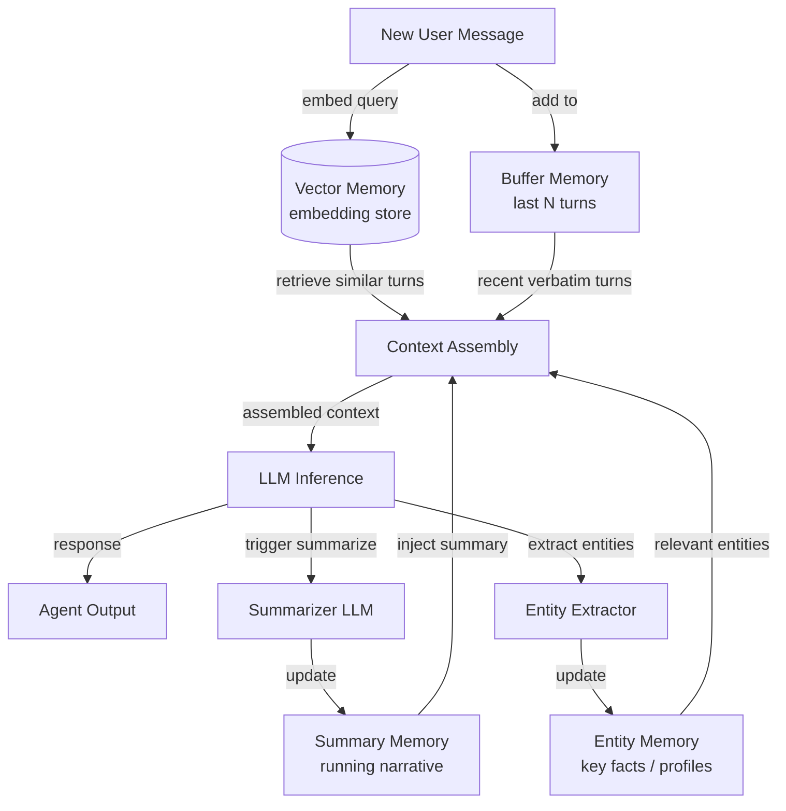

# Mémoire conversationnelle

## Définition

La mémoire conversationnelle désigne l'ensemble des techniques qui permettent à un agent de chat de retenir et d'utiliser les informations des tours précédents d'un dialogue. Contrairement à la génération augmentée par récupération, qui extrait des documents externes, la mémoire conversationnelle concerne exclusivement ce qui a déjà été dit entre l'utilisateur et l'agent. Bien gérer cela est ce qui distingue un chatbot frustrant qui vous demande de vous répéter d'un agent qui semble véritablement attentif.

Il existe plusieurs stratégies distinctes pour gérer l'historique de conversation, chacune avec des compromis différents entre coût, fidélité et évolutivité. L'approche la plus simple — conserver chaque message mot pour mot — fonctionne bien pour les conversations courtes mais épuise rapidement la fenêtre de contexte du modèle. Des modèles plus sophistiqués utilisent la résumérisation ou l'indexation sémantique pour compresser ou récupérer sélectivement l'historique le plus pertinent pour le tour actuel.

Le choix du bon modèle de mémoire dépend fortement de la durée de conversation prévue, de l'importance de la formulation exacte par rapport au sens sémantique, et des contraintes de coût du déploiement. En pratique, les agents de chat en production combinent souvent deux modèles ou plus : un tampon verbatim à court terme pour la cohérence immédiate et une couche de résumé ou vectorielle pour le rappel à long horizon.

## Comment ça fonctionne

### Mémoire tampon

La mémoire tampon est le modèle le plus simple : l'agent maintient une liste ordonnée des N dernières paires de messages et les ajoute en préfixe à chaque nouvelle fenêtre de contexte. Quand le tampon atteint sa capacité, la paire la plus ancienne est supprimée (FIFO). Cela garantit que l'agent a toujours accès aux échanges les plus récents sans transformation ni compression avec perte. La mémoire tampon est idéale pour les conversations courtes à moyennes où la récence est le signal principal, et elle n'entraîne aucun appel LLM supplémentaire. Sa principale faiblesse est que le contexte plus ancien est silencieusement perdu sans aucun résumé.

### Mémoire de résumé

La mémoire de résumé résout le problème d'oubli en utilisant un LLM pour générer périodiquement un résumé courant de la conversation jusqu'à présent. Quand le tampon devient trop grand, l'agent le condense en un récit compact — capturant les faits clés, les décisions et le sentiment — puis supprime les messages bruts. Le résumé occupe beaucoup moins de tokens que les tours originaux, rendant les longues conversations gérables. Le compromis est un appel LLM secondaire pour chaque étape de résumérisation, ce qui ajoute de la latence et du coût, et certaines informations sont inévitablement perdues dans la compression.

### Mémoire vectorielle

La mémoire vectorielle incorpore chaque tour de conversation et le stocke dans une base de données vectorielle. À chaque nouveau tour, les échanges passés les plus sémantiquement pertinents sont récupérés par recherche de similarité et injectés dans la fenêtre de contexte aux côtés des messages récents du tampon. Ce modèle excelle quand les conversations sont très longues ou quand la question actuelle porte sur quelque chose dit de nombreux tours auparavant. La mémoire vectorielle est l'approche à plus haute fidélité pour le rappel à long horizon mais nécessite une infrastructure d'embedding et introduit une latence de récupération.

### Mémoire d'entités

La mémoire d'entités extrait les entités nommées — personnes, lieux, produits, préférences — de la conversation et maintient un enregistrement structuré de ce que l'agent sait sur chaque entité. Quand une entité est à nouveau mentionnée, son profil stocké est injecté dans le contexte. La mémoire d'entités est idéale pour les cas d'utilisation d'assistant personnel où se souvenir qu'« Alice préfère les réunions matinales » ou que « la date limite du projet est le 10 juin » est plus précieux que de se rappeler la formulation exacte des messages passés.



## Quand utiliser / Quand NE PAS utiliser

| Utiliser quand | Éviter quand |
|---|---|
| Les conversations s'étendent sur plus de quelques tours | La tâche est à tour unique sans besoin d'historique |
| Les utilisateurs s'attendent à ce que l'agent se souvienne de ce qu'ils ont dit précédemment | Les données de conversation ne peuvent pas être stockées pour des raisons de confidentialité ou de conformité |
| Les coûts de fenêtre de contexte sont significatifs et l'historique est long | La conversation est toujours suffisamment courte pour tenir entièrement dans la fenêtre de contexte |
| Les utilisateurs discutent de plusieurs entités ou sujets au cours de la session | La latence de résumérisation est inacceptable pour le cas d'utilisation |
| Le rappel inter-sessions est requis (modèles vectoriels/d'entités) | La complexité d'infrastructure ajoutée l'emporte sur l'avantage de fidélité |

## Comparaisons

| Critère | Mémoire tampon | Mémoire de résumé | Mémoire vectorielle |
|---|---|---|---|
| Coût par tour | Faible (pas d'appel LLM supplémentaire) | Moyen (appel de résumérisation occasionnel) | Moyen (appel d'embedding + requête DB) |
| Fidélité du rappel | Exacte mais limitée aux N derniers tours | Compression avec perte des tours plus anciens | Élevée pour le contenu sémantiquement pertinent |
| Gestion de la longueur du contexte | Faible — les tours les plus anciens sont silencieusement supprimés | Bonne — le résumé compresse les anciens tours | Excellente — récupère uniquement les blocs pertinents |
| Latence | Minimale | Modérée (la résumérisation ajoute une étape) | Modérée (embedding + recherche du plus proche voisin) |
| Rappel inter-sessions | Non (tampon en mémoire) | Possible si le résumé est persisté | Oui (le store vectoriel est persistant) |
| Complexité d'implémentation | Très faible | Faible à moyenne | Moyenne à élevée |

## Exemples de code

```python
"""
Conversational memory patterns using LangChain.

Demonstrates:
1. ConversationBufferMemory  — keep verbatim last N messages
2. ConversationSummaryMemory — compress history into a running summary
3. ConversationBufferWindowMemory — sliding window variant
"""
# pip install langchain langchain-openai openai
from langchain.memory import (
    ConversationBufferMemory,
    ConversationSummaryMemory,
    ConversationBufferWindowMemory,
)
from langchain.chains import ConversationChain
from langchain_openai import ChatOpenAI


# ---------------------------------------------------------------------------
# 1. Buffer memory — keeps ALL messages (use for short conversations)
# ---------------------------------------------------------------------------
def demo_buffer_memory():
    llm = ChatOpenAI(model="gpt-4o-mini", temperature=0)
    memory = ConversationBufferMemory(return_messages=True)
    chain = ConversationChain(llm=llm, memory=memory, verbose=False)

    reply1 = chain.predict(input="My name is Alice. I enjoy hiking.")
    reply2 = chain.predict(input="What outdoor activities would you recommend for me?")

    # The second call has access to the first turn verbatim
    print("Buffer memory — reply 2:", reply2)
    print("History length:", len(memory.chat_memory.messages), "messages\n")


# ---------------------------------------------------------------------------
# 2. Summary memory — LLM compresses history on each turn
# ---------------------------------------------------------------------------
def demo_summary_memory():
    llm = ChatOpenAI(model="gpt-4o-mini", temperature=0)
    # The same LLM is used to generate summaries; you can use a cheaper model here
    memory = ConversationSummaryMemory(llm=llm, return_messages=True)
    chain = ConversationChain(llm=llm, memory=memory, verbose=False)

    chain.predict(input="I'm planning a trip to Japan next spring.")
    chain.predict(input="I'm most interested in traditional temples and local food.")
    reply3 = chain.predict(input="Can you suggest a one-week itinerary?")

    print("Summary memory — reply 3:", reply3)
    # The buffer contains only the latest summary, not all past raw messages
    print("Summary:", memory.moving_summary_buffer[:200], "...\n")


# ---------------------------------------------------------------------------
# 3. Window memory — keeps only the last k turns (sliding window)
# ---------------------------------------------------------------------------
def demo_window_memory(k: int = 3):
    llm = ChatOpenAI(model="gpt-4o-mini", temperature=0)
    # k=3 means only the last 3 HumanMessage+AIMessage pairs are retained
    memory = ConversationBufferWindowMemory(k=k, return_messages=True)
    chain = ConversationChain(llm=llm, memory=memory, verbose=False)

    for i in range(6):
        reply = chain.predict(input=f"This is message number {i + 1}.")
        print(f"Turn {i + 1}: {reply[:80]}")

    print(
        f"\nWindow memory keeps {len(memory.chat_memory.messages)} messages "
        f"(max {k * 2} for k={k} turn pairs)\n"
    )


# ---------------------------------------------------------------------------
# Manual entity-style memory (illustrative, no extra dependency)
# ---------------------------------------------------------------------------
def demo_entity_memory_manual():
    """
    Minimal entity memory: parse key facts from each turn and inject them.
    In production, use LangChain's ConversationEntityMemory or a dedicated NER model.
    """
    entity_store: dict[str, str] = {}

    def extract_entities_mock(text: str) -> dict[str, str]:
        """Mock extraction — real impl would call an LLM or NER model."""
        entities = {}
        if "my name is" in text.lower():
            name = text.lower().split("my name is")[-1].strip().split()[0].rstrip(".,")
            entities["user_name"] = name.capitalize()
        if "deadline" in text.lower():
            entities["deadline"] = "mentioned but not parsed in this mock"
        return entities

    turns = [
        ("user", "My name is Bob and my project deadline is end of July."),
        ("user", "Can you help me prioritize my tasks?"),
    ]
    for role, msg in turns:
        entity_store.update(extract_entities_mock(msg))
        entity_context = "; ".join(f"{k}={v}" for k, v in entity_store.items())
        print(f"[{role}] {msg}")
        print(f"  Entity context injected: {entity_context}\n")


if __name__ == "__main__":
    import os

    if os.getenv("OPENAI_API_KEY"):
        demo_buffer_memory()
        demo_summary_memory()
        demo_window_memory()
    else:
        print("Set OPENAI_API_KEY to run LangChain demos.")
    demo_entity_memory_manual()
```

## Ressources pratiques

- [Documentation LangChain Memory](https://python.langchain.com/docs/concepts/memory/) — Référence complète pour toutes les classes de mémoire LangChain avec des exemples d'utilisation.
- [Repenser la mémoire dans l'IA conversationnelle (Lilian Weng)](https://lilianweng.github.io/posts/2023-06-23-agent/#memory) — Article de blog approfondi couvrant la taxonomie de la mémoire et les compromis de conception dans les systèmes d'agents.
- [MemoryOS: Memory-based Operating System for LLM Agents](https://arxiv.org/abs/2506.06326) — Recherche sur la gestion hiérarchique de la mémoire inspirée de la conception des systèmes d'exploitation.
- [Gestion des threads OpenAI Assistants](https://platform.openai.com/docs/assistants/how-it-works/managing-threads) — Comment l'API gérée d'OpenAI gère les threads de conversation persistants.

## Voir aussi

- [Mémoire des agents](/docs/agents/memory)
- [Agents IA](/docs/agents)
- [Embeddings RAG](/docs/rag/embeddings)
