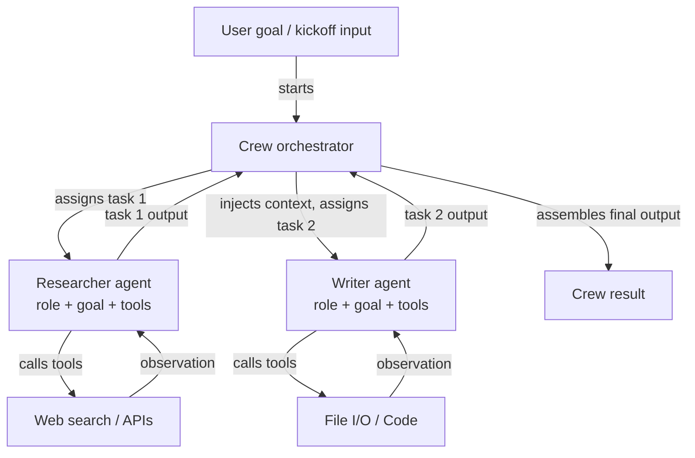

# CrewAI

## Définition

CrewAI est un framework Python open-source pour orchestrer des **systèmes multi-agents basés sur les rôles**. Chaque agent dans une équipe est défini par trois éléments : un **rôle** (ce que fait l'agent, par exemple « Analyste Recherche Senior »), un **objectif** (ce que l'agent cherche à accomplir, par exemple « Trouver des informations précises et à jour »), et une **histoire** (une description de persona qui façonne le comportement et le ton de l'agent). Cette structure rend le comportement des agents intuitif à spécifier et facile à comprendre — elle reflète la façon dont vous intégreriez un nouveau membre d'une équipe humaine.

Les tâches dans CrewAI sont des unités de travail discrètes assignées aux agents. Une tâche a une description, une sortie attendue et éventuellement un contexte des tâches précédentes. Les tâches sont regroupées dans une **Crew**, qui définit le processus d'exécution : **séquentiel** (les tâches s'exécutent l'une après l'autre, avec la sortie de chacune alimentant la suivante) ou **hiérarchique** (un agent gestionnaire délègue et coordonne les tâches entre les travailleurs). Ce modèle déclaratif abstrait la boucle de transmission de messages, permettant aux développeurs de se concentrer sur *ce qui* doit être fait plutôt que sur *comment* les agents se parlent.

CrewAI a une intégration d'outils intégrée, prenant en charge les outils LangChain, les fonctions Python personnalisées décorées avec `@tool`, et une bibliothèque croissante d'outils intégrés (recherche web, E/S de fichiers, exécution de code). Les agents peuvent également recevoir de la mémoire (court terme, long terme, mémoire d'entités) pour maintenir le contexte à travers les exécutions de tâches et les courses d'équipe.

## Comment ça fonctionne

### Agents : rôles, objectifs et histoires

Un agent est l'unité fondamentale de travail dans CrewAI. Vous instanciez un `Agent` avec un rôle, un objectif et une histoire, plus des outils optionnels et un remplacement de LLM. L'histoire prépare le système prompt de l'agent, lui donnant une persona cohérente à travers toutes les interactions de tâches. Les agents peuvent être configurés avec `verbose=True` pour exposer leurs étapes de raisonnement internes. Chaque agent fonctionne indépendamment dans la couche d'orchestration de l'équipe, recevant des tâches du gestionnaire de processus et retournant des sorties structurées. La mémoire de l'agent (quand elle est activée) persiste les observations entre les tâches, ce qui est essentiel pour les flux de travail de recherche ou d'analyse de longue durée.

### Tâches : descriptions, sorties attendues et contexte

Un objet `Task` décrit ce qu'un agent doit faire, à quoi ressemble une bonne sortie et quel agent doit l'exécuter. Les tâches peuvent déclarer des dépendances de `context` sur d'autres tâches, faisant que leurs sorties sont automatiquement injectées comme contexte. Les descriptions de sortie attendue guident le LLM pour produire des résultats structurés et utilisables. Les tâches prennent en charge les formats de sortie : texte brut, JSON via des modèles Pydantic ou des sorties de fichiers. Lors de l'utilisation d'un processus hiérarchique, l'agent gestionnaire utilise les descriptions de tâches pour décider de l'affectation et du séquençage dynamiquement, sans que le développeur ait à coder en dur les dépendances.

### Processus : séquentiel et hiérarchique

L'objet `Crew` lie les agents et les tâches ensemble et spécifie un `Process`. Dans `Process.sequential`, les tâches s'exécutent dans l'ordre de la liste, avec la sortie de chaque tâche transmise à la suivante. Dans `Process.hierarchical`, un gestionnaire LLM est automatiquement instancié pour décomposer les objectifs, attribuer le travail et réviser les résultats — permettant une coordination émergente sans câblage explicite. Le séquentiel est prévisible et facile à tester ; le hiérarchique est plus flexible mais moins déterministe. Choisir entre les deux dépend de si votre flux de travail a un DAG fixe (séquentiel) ou nécessite une allocation de tâches dynamique (hiérarchique).

### Intégration d'outils intégrée

CrewAI est livré avec un décorateur `@tool` compatible avec les outils LangChain, ce qui facilite l'équipement des agents avec la recherche web (SerperDev, DuckDuckGo), l'exécution de code, la lecture/écriture de fichiers et les appels d'API personnalisés. Les outils sont enregistrés par agent, de sorte que l'agent chercheur peut avoir des outils de recherche tandis que l'agent rédacteur a des outils de fichiers. Les descriptions d'outils sont incluses dans le prompt de l'agent, et le framework gère la boucle d'appel d'outils de manière transparente. Pour une utilisation en production, le package `CrewAI Tools` fournit un ensemble organisé d'intégrations prêtes à l'emploi.



## Quand utiliser / Quand NE PAS utiliser

| Utiliser quand | Éviter quand |
|---|---|
| Votre problème se mappe naturellement sur des rôles distincts semblables à des humains (chercheur, rédacteur, réviseur) | Vous avez besoin d'un seul agent avec des outils — la surcharge de CrewAI est inutile |
| Vous voulez une API déclarative de haut niveau qui cache la complexité de transmission de messages | Vous avez besoin d'un contrôle précis sur chaque message échangé entre les agents |
| Vous construisez des pipelines de contenu, des flux de travail de recherche ou des systèmes d'analyse | Votre flux de travail nécessite un branchement conditionnel complexe ou des cycles non pris en charge par séquentiel/hiérarchique |
| Vous voulez une mémoire intégrée et une intégration d'outils avec une configuration minimale | La latence en temps réel est critique — les exécutions séquentielles multi-agents ajoutent une surcharge |
| Votre équipe n'est pas experte en frameworks d'agents et a besoin d'une API intuitive | Vous avez besoin d'une observabilité fine sur chaque interaction d'agent au niveau du graphe |

## Comparaisons

| Critère | CrewAI | AutoGen | LangGraph |
|---|---|---|---|
| **Niveau d'abstraction** | Élevé : rôles déclaratifs, objectifs, tâches | Moyen : agents conversationnels avec API basée sur les messages | Faible : nœuds et arêtes de graphe explicites |
| **Modèle multi-agent** | Équipe basée sur les rôles avec des processus séquentiels ou hiérarchiques | Paires d'agents pilotées par la conversation ou group chats | Sous-graphes ; graphe unique avec état avec plusieurs nœuds par agent |
| **Gestion de l'état** | Implicite : transmis via le contexte de tâche et la mémoire de l'équipe | Implicite : historique des messages | Explicite : état TypedDict partagé entre tous les nœuds |
| **Facilité de configuration** | Très facile : 10-20 lignes pour une équipe multi-agents fonctionnelle | Modérée : nécessite de comprendre les types d'agents et les modèles d'initiation | Plus difficile : nécessite un modèle mental de construction de graphe |
| **Flux conditionnels/cycliques** | Limité : le séquentiel est linéaire, le hiérarchique est opaque | Limité : dépend des réponses des agents | Première classe : les arêtes conditionnelles et les cycles sont la fonctionnalité centrale |

## Exemples de code

```python
import os
from crewai import Agent, Task, Crew, Process
from crewai_tools import SerperDevTool

# --- Tool setup ---
# Requires SERPER_API_KEY environment variable for web search
search_tool = SerperDevTool()

# --- Agent definitions ---
# Each agent has a role, a goal that guides its behavior, and a backstory
# that sets its persona. Tools are assigned per-agent.

researcher = Agent(
    role="Senior AI Research Analyst",
    goal="Uncover the latest developments and practical applications of AI agent frameworks",
    backstory=(
        "You are an expert AI researcher with 10 years of experience evaluating "
        "LLM frameworks. You excel at finding accurate, up-to-date information "
        "and synthesizing it into clear technical summaries."
    ),
    tools=[search_tool],
    verbose=True,  # shows reasoning steps
    allow_delegation=False,
)

writer = Agent(
    role="Technical Content Writer",
    goal="Transform technical research into clear, engaging documentation",
    backstory=(
        "You are a seasoned technical writer who specializes in AI and machine learning. "
        "You turn dense research into accessible content without losing precision."
    ),
    tools=[],  # writer does not need search tools
    verbose=True,
)

reviewer = Agent(
    role="Editorial Reviewer",
    goal="Ensure accuracy, clarity, and completeness of technical content",
    backstory=(
        "You are a detail-oriented editor with a background in computer science. "
        "You catch technical inaccuracies, improve clarity, and verify all claims."
    ),
    verbose=True,
)

# --- Task definitions ---
# Tasks describe what to do, what output to expect, and which agent executes them.
# Context dependencies are declared explicitly.

research_task = Task(
    description=(
        "Research the current state of AI agent frameworks in 2024-2025. "
        "Focus on CrewAI, AutoGen, LangGraph, and Anthropic Tool Use. "
        "Cover: architecture, use cases, community size, and key differentiators."
    ),
    expected_output=(
        "A structured research report with sections for each framework, "
        "covering architecture, strengths, weaknesses, and best use cases. "
        "Include specific version numbers and recent updates where available."
    ),
    agent=researcher,
)

writing_task = Task(
    description=(
        "Using the research report, write a 500-word technical blog post comparing "
        "the four agent frameworks. Target audience: senior software engineers "
        "who are evaluating frameworks for production use."
    ),
    expected_output=(
        "A well-structured blog post with an introduction, per-framework sections, "
        "a comparison table, and a recommendation section. "
        "Use clear headings and avoid jargon where possible."
    ),
    agent=writer,
    context=[research_task],  # injects research_task output as context
)

review_task = Task(
    description=(
        "Review the blog post for technical accuracy, clarity, and completeness. "
        "Fix any errors and improve readability without changing the core content."
    ),
    expected_output=(
        "A polished, publication-ready blog post with all inaccuracies corrected "
        "and prose improved. Return the full revised text."
    ),
    agent=reviewer,
    context=[writing_task],
)

# --- Crew assembly ---
# Process.sequential runs tasks in order, passing outputs as context.
# Switch to Process.hierarchical for dynamic task allocation by a manager LLM.

crew = Crew(
    agents=[researcher, writer, reviewer],
    tasks=[research_task, writing_task, review_task],
    process=Process.sequential,
    verbose=True,
)

# --- Execution ---
result = crew.kickoff(inputs={"topic": "AI agent frameworks comparison 2025"})
print(result.raw)
```

## Ressources pratiques

- [Documentation officielle CrewAI](https://docs.crewai.com/) — Référence complète couvrant les agents, les tâches, les équipes, les processus, les outils et la configuration de la mémoire.
- [Dépôt GitHub CrewAI](https://github.com/crewAIInc/crewAI) — Code source, exemples et suivi des problèmes pour le framework open-source.
- [Documentation CrewAI Tools](https://docs.crewai.com/concepts/tools) — Intégrations d'outils prêtes à l'emploi : recherche web, E/S de fichiers, exécution de code et création d'outils personnalisés.
- [Guide d'intégration CrewAI + LangChain](https://docs.crewai.com/how-to/llm-connections) — Comment configurer différents fournisseurs LLM incluant OpenAI, Anthropic et les modèles locaux.

## Voir aussi

- [Vue d'ensemble des frameworks d'agents](/docs/agents/frameworks-overview)
- [AutoGen](/docs/agents/autogen)
- [LangGraph](/docs/agents/langgraph)
- [Systèmes multi-agents](/docs/agents/multi-agent-systems)
- [Agents IA](/docs/agents)
