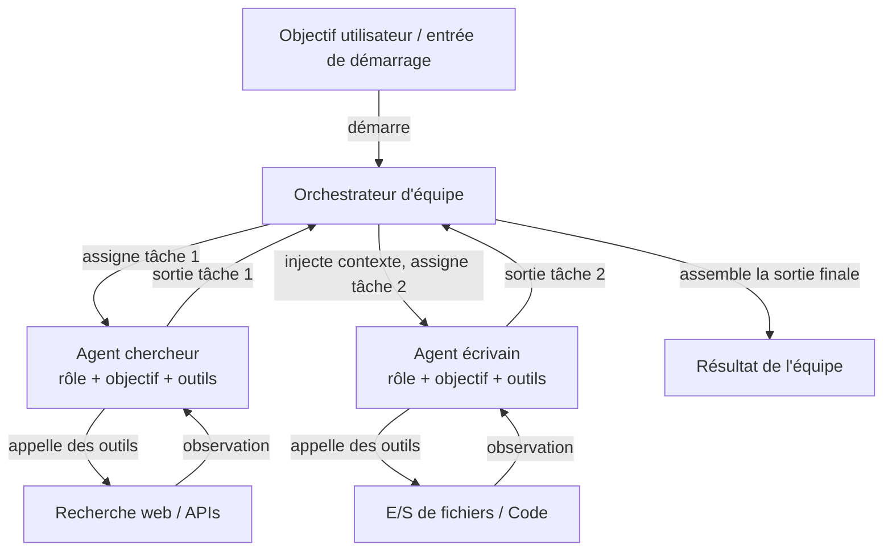

# CrewAI

## Définition

CrewAI est un framework Python open-source pour l'orchestration de **systèmes multi-agents basés sur les rôles**. Chaque agent dans une équipe est défini par trois choses : un **rôle** (ce que fait l'agent, par ex. « Chercheur Senior »), un **objectif** (ce que l'agent essaie d'atteindre, par ex. « Trouver des informations précises et à jour ») et un **historique** (une description de persona qui façonne le comportement et le ton de l'agent). Cette structure rend le comportement de l'agent intuitif à spécifier et facile à comprendre — elle ressemble à la façon dont vous intégreriez un membre d'équipe humain.

Les tâches dans CrewAI sont des unités de travail discrètes assignées aux agents. Une tâche a une description, une sortie attendue et optionnellement un contexte provenant des tâches précédentes. Les tâches sont regroupées dans une **Équipe (Crew)**, qui définit le processus d'exécution : **séquentiel** (les tâches s'exécutent l'une après l'autre, avec la sortie de chaque alimentant la suivante) ou **hiérarchique** (un agent gestionnaire délègue et coordonne les tâches parmi les travailleurs). Ce modèle déclaratif abstrait la boucle de passage de messages, permettant aux développeurs de se concentrer sur *ce* qui doit être fait plutôt que sur *comment* les agents se parlent.

CrewAI a une intégration d'outils intégrée, prenant en charge les outils LangChain, les fonctions Python personnalisées décorées avec `@tool`, et une bibliothèque croissante d'outils intégrés (recherche web, E/S de fichiers, exécution de code). Les agents peuvent également être dotés de mémoire (mémoire à court terme, à long terme, mémoire d'entité) pour maintenir le contexte entre les exécutions de tâches et les exécutions d'équipe.

## Comment ça fonctionne

### Agents : rôles, objectifs et historiques

Un agent est l'unité fondamentale de travail dans CrewAI. Vous instanciez un `Agent` avec un rôle, un objectif et un historique, plus des outils optionnels et une surcharge de LLM. L'historique amorce l'invite système de l'agent, lui donnant une persona cohérente à travers toutes les interactions de tâche. Les agents peuvent être configurés avec `verbose=True` pour exposer leurs étapes de raisonnement internes. Chaque agent opère indépendamment dans la couche d'orchestration de l'équipe, recevant des tâches du gestionnaire de processus et retournant des sorties structurées. La mémoire des agents (quand activée) persiste les observations entre les tâches, ce qui est critique pour les workflows de recherche ou d'analyse de longue durée.

### Tâches : descriptions, sorties attendues et contexte

Un objet `Task` décrit ce qu'un agent doit faire, à quoi ressemble une bonne sortie, et quel agent doit l'exécuter. Les tâches peuvent déclarer des dépendances de `contexte` sur d'autres tâches, faisant que leurs sorties sont automatiquement injectées comme contexte. Les descriptions de sortie attendue guident le LLM pour produire des résultats structurés et utilisables. Les tâches prennent en charge les formats de sortie : texte brut, JSON via des modèles Pydantic, ou sorties de fichiers. Lors de l'utilisation d'un processus hiérarchique, l'agent gestionnaire utilise les descriptions de tâche pour décider l'attribution et le séquençage dynamiquement, sans que le développeur n'ait à coder en dur les dépendances.

### Processus : séquentiel et hiérarchique

L'objet `Crew` lie les agents et les tâches ensemble et spécifie un `Process`. Dans `Process.sequential`, les tâches s'exécutent dans l'ordre de la liste, avec la sortie de chaque tâche passée à la suivante. Dans `Process.hierarchical`, un LLM gestionnaire est automatiquement instancié pour décomposer les objectifs, assigner le travail et examiner les résultats — permettant une coordination émergente sans câblage explicite. Séquentiel est prévisible et facile à tester ; hiérarchique est plus flexible mais moins déterministe. Choisir entre les deux dépend de si votre workflow a un DAG fixe (séquentiel) ou a besoin d'une allocation de tâches dynamique (hiérarchique).

### Intégration d'outils intégrée

CrewAI est livré avec un décorateur `@tool` compatible avec les outils LangChain, facilitant l'équipement des agents de recherche web (SerperDev, DuckDuckGo), d'exécution de code, de lecture/écriture de fichiers et d'appels API personnalisés. Les outils sont enregistrés par agent, pour que l'agent chercheur puisse avoir des outils de recherche tandis que l'agent écrivain a des outils de fichiers. Les descriptions d'outils sont incluses dans l'invite de l'agent, et le framework gère la boucle d'appel d'outil de façon transparente. Pour une utilisation en production, le package `CrewAI Tools` fournit un ensemble organisé d'intégrations pré-construites.



## Quand utiliser / Quand NE PAS utiliser

| Utiliser quand | Éviter quand |
|---|---|
| Votre problème se mappe naturellement à des rôles distincts de type humain (chercheur, écrivain, réviseur) | Vous avez besoin d'un seul agent avec des outils — la surcharge de CrewAI est inutile |
| Vous voulez une API déclarative de haut niveau qui cache la complexité du passage de messages | Vous avez besoin d'un contrôle précis sur chaque message échangé entre agents |
| Vous construisez des pipelines de contenu, des workflows de recherche ou des systèmes d'analyse | Votre workflow nécessite une ramification conditionnelle complexe ou des cycles non supportés par séquentiel/hiérarchique |
| Vous voulez une mémoire intégrée et une intégration d'outils avec une configuration minimale | La latence en temps réel est critique — les exécutions séquentielles multi-agents ajoutent de la surcharge |
| Votre équipe n'est pas experte en frameworks d'agents et a besoin d'une API intuitive | Vous avez besoin d'une observabilité fine sur chaque interaction d'agent au niveau du graphe |

## Comparaisons

| Critère | CrewAI | AutoGen | LangGraph |
|---|---|---|---|
| **Niveau d'abstraction** | Élevé : rôles déclaratifs, objectifs, tâches | Moyen : agents conversationnels avec API basée sur les messages | Faible : nœuds et arêtes de graphe explicites |
| **Modèle multi-agents** | Équipe basée sur les rôles avec processus séquentiels ou hiérarchiques | Paires d'agents conversationnels ou chats de groupe | Sous-graphes ; graphe stateful unique avec plusieurs nœuds par agent |
| **Gestion d'état** | Implicite : passé via le contexte de tâche et la mémoire d'équipe | Implicite : historique des messages | Explicite : état TypedDict partagé entre tous les nœuds |
| **Facilité de configuration** | Très facile : 10-20 lignes pour une équipe multi-agents fonctionnelle | Modérée : nécessite de comprendre les types d'agents et les modèles d'initiation | Plus difficile : nécessite un modèle mental de construction de graphe |
| **Flux conditionnels/cycliques** | Limité : séquentiel est linéaire, hiérarchique est opaque | Limité : dépend des réponses des agents | Première classe : arêtes conditionnelles et cycles sont la fonctionnalité principale |

## Exemples de code

```python
import os
from crewai import Agent, Task, Crew, Process
from crewai_tools import SerperDevTool

# --- Configuration des outils ---
# Nécessite la variable d'environnement SERPER_API_KEY pour la recherche web
search_tool = SerperDevTool()

# --- Définitions des agents ---
# Chaque agent a un rôle, un objectif qui guide son comportement, et un historique
# qui définit sa persona. Les outils sont assignés par agent.

researcher = Agent(
    role="Analyste de recherche IA Senior",
    goal="Découvrir les derniers développements et applications pratiques des frameworks d'agents IA",
    backstory=(
        "Vous êtes un expert en recherche IA avec 10 ans d'expérience dans l'évaluation "
        "des frameworks LLM. Vous excellez à trouver des informations précises et à jour "
        "et à les synthétiser en résumés techniques clairs."
    ),
    tools=[search_tool],
    verbose=True,  # montre les étapes de raisonnement
    allow_delegation=False,
)

writer = Agent(
    role="Rédacteur de contenu technique",
    goal="Transformer la recherche technique en documentation claire et engageante",
    backstory=(
        "Vous êtes un rédacteur technique chevronné spécialisé en IA et apprentissage automatique. "
        "Vous transformez la recherche dense en contenu accessible sans perdre en précision."
    ),
    tools=[],  # l'écrivain n'a pas besoin d'outils de recherche
    verbose=True,
)

reviewer = Agent(
    role="Réviseur éditorial",
    goal="Assurer l'exactitude, la clarté et l'exhaustivité du contenu technique",
    backstory=(
        "Vous êtes un éditeur minutieux avec une formation en informatique. "
        "Vous détectez les inexactitudes techniques, améliorez la clarté et vérifiez toutes les affirmations."
    ),
    verbose=True,
)

# --- Définitions des tâches ---
# Les tâches décrivent ce qu'il faut faire, quelle sortie attendre, et quel agent les exécute.
# Les dépendances de contexte sont déclarées explicitement.

research_task = Task(
    description=(
        "Recherchez l'état actuel des frameworks d'agents IA en 2024-2025. "
        "Concentrez-vous sur CrewAI, AutoGen, LangGraph et l'utilisation des outils Anthropic. "
        "Couvrez : architecture, cas d'usage, taille de la communauté et différenciateurs clés."
    ),
    expected_output=(
        "Un rapport de recherche structuré avec des sections pour chaque framework, "
        "couvrant l'architecture, les forces, les faiblesses et les meilleurs cas d'usage. "
        "Incluez des numéros de version spécifiques et des mises à jour récentes si disponibles."
    ),
    agent=researcher,
)

writing_task = Task(
    description=(
        "En utilisant le rapport de recherche, rédigez un article de blog technique de 500 mots comparant "
        "les quatre frameworks d'agents. Public cible : ingénieurs logiciels seniors "
        "qui évaluent des frameworks pour une utilisation en production."
    ),
    expected_output=(
        "Un article de blog bien structuré avec une introduction, des sections par framework, "
        "un tableau de comparaison et une section de recommandations. "
        "Utilisez des titres clairs et évitez le jargon autant que possible."
    ),
    agent=writer,
    context=[research_task],  # injecte la sortie de research_task comme contexte
)

review_task = Task(
    description=(
        "Révisez l'article de blog pour l'exactitude technique, la clarté et l'exhaustivité. "
        "Corrigez les erreurs et améliorez la lisibilité sans changer le contenu principal."
    ),
    expected_output=(
        "Un article de blog poli, prêt à la publication avec toutes les inexactitudes corrigées "
        "et la prose améliorée. Retournez le texte révisé complet."
    ),
    agent=reviewer,
    context=[writing_task],
)

# --- Assemblage de l'équipe ---
# Process.sequential exécute les tâches dans l'ordre, passant les sorties comme contexte.
# Passez à Process.hierarchical pour une allocation de tâches dynamique par un LLM gestionnaire.

crew = Crew(
    agents=[researcher, writer, reviewer],
    tasks=[research_task, writing_task, review_task],
    process=Process.sequential,
    verbose=True,
)

# --- Exécution ---
result = crew.kickoff(inputs={"topic": "comparaison des frameworks d'agents IA 2025"})
print(result.raw)
```

## Ressources pratiques

- [Documentation officielle CrewAI](https://docs.crewai.com/) — Référence complète couvrant les agents, tâches, équipes, processus, outils et configuration de mémoire.
- [Référentiel GitHub CrewAI](https://github.com/crewAIInc/crewAI) — Code source, exemples et suivi des problèmes pour le framework open-source.
- [Documentation des outils CrewAI](https://docs.crewai.com/concepts/tools) — Intégrations d'outils pré-construites : recherche web, E/S de fichiers, exécution de code et création d'outils personnalisés.
- [Guide d'intégration CrewAI + LangChain](https://docs.crewai.com/how-to/llm-connections) — Comment configurer différents fournisseurs LLM incluant OpenAI, Anthropic et les modèles locaux.

## Voir aussi

- [Vue d'ensemble des frameworks d'agents](/docs/agents/frameworks-overview)
- [AutoGen](/docs/agents/autogen)
- [LangGraph](/docs/agents/langgraph)
- [Systèmes multi-agents](/docs/agents/multi-agent-systems)
- [Agents IA](/docs/agents)
