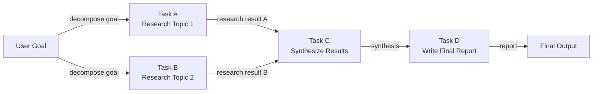

# Agents basés sur les DAG

## Définition

Un agent basé sur les DAG organise son travail comme un **graphe acyclique dirigé (DAG)** : un ensemble de nœuds (tâches ou étapes d'agent) connectés par des arêtes dirigées qui encodent les dépendances entre eux. « Acyclique » signifie qu'il n'y a pas de dépendances circulaires — l'exécution s'écoule strictement vers l'avant des entrées vers les sorties. L'avantage clé par rapport aux pipelines séquentiels est que **les nœuds indépendants peuvent s'exécuter en parallèle**, réduisant considérablement le temps d'horloge murale pour les flux de travail complexes multi-étapes.

En pratique, chaque nœud dans le DAG peut être un appel LLM, une invocation d'outil, une transformation de données ou même un sous-agent. Un nœud se déclenche dès que tous ses prédécesseurs ont terminé avec succès, transmettant leurs sorties comme entrées. Ce modèle s'applique naturellement à des tâches comme l'analyse concurrentielle (rechercher trois entreprises en parallèle, puis synthétiser), la révision de code (vérifier la sécurité, le style et les tests simultanément, puis rapporter), ou les pipelines de données (récupérer plusieurs sources de données en parallèle, les joindre, puis agréger).

La construction dynamique de DAG va encore plus loin : au lieu d'un graphe fixe défini au moment de la conception, l'agent construit ou modifie le graphe au moment de l'exécution en fonction des résultats intermédiaires. Un agent de planification pourrait produire une liste de tâches dont les dépendances ne sont pas connues jusqu'à ce qu'il voit les données, puis construire et exécuter le DAG approprié à la volée. Cela combine le parallélisme structuré des DAG avec l'adaptabilité des agents de planification, au coût d'une complexité d'implémentation supplémentaire.

## Comment ça fonctionne

### Définition du graphe et types de nœuds

Un DAG est défini par un ensemble de nœuds et un ensemble d'arêtes dirigées. Chaque nœud porte une fonction (le travail à faire), une spécification d'entrée (quelles sorties de nœuds en amont accepter) et une spécification de sortie (ce qu'il produit). Les arêtes sont définies comme des paires `(nœud_amont, nœud_aval)`. Les nœuds sans arêtes entrantes sont des points d'entrée ; les nœuds sans arêtes sortantes sont des points de sortie. Les fonctions de nœuds peuvent être synchrones ou asynchrones — les nœuds asynchrones sont essentiels pour obtenir un vrai parallélisme dans les flux de travail liés aux E/S.

### Tri topologique et ordonnancement

Avant l'exécution, l'ordonnanceur calcule un **ordre topologique** du graphe : une séquence linéaire de nœuds telle que chaque nœud apparaît après tous ses prédécesseurs. Si plusieurs nœuds sont à la même profondeur (sans dépendance mutuelle), ils peuvent être distribués simultanément. L'algorithme standard est l'algorithme de Kahn, qui traite les nœuds couche par couche. Au moment de l'exécution, une file d'attente contient les nœuds dont toutes les dépendances ont été satisfaites ; les workers tirent de la file et exécutent les nœuds, puis mettent en file les nœuds en aval nouvellement débloqués.

### Exécution parallèle

Les nœuds indépendants — ceux sans dépendances partagées — s'exécutent en parallèle en utilisant des threads, des coroutines asynchrones ou un pool de processus. Le degré de parallélisme est borné par la structure du DAG : une chaîne entièrement séquentielle n'offre aucun parallélisme, tandis qu'un fan-out large suivi d'une agrégation fan-in peut exécuter des dizaines de tâches simultanément. Dans les flux de travail d'agents, c'est particulièrement précieux pour des tâches comme les recherches web en masse, les récupérations de données multi-sources ou les appels de sous-agents indépendants.

### Construction dynamique de DAG

En mode dynamique, une étape de planification s'exécute d'abord et produit une spécification de graphe (par exemple, une liste JSON de nœuds et d'arêtes). L'ordonnanceur instancie le DAG, le valide pour les cycles, et commence l'exécution. Les DAG dynamiques doivent inclure la détection de cycles — généralement via DFS — avant que l'ordonnancement commence. Ce modèle est plus fragile que les DAG statiques parce qu'un plan malformé peut produire un graphe invalide, mais il permet une adaptabilité beaucoup plus riche.



## Quand utiliser / Quand NE PAS utiliser

| Utiliser quand | Éviter quand |
|---|---|
| Le flux de travail a plusieurs sous-tâches indépendantes pouvant s'exécuter en parallèle | Toutes les tâches sont strictement séquentielles sans opportunité de parallélisme |
| Le temps d'exécution est une priorité et les tâches sont liées aux E/S | Le graphe de dépendances est suffisamment simple pour qu'un pipeline linéaire suffise |
| Les dépendances de tâches sont bien définies et peuvent être spécifiées à l'avance | La replanification dynamique est plus importante que l'exécution parallèle |
| Vous avez besoin d'une observabilité fine sur quelles tâches ont réussi ou échoué | L'équipe manque de familiarité avec les concepts d'ordonnancement de graphes |
| Le flux de travail ressemble à un pipeline de données avec des étapes fan-out et fan-in | Les tâches sont si rapides que la surcharge d'ordonnancement dépasse le bénéfice du parallélisme |

## Comparaisons

| Critère | Agents DAG | Pipeline séquentiel | Planner-Executor |
|---|---|---|---|
| Parallélisme | Natif — les branches indépendantes s'exécutent simultanément | Aucun | Aucun par défaut |
| Flexibilité / adaptation dynamique | Faible à moyenne (graphe fixe) | Faible | Élevée (boucle de replanification) |
| Complexité d'implémentation | Élevée (ordonnanceur, détection de cycles, async) | Très faible | Moyenne |
| Auditabilité | Élevée — la structure du graphe est explicite | Moyenne | Élevée — l'artefact de plan est explicite |
| Gestion des échecs | Nouvelle tentative par nœud, re-exécutions partielles possibles | Redémarrage depuis le début | Replanification en cas d'échec |
| Idéal pour | Flux de travail larges et parallélisables | Tâches séquentielles simples | Tâches adaptatives multi-étapes |

## Exemples de code

```python
"""
Simple DAG execution engine with topological sort.

Nodes are Python callables. Edges encode dependencies.
Independent nodes execute concurrently using asyncio.
"""
from __future__ import annotations

import asyncio
from collections import defaultdict, deque
from dataclasses import dataclass, field
from typing import Any, Callable, Coroutine


# ---------------------------------------------------------------------------
# DAG data structures
# ---------------------------------------------------------------------------

@dataclass
class Node:
    """A single unit of work in the DAG."""
    name: str
    # func receives a dict of {upstream_node_name: result} for all predecessors
    func: Callable[..., Coroutine[Any, Any, Any]]
    depends_on: list[str] = field(default_factory=list)


class DAGExecutionError(Exception):
    pass


# ---------------------------------------------------------------------------
# DAG engine
# ---------------------------------------------------------------------------

class DAGExecutor:
    """
    Executes a DAG of async nodes respecting dependencies.
    Independent nodes are dispatched concurrently.
    """

    def __init__(self):
        self._nodes: dict[str, Node] = {}

    def add_node(self, node: Node) -> "DAGExecutor":
        self._nodes[node.name] = node
        return self

    def _validate(self) -> list[str]:
        """
        Kahn's topological sort algorithm.
        Returns an ordered list of node names, or raises on cycle detection.
        """
        in_degree: dict[str, int] = {n: 0 for n in self._nodes}
        dependents: dict[str, list[str]] = defaultdict(list)

        for node in self._nodes.values():
            for dep in node.depends_on:
                if dep not in self._nodes:
                    raise DAGExecutionError(f"Dependency '{dep}' not found in DAG.")
                in_degree[node.name] += 1
                dependents[dep].append(node.name)

        queue = deque(n for n, deg in in_degree.items() if deg == 0)
        order: list[str] = []

        while queue:
            current = queue.popleft()
            order.append(current)
            for downstream in dependents[current]:
                in_degree[downstream] -= 1
                if in_degree[downstream] == 0:
                    queue.append(downstream)

        if len(order) != len(self._nodes):
            raise DAGExecutionError("Cycle detected in DAG — cannot execute.")

        return order

    async def run(self) -> dict[str, Any]:
        """Execute the DAG and return a mapping of node_name -> result."""
        self._validate()

        results: dict[str, Any] = {}
        completed: set[str] = set()
        pending: dict[str, asyncio.Task] = {}
        in_degree: dict[str, int] = {n: len(self._nodes[n].depends_on) for n in self._nodes}

        async def execute_node(node: Node) -> Any:
            upstream = {dep: results[dep] for dep in node.depends_on}
            return await node.func(upstream)

        # Start nodes with no dependencies immediately
        ready = [n for n, deg in in_degree.items() if deg == 0]
        for name in ready:
            pending[name] = asyncio.create_task(execute_node(self._nodes[name]))

        # Build reverse adjacency for unblocking
        dependents: dict[str, list[str]] = defaultdict(list)
        for node in self._nodes.values():
            for dep in node.depends_on:
                dependents[dep].append(node.name)

        while pending:
            # Wait for any one task to finish
            done_tasks, _ = await asyncio.wait(
                pending.values(), return_when=asyncio.FIRST_COMPLETED
            )
            for task in done_tasks:
                # Find the node name for this task
                finished_name = next(n for n, t in pending.items() if t is task)
                results[finished_name] = task.result()
                completed.add(finished_name)
                del pending[finished_name]

                # Unblock downstream nodes
                for downstream in dependents[finished_name]:
                    in_degree[downstream] -= 1
                    if in_degree[downstream] == 0 and downstream not in completed:
                        pending[downstream] = asyncio.create_task(
                            execute_node(self._nodes[downstream])
                        )

        return results


# ---------------------------------------------------------------------------
# Example: Research DAG (mirrors the Mermaid diagram above)
# ---------------------------------------------------------------------------

async def research_topic_1(upstream: dict) -> str:
    await asyncio.sleep(0.1)  # Simulate async I/O (e.g., web search)
    return "Research result for Topic 1: renewable energy trends in Europe."

async def research_topic_2(upstream: dict) -> str:
    await asyncio.sleep(0.1)  # Runs in parallel with research_topic_1
    return "Research result for Topic 2: renewable energy adoption in Asia."

async def synthesize(upstream: dict) -> str:
    result_a = upstream["task_a"]
    result_b = upstream["task_b"]
    return f"Synthesis of:\n  A: {result_a}\n  B: {result_b}"

async def write_report(upstream: dict) -> str:
    synthesis = upstream["task_c"]
    return f"Final report based on synthesis:\n{synthesis}"


async def main():
    dag = DAGExecutor()
    dag.add_node(Node("task_a", research_topic_1, depends_on=[]))
    dag.add_node(Node("task_b", research_topic_2, depends_on=[]))
    dag.add_node(Node("task_c", synthesize, depends_on=["task_a", "task_b"]))
    dag.add_node(Node("task_d", write_report, depends_on=["task_c"]))

    import time
    start = time.perf_counter()
    results = await dag.run()
    elapsed = time.perf_counter() - start

    print(f"DAG completed in {elapsed:.3f}s (task_a and task_b ran in parallel)\n")
    for name, result in results.items():
        print(f"[{name}]\n{result}\n")


if __name__ == "__main__":
    asyncio.run(main())
```

## Ressources pratiques

- [Documentation LangGraph](https://langchain-ai.github.io/langgraph/) — Framework d'exécution de graphe de qualité production pour les agents LLM, avec prise en charge de première classe pour le branchement, l'exécution parallèle et les cycles.
- [LLM Compiler: Parallel Function Calling (Kim et al., 2023)](https://arxiv.org/abs/2312.04511) — Article introduisant les appels d'outils parallèles basés sur DAG pour les agents LLM, avec des améliorations de latence significatives.
- [Concepts DAG Apache Airflow](https://airflow.apache.org/docs/apache-airflow/stable/core-concepts/dags.html) — Modèle d'orchestration DAG éprouvé dans le monde de l'ingénierie des données ; de nombreux moteurs DAG d'agents empruntent ces concepts.
- [Prefect — Orchestration de flux de travail](https://docs.prefect.io/latest/concepts/flows/) — Orchestration de flux de travail moderne avec exécution de tâches parallèles intégrée, applicable aux flux de travail d'agents.

## Voir aussi

- [Architecture Planner-Executor](/docs/agents/planner-executor)
- [Agents IA](/docs/agents)
- [Airflow](/docs/mlops/data-engineering/airflow)
