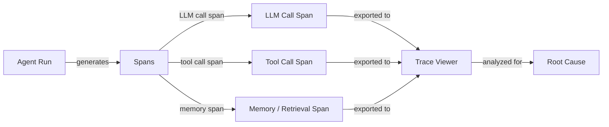

# Débogage et observabilité des agents

## Définition

Le débogage et l'observabilité des agents est la discipline qui consiste à rendre les systèmes d'agents IA suffisamment transparents pour que les défaillances, régressions et inefficacités puissent être identifiées, diagnostiquées et corrigées. Contrairement au débogage logiciel traditionnel — où une trace de pile pointe vers une ligne exacte — les défaillances des agents sont souvent émergentes : un appel LLM correct produit une sortie plausible mais erronée qui se propage à travers les appels d'outils ultérieurs, corrompt l'état de l'agent et produit une réponse finale incorrecte sans qu'aucune exception ne soit levée. L'observabilité vous donne les données nécessaires pour reconstruire ce qui s'est passé.

Les trois piliers de l'observabilité — journaux, métriques et traces — s'appliquent aux agents comme aux systèmes distribués, mais avec des adaptations importantes. Les journaux doivent capturer non seulement les erreurs mais aussi le contenu sémantique des entrées et sorties LLM. Les métriques doivent inclure les nombres de tokens, la latence par span et les fréquences d'appels d'outils aux côtés des métriques système habituelles. Les traces doivent modéliser la structure hiérarchique d'une exécution d'agent : un span racine pour la tâche globale, des spans enfants pour chaque appel LLM, des spans petits-enfants pour chaque invocation d'outil, et ainsi de suite. Ensemble, ils vous donnent un enregistrement complet et rejouable de chaque exécution d'agent.

Sans une bonne observabilité, le débogage devient du travail à l'aveugle : vous réexécutez l'agent, obtenez peut-être un résultat différent en raison du non-déterminisme, et ne pouvez pas être certain que votre correction a traité la cause racine. Avec elle, vous pouvez identifier l'appel LLM exact où le raisonnement a dévié, identifier quel outil a renvoyé des données inattendues, mesurer la contribution de latence de chaque étape et comparer deux exécutions côte à côte pour comprendre ce qui a changé.

## Comment ça fonctionne



### Journalisation structurée

La journalisation structurée consiste à émettre des journaux JSON lisibles par machine plutôt que des chaînes de texte libre. Pour les agents, chaque entrée de journal doit inclure : l'ID d'exécution, le numéro d'étape, le type de span (llm/tool/memory), la charge utile d'entrée, la charge utile de sortie, les horodatages, les nombres de tokens et toute erreur. Les journaux structurés permettent de filtrer, agréger et corréler des événements à travers une exécution distribuée sans analyse de chaîne manuelle. Des bibliothèques comme `structlog` ou `loguru` de Python rendent cela simple.

### Traçage distribué et spans

Une trace est un graphe acyclique dirigé de spans représentant une seule exécution d'agent. Le span racine couvre l'intégralité de l'exécution ; les spans enfants couvrent les appels LLM, les invocations d'outils et les recherches en mémoire. Chaque span porte un ID de trace (partagé à travers l'exécution) et un ID de span (unique par span), permettant une reconstruction complète. OpenTelemetry (OTel) est le standard ouvert pour émettre des traces ; il a des exportateurs pour Jaeger, Zipkin, Phoenix et LangSmith. L'instrumentation d'un agent avec des spans OTel nécessite d'envelopper les appels LLM et les appels d'outils avec des gestionnaires de contexte de span.

### Visualisation de traces

Les visionneuses de traces rendent l'arbre de spans visuellement, montrant la chronologie, la durée, les entrées, les sorties et les erreurs pour chaque span. LangSmith fournit une visionneuse de traces spécialement conçue pour les agents LangChain avec des détails au niveau des tokens. Phoenix (Arize) est une alternative open-source qui prend en charge n'importe quelle source compatible OpenTelemetry. Weights & Biases Traces s'intègre avec les exécutions W&B pour les équipes qui l'utilisent déjà pour le suivi des expériences. Les bonnes visionneuses de traces vous permettent de comparer deux exécutions côte à côte, de filtrer les spans par type et d'explorer l'entrée/sortie exacte au niveau des tokens qui a causé une défaillance.

### Analyse des causes racines

Avec les traces en main, l'analyse des causes racines suit un processus systématique : trouver le premier span où la sortie a dévié des attentes, inspecter ses entrées (étaient-elles correctes ?), et déterminer si la défaillance était dans le raisonnement LLM, un outil retournant de mauvaises données, ou un problème de mémoire/contexte. Le non-déterminisme rend cela plus difficile — exécuter la même entrée deux fois peut produire des résultats différents — donc capturer des traces pour chaque exécution (pas seulement les échecs) et comparer avec une trace connue-bonne est essentiel. Étiqueter les traces avec des métadonnées (ID utilisateur, type de tâche, version du prompt) permet une analyse de cohorte pour faire remonter des modèles à travers de nombreuses exécutions.

### Défis de débogage courants

Le non-déterminisme signifie que le même bug peut ne pas se reproduire à la prochaine exécution, nécessitant une analyse statistique à travers de nombreuses traces. Les défaillances multi-étapes se composent : une erreur à l'étape 2 peut ne pas apparaître avant l'étape 7, donc vous devez tracer la propagation d'erreur en arrière. Les erreurs d'outils — délais d'attente réseau, réponses API malformées, erreurs de permissions — sont souvent silencieuses (l'agent reçoit une chaîne d'erreur comme résultat d'outil et continue). L'injection de prompts et les limites de fenêtre de contexte peuvent causer des changements comportementaux soudains qui semblent aléatoires sans contexte de trace.

## Quand utiliser / Quand NE PAS utiliser

| Utiliser quand | Éviter quand |
|---|---|
| Diagnostiquer une défaillance d'agent spécifique en production | Traiter l'observabilité comme une réflexion après coup après le déploiement |
| Comparer deux versions de prompt pour comprendre les différences comportementales | Sur-journaliser chaque token dans un pipeline à faible latence et haut volume sans échantillonnage |
| Identifier quel appel d'outil est le goulot d'étranglement pour la latence | Se fier uniquement à la réponse finale pour juger si une exécution a réussi |
| Construire une suite de régression qui nécessite des assertions au niveau des traces | Journaliser des données personnelles brutes sans rédaction dans des systèmes multi-locataires |
| Auditer les fréquences d'appels d'outils et les distributions d'arguments | Utiliser des instructions print au lieu de traces structurées et corrélées |

## Avantages et inconvénients

| Avantages | Inconvénients |
|---|---|
| Permet une analyse précise des causes racines pour les défaillances multi-étapes | L'instrumentation ajoute de la complexité de code et une légère surcharge de latence |
| Fournit une piste d'audit complète pour la conformité et le débogage | Stocker des traces LLM complètes génère un volume de données significatif |
| Rend le comportement non déterministe gérable via la comparaison d'exécutions | Les visionneuses de traces ont une courbe d'apprentissage pour les nouveaux membres de l'équipe |
| S'intègre avec les stacks MLOps et de surveillance existants | Les stratégies d'échantillonnage doivent être ajustées pour équilibrer la couverture vs le coût |
| Les journaux structurés permettent la détection automatisée d'anomalies | Les données utilisateur sensibles dans les traces nécessitent un contrôle d'accès soigneux |

## Exemples de code

```python
# Agent observability with OpenTelemetry + Phoenix (Arize)
# pip install opentelemetry-api opentelemetry-sdk openinference-instrumentation-openai arize-phoenix

import os
import time
import json
import structlog
from opentelemetry import trace
from opentelemetry.sdk.trace import TracerProvider
from opentelemetry.sdk.trace.export import BatchSpanProcessor
from opentelemetry.exporter.otlp.proto.http.trace_exporter import OTLPSpanExporter
from opentelemetry.sdk.resources import Resource


# --- Configure structured logger ---
structlog.configure(
    processors=[
        structlog.processors.TimeStamper(fmt="iso"),
        structlog.stdlib.add_log_level,
        structlog.processors.JSONRenderer(),
    ]
)
log = structlog.get_logger()


# --- Set up OpenTelemetry tracer pointing at Phoenix (default port 6006) ---
resource = Resource.create({"service.name": "my-agent", "service.version": "0.1.0"})
provider = TracerProvider(resource=resource)
otlp_exporter = OTLPSpanExporter(
    endpoint="http://localhost:6006/v1/traces",  # Phoenix local endpoint
)
provider.add_span_processor(BatchSpanProcessor(otlp_exporter))
trace.set_tracer_provider(provider)
tracer = trace.get_tracer("agent.tracer")


# --- Simulated LLM call (replace with real client) ---
def call_llm(messages: list[dict], run_id: str) -> dict:
    """Wrap an LLM call in an OTel span."""
    with tracer.start_as_current_span("llm.call") as span:
        span.set_attribute("llm.model", "gpt-4o-mini")
        span.set_attribute("llm.prompt_tokens", sum(len(m["content"]) for m in messages))
        span.set_attribute("run.id", run_id)

        # Simulate LLM response with a tool call decision
        time.sleep(0.05)  # Simulate network latency
        response = {
            "content": None,
            "tool_call": {"name": "search_web", "args": {"query": messages[-1]["content"]}},
            "completion_tokens": 42,
        }
        span.set_attribute("llm.completion_tokens", response["completion_tokens"])
        log.info("llm_call_complete", run_id=run_id, tool_call=response.get("tool_call"))
        return response


# --- Simulated tool call ---
def call_tool(name: str, args: dict, run_id: str) -> str:
    """Wrap a tool call in an OTel span."""
    with tracer.start_as_current_span(f"tool.{name}") as span:
        span.set_attribute("tool.name", name)
        span.set_attribute("tool.input", json.dumps(args))
        span.set_attribute("run.id", run_id)

        start = time.time()
        # Simulate tool execution
        time.sleep(0.1)
        result = f"Search results for: {args.get('query', '')}"
        duration_ms = (time.time() - start) * 1000

        span.set_attribute("tool.output", result)
        span.set_attribute("tool.duration_ms", round(duration_ms, 1))
        log.info("tool_call_complete", run_id=run_id, tool=name, duration_ms=duration_ms)
        return result


# --- Agent run with full trace ---
def run_agent(task: str, run_id: str, max_steps: int = 5) -> str:
    """Run a simple ReAct-style agent with full OTel tracing."""
    with tracer.start_as_current_span("agent.run") as root_span:
        root_span.set_attribute("agent.task", task)
        root_span.set_attribute("run.id", run_id)
        log.info("agent_run_start", run_id=run_id, task=task)

        messages = [
            {"role": "system", "content": "You are a helpful assistant with tool access."},
            {"role": "user", "content": task},
        ]

        for step in range(max_steps):
            with tracer.start_as_current_span(f"agent.step.{step}") as step_span:
                step_span.set_attribute("agent.step", step)

                response = call_llm(messages, run_id)

                if response.get("tool_call"):
                    tool_call = response["tool_call"]
                    tool_result = call_tool(tool_call["name"], tool_call["args"], run_id)
                    # Append tool result to conversation
                    messages.append({"role": "assistant", "content": str(response["content"])})
                    messages.append({"role": "tool", "content": tool_result})
                else:
                    # No tool call: agent has a final answer
                    final_answer = response.get("content", "")
                    root_span.set_attribute("agent.final_answer", str(final_answer))
                    log.info("agent_run_complete", run_id=run_id, steps=step + 1)
                    return final_answer

        root_span.set_attribute("agent.stopped", "max_steps_reached")
        log.warning("agent_max_steps_reached", run_id=run_id, max_steps=max_steps)
        return "Agent stopped: max steps reached."


# --- Run the agent ---
if __name__ == "__main__":
    import uuid
    run_id = str(uuid.uuid4())
    answer = run_agent("What are the latest developments in AI agents?", run_id)
    print(f"Answer: {answer}")
    # Traces are now visible at http://localhost:6006 in Phoenix UI
```

## Ressources pratiques

- [Documentation LangSmith](https://docs.smith.langchain.com/) — Plateforme complète de traçage, gestion de jeux de données et d'évaluation pour les agents basés sur LangChain, avec une visionneuse de traces dédiée.
- [Documentation Phoenix by Arize](https://docs.arize.com/phoenix) — Plateforme d'observabilité LLM open-source prenant en charge les traces OpenTelemetry ; fonctionne avec n'importe quel framework d'agents.
- [Documentation Python OpenTelemetry](https://opentelemetry-python.readthedocs.io/) — Documentation officielle pour l'instrumentation d'applications Python avec le traçage distribué, les métriques et les journaux.
- [Weights & Biases Weave](https://wandb.github.io/weave/) — Outil de traçage et d'évaluation de W&B pour les applications LLM, intégré au suivi des expériences W&B.
- [Instrumentation OpenInference](https://github.com/Arize-ai/openinference) — Bibliothèques d'instrumentation open-source basées sur OTel pour les LLM, agents et stores vectoriels (utilisées par Phoenix).

## Voir aussi

- [Évaluation et test des agents](/docs/agents/evaluation)
- [Agents](/docs/agents)
- [Surveillance MLOps](/docs/mlops/monitoring)
