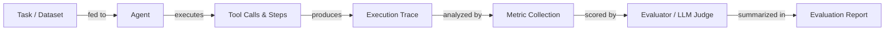

# Évaluation et test des agents

## Définition

L'évaluation des agents est la pratique consistant à mesurer dans quelle mesure un agent IA complète des tâches, utilise correctement les outils, respecte les budgets de coût et de latence, et produit des résultats précis. Contrairement à l'évaluation statique de modèles — où vous comparez une sortie fixe à une référence — l'évaluation des agents doit tenir compte des trajectoires multi-étapes, des chemins non déterministes, des appels d'outils intermédiaires et de l'effet cumulatif des erreurs à travers les étapes. Une seule tâche peut réussir par de nombreux chemins d'exécution différents, rendant les scores de précision traditionnels insuffisants à eux seuls.

Une évaluation rigoureuse est ce qui distingue une démo d'un système de production. Sans elle, vous ne pouvez pas savoir si un changement de prompt a amélioré ou dégradé le comportement, si une nouvelle définition d'outil est utilisée correctement, ou si la latence est acceptable sous une charge réelle. L'évaluation doit se produire à plusieurs niveaux : test unitaire des outils individuels, test d'intégration des exécutions complètes d'agents, et tests de régression contre un jeu de données doré de tâches représentatives.

Une stratégie d'évaluation mature combine des métriques automatisées (taux de complétion de tâches, précision, latence, coût, efficacité d'utilisation des outils) avec une révision humaine pour les cas limites et la qualité subjective. Des benchmarks comme AgentBench et SWE-bench fournissent des ensembles de tâches standardisés pour comparer entre modèles et frameworks, tandis que des frameworks comme LangSmith, Ragas et DeepEval fournissent l'infrastructure pour exécuter des évaluations à grande échelle et suivre les résultats dans le temps.

## Comment ça fonctionne



### Préparation des tâches et du jeu de données

Un bon jeu de données d'évaluation contient des tâches représentatives tirées de demandes d'utilisateurs réelles ou réalistes, chacune avec des résultats attendus ou des réponses de référence. Les tâches doivent couvrir les chemins heureux, les cas limites, les entrées adversariales et les flux de travail multi-étapes. Pour l'évaluation spécifique des agents, chaque tâche doit spécifier la réponse finale attendue et, optionnellement, la séquence attendue d'appels d'outils. La qualité du jeu de données est le plus grand levier unique sur la qualité de l'évaluation — ordures en entrée, ordures en sortie.

### Exécution et collecte de traces

L'agent exécute chaque tâche dans le jeu de données, et chaque étape — appels LLM, invocations d'outils, lectures de mémoire et sorties — est capturée sous forme de trace structurée. Les traces enregistrent les entrées, sorties, horodatages, nombres de tokens et erreurs pour chaque span. C'est la matière première pour toutes les métriques en aval et est également précieuse pour déboguer les défaillances. Le déterminisme peut être amélioré en fixant des graines aléatoires et la température, mais une certaine variabilité doit être attendue et prise en compte en exécutant plusieurs essais par tâche.

### Collecte de métriques

Les métriques principales pour l'évaluation des agents incluent : le **taux de complétion de tâches** (l'agent a-t-il terminé la tâche avec succès ?), la **précision** (la réponse finale est-elle correcte ?), la **latence** (temps total de bout en bout), le **coût** (tokens totaux × prix), et l'**efficacité d'utilisation des outils** (les outils ont-ils été appelés le bon nombre de fois avec des arguments corrects ?). Les métriques secondaires incluent le nombre d'étapes, le taux de nouvelles tentatives, le taux d'hallucination et la fidélité au contexte récupéré. Les métriques sont calculées par tâche et agrégées sur l'ensemble du jeu de données.

### Évaluation et notation

De nombreuses métriques — en particulier la correction pour les sorties en texte libre — nécessitent un juge. Un juge LLM (par exemple GPT-4 ou Claude) reçoit la tâche, la réponse de l'agent et optionnellement une réponse de référence, et note la qualité selon une rubrique. C'est parfois appelé « LLM-as-a-judge » et est la colonne vertébrale de frameworks comme Ragas et DeepEval. Pour les tâches déterministes (exécution de code, requêtes SQL, extraction structurée), les vérifications basées sur des règles sont plus fiables et moins coûteuses. La révision humaine doit être utilisée pour calibrer les juges LLM et détecter les biais systématiques.

### Rapports et suivi des régressions

Les résultats d'évaluation sont agrégés dans un rapport et stockés aux côtés de la version de l'agent, de la version du prompt et de la version du modèle. Cela permet le suivi des régressions : vous pouvez comparer l'agent actuel à une référence et détecter les régressions avant le déploiement. Les tableaux de bord dans des outils comme LangSmith affichent les tendances des métriques dans le temps, aidant les équipes à détecter des dégradations subtiles que les exécutions de test individuelles manqueraient.

## Quand utiliser / Quand NE PAS utiliser

| Utiliser quand | Éviter quand |
|---|---|
| Comparer deux versions d'agents ou de prompts avant le déploiement | Passer l'évaluation parce que la tâche « semble correcte » dans une démo |
| Construire une suite de régression pour détecter les changements qui cassent les prompts | Exécuter l'évaluation une seule fois au début du projet et ne plus jamais |
| Mesurer le coût et la latence pour respecter les SLA | Utiliser une seule métrique (par exemple seulement la précision) pour juger la qualité globale |
| Valider le comportement d'appel d'outils et la correction des arguments | Utiliser un jeu de données contenant uniquement des tâches faciles et propres sans cas limites |
| Intégrer un nouveau modèle pour vérifier le transfert de capacités | Traiter les scores des juges LLM comme une vérité terrain sans calibration humaine |

## Comparaisons

| Critère | LangSmith | DeepEval | Ragas |
|---|---|---|---|
| **Facilité d'utilisation** | Intégration LangChain étroite, configuration rapide pour les utilisateurs LangChain ; plus difficile pour les autres | API Python propre, boilerplate minimal, facile à ajouter à n'importe quel pipeline | Optimisé pour les pipelines RAG ; direct pour les tâches de récupération |
| **Couverture des métriques** | Traçage, évaluateurs personnalisés, gestion de jeux de données ; moins de métriques LLM intégrées | Plus de 20 métriques intégrées (hallucination, fidélité, correction des outils, toxicité) | Métriques axées RAG (fidélité, pertinence des réponses, rappel de contexte, précision) |
| **Intégration du traçage** | Première classe : capture complète des traces, visualisation des spans, comparaison des exécutions | Capture des traces via des décorateurs ; moins de visualisation native | Pas de traçage intégré ; s'intègre via LangSmith ou W&B |
| **Tarification** | Niveau gratuit + plans hébergés payants ; peut être auto-hébergé | Open source ; tableau de bord cloud disponible | Open source ; pas de tableau de bord hébergé |
| **Personnalisation** | Évaluateurs personnalisés via Python ou modèles de prompts | Extension par sous-classement des classes de métriques | Métriques personnalisées via Python ; forte prise en charge des bibliothèques de métriques NLP |

## Avantages et inconvénients

| Avantages | Inconvénients |
|---|---|
| Détecte les régressions avant qu'elles n'atteignent les utilisateurs | Construire un bon jeu de données est chronophage |
| Fournit des preuves objectives pour les décisions de prompt/modèle | Les juges LLM peuvent être biaisés ou incohérents |
| Permet la budgétisation des coûts et de la latence | Le non-déterminisme nécessite plusieurs essais, augmentant le coût |
| Se met à l'échelle sur de grands jeux de données avec l'automatisation | Les traces d'agents peuvent être grandes et coûteuses à stocker |
| S'intègre dans CI/CD pour des portes de qualité continues | Le choix des métriques est difficile et spécifique au domaine |

## Exemples de code

```python
# Agent evaluation with DeepEval
# pip install deepeval langchain-openai

from deepeval import evaluate
from deepeval.metrics import (
    TaskCompletionMetric,
    ToolCorrectnessMetric,
    HallucinationMetric,
)
from deepeval.test_case import LLMTestCase, ToolCall
from langchain_openai import ChatOpenAI
from langchain.agents import AgentExecutor, create_openai_tools_agent
from langchain_core.prompts import ChatPromptTemplate
from langchain_core.tools import tool


# --- Define a simple tool for the agent ---
@tool
def get_weather(city: str) -> str:
    """Return the current weather for a city."""
    # In production this would call a real API
    return f"The weather in {city} is sunny and 22°C."


# --- Build a minimal agent ---
llm = ChatOpenAI(model="gpt-4o-mini", temperature=0)
prompt = ChatPromptTemplate.from_messages([
    ("system", "You are a helpful assistant. Use tools when needed."),
    ("human", "{input}"),
    ("placeholder", "{agent_scratchpad}"),
])
agent = create_openai_tools_agent(llm, [get_weather], prompt)
agent_executor = AgentExecutor(agent=agent, tools=[get_weather], verbose=False)


def run_agent(user_input: str) -> tuple[str, list[ToolCall]]:
    """Run the agent and return (final_answer, tool_calls)."""
    result = agent_executor.invoke({"input": user_input})
    # In a real setup, parse the intermediate steps for tool call records
    actual_output = result["output"]
    tool_calls_used = [
        ToolCall(name="get_weather", input_parameters={"city": "Paris"})
    ]  # Extracted from result["intermediate_steps"] in production
    return actual_output, tool_calls_used


# --- Build DeepEval test cases from an evaluation dataset ---
dataset = [
    {
        "input": "What is the weather in Paris?",
        "expected_output": "The weather in Paris is sunny and 22°C.",
        "expected_tools": [
            ToolCall(name="get_weather", input_parameters={"city": "Paris"})
        ],
        "context": ["get_weather tool returns current conditions"],
    },
    {
        "input": "Tell me the weather in London.",
        "expected_output": "The weather in London is sunny and 22°C.",
        "expected_tools": [
            ToolCall(name="get_weather", input_parameters={"city": "London"})
        ],
        "context": ["get_weather tool returns current conditions"],
    },
]

test_cases = []
for item in dataset:
    actual_output, tool_calls_used = run_agent(item["input"])

    test_case = LLMTestCase(
        input=item["input"],
        actual_output=actual_output,
        expected_output=item["expected_output"],
        tools_called=tool_calls_used,
        expected_tools=item["expected_tools"],
        context=item["context"],
    )
    test_cases.append(test_case)

# --- Define metrics ---
task_completion = TaskCompletionMetric(
    threshold=0.7,
    model="gpt-4o-mini",
    include_reason=True,
)
tool_correctness = ToolCorrectnessMetric()  # Checks tool name + args match
hallucination = HallucinationMetric(
    threshold=0.3,
    model="gpt-4o-mini",
)

# --- Run evaluation ---
results = evaluate(
    test_cases=test_cases,
    metrics=[task_completion, tool_correctness, hallucination],
)

# --- Print summary ---
for tc, result in zip(test_cases, results.test_results):
    print(f"Input: {tc.input}")
    for metric_result in result.metrics_data:
        status = "PASS" if metric_result.success else "FAIL"
        print(f"  [{status}] {metric_result.name}: {metric_result.score:.2f}")
        if metric_result.reason:
            print(f"         Reason: {metric_result.reason}")
    print()
```

## Ressources pratiques

- [Documentation DeepEval](https://docs.confident-ai.com/) — Guide complet des métriques DeepEval, cas de test et intégration CI/CD pour l'évaluation des LLM et des agents.
- [Documentation Ragas](https://docs.ragas.io/) — Framework Ragas pour évaluer les pipelines RAG et la fidélité des agents, avec des métriques comme la pertinence des réponses et le rappel de contexte.
- [Documentation LangSmith](https://docs.smith.langchain.com/) — Fonctionnalités d'évaluation, de traçage et de gestion des jeux de données de LangSmith pour les agents basés sur LangChain.
- [Article et classement AgentBench](https://github.com/THUDM/AgentBench) — Benchmark pour évaluer les agents LLM sur diverses tâches du monde réel incluant le web, le codage et les environnements d'OS.
- [SWE-bench](https://www.swebench.com/) — Benchmark mesurant la capacité des agents à résoudre de vrais problèmes GitHub dans des dépôts de génie logiciel.

## Voir aussi

- [Agents](/docs/agents)
- [Débogage et observabilité des agents](/docs/agents/debugging)
- [Métriques d'évaluation](/docs/evaluation-metrics)
- [Benchmarks](/docs/benchmarks)
