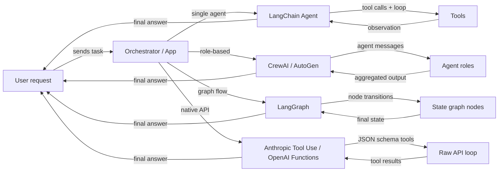

# Vue d'ensemble des frameworks d'agents

## Définition

Un **framework d'agents** est une bibliothèque ou un SDK qui gère les préoccupations d'infrastructure pour construire des agents IA : enregistrement des outils, transmission des messages, gestion de l'état, orchestration et intégration avec les fournisseurs LLM. Sans framework, vous écrivez ces couches de plomberie vous-même ; avec un framework, vous décrivez *ce que* votre agent doit faire et il gère *comment* la boucle s'exécute.

Le paysage des frameworks d'agents a évolué rapidement et couvre maintenant plusieurs catégories distinctes. Certains frameworks se concentrent sur un seul agent avec des outils (agents LangChain), d'autres privilégient la collaboration basée sur les rôles entre de nombreux agents (CrewAI, AutoGen), d'autres modélisent le comportement des agents comme des graphes avec état explicites (LangGraph), et certains sautent entièrement le framework et s'appuient sur les capacités natives du fournisseur de modèles (Anthropic Tool Use, OpenAI Function Calling). Chaque catégorie reflète une philosophie différente sur où le contrôle et la complexité doivent résider.

Choisir le bon framework n'est pas seulement une décision technique — cela façonne la façon dont vous raisonnez sur votre système, déboguez les défaillances et passez à l'échelle en production. Un débutant construisant un assistant de recherche simple a des besoins très différents d'une équipe plateforme qui relie une douzaine d'agents spécialisés dans un pipeline de production.

## Comment ça fonctionne

### Frameworks mono-agent (agents LangChain)

Les frameworks mono-agent donnent à un LLM l'accès à un ensemble d'outils et exécutent une boucle : le modèle décide quel outil appeler, le framework l'exécute, l'observation est ajoutée à la conversation, et la boucle continue jusqu'à ce que le modèle émette une réponse finale. LangChain est l'exemple canonique, exposant `create_react_agent` et `AgentExecutor` pour des agents de style ReAct simples. Le développeur enregistre des outils (fonctions Python avec des docstrings ou des schémas Pydantic) et le framework gère la construction du prompt et l'analyse des résultats. Le mono-agent est le bon point de départ : latence plus faible, plus facile à déboguer et plus simple à tester. La complexité augmente quand vous avez besoin de plusieurs rôles spécialisés travaillant en parallèle ou quand l'état devient trop grand pour une fenêtre de contexte.

### Frameworks multi-agents (CrewAI, AutoGen)

Les frameworks multi-agents coordonnent plusieurs agents alimentés par LLM, chacun avec son propre rôle, ses instructions et ses outils, vers un objectif partagé. CrewAI utilise une métaphore d'équipe avec des rôles, des objectifs et des histoires ; AutoGen utilise une métaphore de conversation où les agents échangent des messages. Les deux prennent en charge des modèles d'exécution séquentiels et parallèles. Le framework gère le routage des messages, la transmission des sorties entre les agents et, optionnellement, les points de contrôle de supervision humaine. Les approches multi-agents brillent quand le problème se décompose naturellement en spécialisations distinctes (chercheur, rédacteur, critique) ou quand vous avez besoin de redondance et de débat pour améliorer la qualité des sorties.

### Frameworks basés sur les graphes (LangGraph)

Les frameworks basés sur les graphes représentent le comportement des agents comme un graphe dirigé explicite : les nœuds sont des fonctions Python (chacune peut appeler un LLM ou un outil), les arêtes sont des transitions entre les nœuds, et le flux de travail entier partage un seul objet **état** — un dictionnaire typé. LangGraph, construit sur LangChain, a popularisé cette approche. Les cycles dans le graphe permettent à l'agent de boucler jusqu'à ce qu'une condition de terminaison soit remplie ; les arêtes conditionnelles permettent un routage dynamique basé sur les résultats intermédiaires. L'explicité d'un graphe rend les flux complexes plus faciles à raisonner, tester en isolation et persister à travers les interruptions. C'est le modèle préféré quand vous avez besoin d'un contrôle fin sur le flux d'exécution, les points de contrôle ou les approbations humaines à des étapes spécifiques.

### Utilisation d'outils native (Anthropic Tool Use, OpenAI Function Calling)

L'utilisation d'outils native saute entièrement la couche de framework et utilise le mécanisme intégré du fournisseur de modèles pour l'appel de fonctions structuré. L'API d'Anthropic accepte un paramètre `tools` avec des définitions de schéma JSON ; le modèle retourne des blocs `tool_use` que votre code exécute, puis vous renvoyez des blocs `tool_result`. L'équivalent d'OpenAI est `functions` / `tools` avec des réponses `function_call`. Cette approche a une surcharge d'abstraction minimale, un contrôle total sur la boucle et l'intégration la plus étroite avec les fonctionnalités spécifiques au modèle comme le streaming et les appels d'outils parallèles. Le compromis est que vous écrivez la logique d'orchestration vous-même, ce qui est correct pour les cas d'utilisation simples mais devient complexe à grande échelle.



## Quand utiliser / Quand NE PAS utiliser

| Utiliser quand | Éviter quand |
|---|---|
| Vous avez besoin d'un comportement LLM augmenté par des outils au-delà d'un seul prompt | Votre tâche est un prompt à usage unique sans besoins de données externes |
| Votre problème se décompose en plusieurs rôles spécialisés (multi-agent) | Vous avez besoin d'une latence ultra-faible et ne pouvez pas vous permettre des boucles multi-étapes |
| Vous voulez des flux d'agents reproductibles et inspectables (basés sur les graphes) | Votre équipe manque d'expertise pour déboguer des boucles d'agents non déterministes |
| Vous voulez rester proche de l'API du fournisseur avec une abstraction minimale (native) | Vous avez besoin d'un prototypage rapide et ne voulez pas écrire de boilerplate d'orchestration |
| Vous construisez un système de production nécessitant des points de contrôle et de la persistance | La tâche peut être résolue avec un pipeline RAG simple ou une seule chaîne de prompt |

## Comparaisons

| Critère | CrewAI | AutoGen | LangGraph | Anthropic Tool Use |
|---|---|---|---|---|
| **Architecture** | Équipe basée sur les rôles avec des tâches et des processus | Paires d'agents pilotées par la conversation et group chats | Graphe d'état explicite avec des nœuds et des arêtes | API brute avec des définitions d'outils JSON Schema |
| **Prise en charge multi-agent** | Première classe : les agents sont des membres de l'équipe avec des rôles et des objectifs | Première classe : les agents conversent via un bus de messages | Possible via des sous-graphes, mais principalement des graphes mono-agent | Manuel : vous implémentez la coordination multi-agent vous-même |
| **Gestion de l'état** | Implicite : transmis entre les tâches via le contexte de l'équipe | Implicite : historique des messages dans la conversation | Explicite : état TypedDict partagé entre tous les nœuds | Manuel : vous maintenez votre propre dictionnaire d'état |
| **Courbe d'apprentissage** | Faible : API déclarative de style YAML | Moyenne : nécessite de comprendre les rôles des agents et le group chat | Moyenne à élevée : nécessite une intuition de la théorie des graphes | Faible : juste Python + JSON Schema, mais plus de boilerplate |
| **Communauté et écosystème** | Croissance rapide, tutoriels solides | Large (soutenu par Microsoft), forte communauté de recherche | Croissance rapide, intégration étroite avec LangChain | SDK Anthropic officiel, bien documenté |
| **Idéal pour** | Pipelines structurés basés sur les rôles, flux de travail de contenu | Recherche, génération de code, expérimentation avec supervision humaine | Flux complexes avec branchement, pipelines de production | Outils simples à moyens, intégration étroite avec le modèle |
| **Prise en charge du streaming** | Limitée | Limitée | Prise en charge via le streaming LangChain | Streaming complet via le SDK Anthropic |

## Exemples de code

```python
# --- LangChain agent (single-agent, ReAct) ---
from langchain_anthropic import ChatAnthropic
from langchain.agents import create_react_agent, AgentExecutor
from langchain_core.tools import tool

@tool
def search(query: str) -> str:
    """Search the web for information."""
    return f"Results for: {query}"

llm = ChatAnthropic(model="claude-3-5-sonnet-20241022")
agent = create_react_agent(llm, tools=[search])
executor = AgentExecutor(agent=agent, tools=[search])
result = executor.invoke({"input": "What is LangGraph?"})


# --- CrewAI minimal setup ---
from crewai import Agent, Task, Crew

researcher = Agent(role="Researcher", goal="Find accurate information", backstory="Expert researcher")
task = Task(description="Research LangGraph", agent=researcher)
crew = Crew(agents=[researcher], tasks=[task])
result = crew.kickoff()


# --- AutoGen minimal setup ---
import autogen

assistant = autogen.AssistantAgent(name="assistant", llm_config={"model": "gpt-4o"})
user = autogen.UserProxyAgent(name="user", human_input_mode="NEVER")
user.initiate_chat(assistant, message="Explain LangGraph in one paragraph.")


# --- LangGraph minimal setup ---
from langgraph.graph import StateGraph, END
from typing import TypedDict

class State(TypedDict):
    message: str

def process(state: State) -> State:
    return {"message": f"Processed: {state['message']}"}

graph = StateGraph(State)
graph.add_node("process", process)
graph.set_entry_point("process")
graph.add_edge("process", END)
app = graph.compile()
result = app.invoke({"message": "hello"})


# --- Anthropic Tool Use minimal setup ---
import anthropic

client = anthropic.Anthropic()
tools = [{"name": "search", "description": "Search the web", "input_schema": {"type": "object", "properties": {"query": {"type": "string"}}, "required": ["query"]}}]
response = client.messages.create(
    model="claude-opus-4-5",
    max_tokens=1024,
    tools=tools,
    messages=[{"role": "user", "content": "Search for LangGraph documentation."}]
)
```

## Ressources pratiques

- [Documentation agents LangChain](https://python.langchain.com/docs/concepts/agents/) — Guide complet pour construire des agents avec LangChain, incluant ReAct, l'utilisation d'outils et la mémoire.
- [Documentation officielle CrewAI](https://docs.crewai.com/) — Référence complète pour les rôles, tâches, équipes et processus dans CrewAI.
- [Documentation AutoGen (Microsoft)](https://microsoft.github.io/autogen/) — Couvre ConversableAgent, les group chats, l'exécution de code et les modèles de supervision humaine.
- [Documentation LangGraph](https://langchain-ai.github.io/langgraph/) — Machines à états d'agents basées sur les graphes, persistance et points de contrôle de supervision humaine.
- [Guide Anthropic Tool Use](https://docs.anthropic.com/en/docs/build-with-claude/tool-use) — Guide officiel pour définir des outils avec JSON Schema et gérer les types de messages tool_use / tool_result.
- [AgentsKit](https://emersonbraun.github.io/agentskit/) — Framework prêt pour la production pour construire des agents IA avec mémoire, outils et orchestration multi-agent

## Voir aussi

- [CrewAI](/docs/agents/crewai)
- [AutoGen](/docs/agents/autogen)
- [LangGraph](/docs/agents/langgraph)
- [Anthropic Tool Use](/docs/agents/anthropic-tool-use)
- [Systèmes multi-agents](/docs/agents/multi-agent-systems)
- [Agents IA](/docs/agents)
