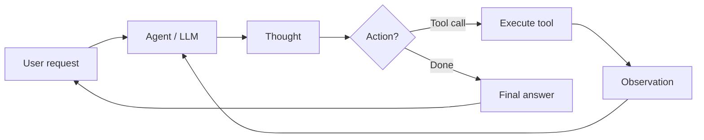

# Agents IA

## Définition

An **AI agent** est un système qui perçoit son environnement (par ex. user input, tool outputs), reasons (possibly with an LLM), and takes actions (par ex. calling APIs, writing code) to achieve goals. Agents often use tools and loops of thought–action–observation.

Plus formellement : **un agent est un programme autonome qui communique avec un modèle d'IA pour effectuer des opérations basées sur des objectifs en utilisant les outils et le contexte dont il dispose, et is capable of autonomous décision-making grounded in truth.** Agents bridge the gap between a one-off prototype (par ex. in AI Studio) and a scalable application: you define tools, give the agent access to them, and it decides when to call which tool and how to combine results to satisfy the user's goal.

## Comment ça fonctionne

Typical loop: receive task → plan or reason → choose action (par ex. tool call) → observe result → repeat until done or limit. The **user** sends a request; the **agent** (backed by an LLM) produces a **thought** (raisonnement) and a **décision**: either call a **tool** (par ex. search, API, code runner) and get an **observation**, or return a **final answer**. The observation is fed back into the agent for the next step. LLMs provide raisonnement and tool selection; frameworks (LangChain, LlamaIndex, Google ADK) handle orchestration, tool registration, and message passing. [Multi-agent](/docs/agents/multi-agent-systems) and [subagent](/docs/subagents) setups extend this with multiple agents or a parent delegating to children.



```python
# Conceptual agent loop (pseudocode)
def agent_loop(task):
    state = {"messages": [user_message(task)]}
    while not done(state):
        response = llm.invoke(state["messages"])
        if response.tool_calls:
            for call in response.tool_calls:
                result = tools.execute(call)
                state["messages"].append(tool_result(result))
        else:
            return response.content
    return state
```

## Cas d'utilisation

Les agents sont adaptés lorsque la tâche nécessite plusieurs étapes, l'utilisation d'outils ou des décisions allant au-delà d'un seul appel LLM.

- Automatisation de tâches (planification, pipelines de données, remplissage de formulaires)
- Génération et édition de code avec accès aux fichiers et aux API
- Assistants de recherche qui cherchent, résument et citent
- Multi-step workflows that combine tools and human-in-the-loop

## Avantages et inconvénients

| Pros | Cons |
|------|------|
| Flexible, can use many tools | Unpredictable, can loop or fail |
| Handles multi-step tasks | Latency and cost from many LLM calls |
| Enables automation | Needs good tool conception and safety |
| Scale from prototype to production | Requires monitoring and guardrails |

## Documentation externe

- [From Prototypes to Agents with ADK – Google Codelabs](https://codelabs.developers.google.com/your-first-agent-with-adk#0) — Build your first agent with Google's Agent Development Kit (ADK)
- [LangChain – Agents](https://python.langchain.com/docs/concepts/agents/) — Agent concepts and tool use
- [LlamaIndex – Agents](https://docs.llamaindex.ai/en/stable/module_guides/deploying/agents/) — Agent and query engine guides
- [OpenAI Assistants API](https://platform.openai.com/docs/assistants/overview) — Managed agents with tools

## Voir aussi

- [Multi-agent systems](/docs/agents/multi-agent-systems)
- [Subagents](/docs/subagents)
- [ReAct](/docs/reasoning-patterns/react)
- [RDD](/docs/reasoning-patterns/rdd)
