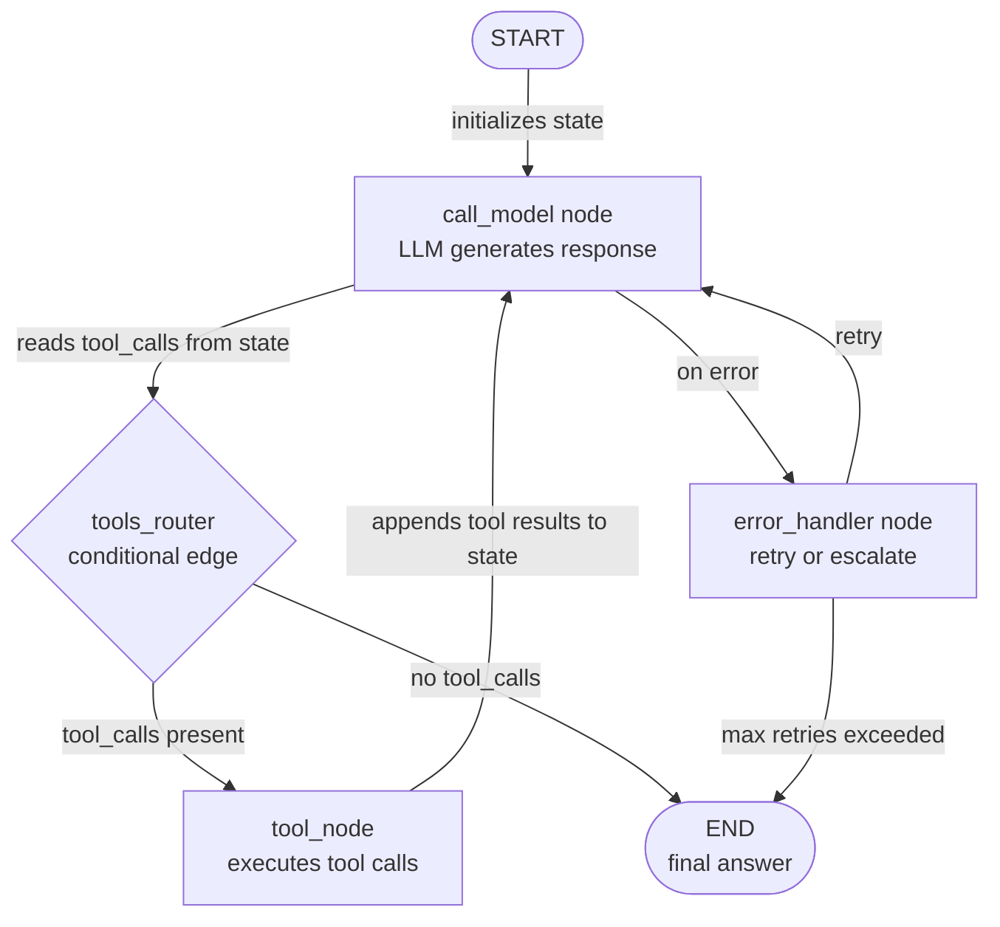

# LangGraph

## Définition

LangGraph est une bibliothèque Python open-source, construite sur LangChain, pour construire des **flux de travail d'agents avec état sous forme de graphes dirigés explicites**. Là où la plupart des frameworks d'agents cachent la boucle d'exécution derrière un appel opaque `run()`, LangGraph l'expose comme un objet graphe de premier rang que vous pouvez inspecter, tester et modifier. Les nœuds sont des fonctions Python ordinaires (chacune peut appeler un LLM, un outil ou de la logique arbitraire) ; les arêtes sont des transitions entre les nœuds ; et le flux de travail entier partage un seul objet **état** — un dictionnaire typé que chaque nœud peut lire et écrire.

L'insight clé de LangGraph est que de nombreux comportements d'agents qui semblent complexes — boucler jusqu'à ce qu'une condition soit remplie, brancher sur le contenu d'une réponse LLM, faire une pause pour l'approbation humaine, reprendre depuis un point de contrôle sauvegardé — se mappent proprement sur des primitives de graphe : cycles, arêtes conditionnelles, interruptions et état persistant. Cette explicité a un coût (plus de boilerplate que CrewAI ou AutoGen) mais porte ses fruits en production : vous pouvez tester chaque nœud unitairement en isolation, tracer exactement quel chemin une exécution a emprunté, et rejouer un flux de travail depuis n'importe quel point de contrôle.

LangGraph prend en charge à la fois les modèles **mono-agent** (un graphe avec quelques nœuds qui appelle des outils en boucle) et les modèles **multi-agents** (plusieurs sous-graphes composés ensemble, avec partage d'état inter-graphes). Il s'intègre nativement avec l'écosystème d'outils de LangChain, les modèles de chat et LangSmith pour l'observabilité. Le framework est la base de l'architecture d'agent de production recommandée par LangChain à partir de 2024-2025.

## Comment ça fonctionne

### Nœuds : fonctions Python comme unités d'exécution

Un nœud dans LangGraph est n'importe quel callable Python qui accepte l'état actuel et retourne un état mis à jour (partiel). Les nœuds sont ajoutés au graphe avec `graph.add_node("nom", fonction)`. La signature de la fonction est toujours `(state: State) -> dict` — elle lit ce dont elle a besoin à partir de l'état, fait son travail (appel LLM, exécution d'outil, transformation de données), et retourne uniquement les clés qu'elle veut mettre à jour. Cela rend les nœuds faciles à tester indépendamment : passez un état fictif, affirmez sur le dict retourné. Le `ToolNode` de LangChain est un nœud préconstruit qui exécute les appels d'outils à partir de la réponse d'un LLM, ce qui couvre le modèle d'agent le plus courant dès le départ.

### Arêtes : routage et branchement conditionnel

Les arêtes connectent les nœuds et déterminent l'ordre d'exécution. Une arête simple (`graph.add_edge("a", "b")`) transite toujours du nœud `a` au nœud `b`. Une arête conditionnelle (`graph.add_conditional_edges`) appelle une fonction de routage avec l'état actuel et utilise la chaîne retournée pour décider du prochain nœud. C'est le mécanisme pour le flux de contrôle dynamique : après qu'un LLM génère une réponse, un routeur vérifie si elle contient des appels d'outils (route vers `tools`) ou une réponse finale (route vers `END`). Les arêtes conditionnelles rendent LangGraph significativement plus puissant qu'un pipeline séquentiel — vous pouvez exprimer des arbres de décision complexes, de la logique de nouvelles tentatives et des chemins d'escalade comme une structure de graphe lisible.

### État : TypedDict partagé entre tous les nœuds

L'état est la colonne vertébrale d'une application LangGraph. Vous définissez un `TypedDict` (ou un modèle Pydantic) avec tous les champs dont votre flux de travail a besoin : messages, résultats intermédiaires, drapeaux, compteurs. Chaque nœud reçoit l'état complet et retourne uniquement les champs qu'il modifie. LangGraph fusionne les mises à jour partielles avec l'état actuel en utilisant des **réducteurs** — par défaut, les affectations écrasent ; avec le réducteur `add_messages`, la liste de messages est annexée plutôt que remplacée. Le typage explicite de l'état signifie que les vérificateurs de types peuvent détecter les erreurs avant l'exécution, et l'instantané de l'état à n'importe quel point de contrôle est un enregistrement complet et inspectable de ce qui s'est passé.

### Cycles, persistance et supervision humaine

LangGraph gère les cycles nativement : un nœud peut revenir à un nœud précédent (ou à lui-même) selon une condition, permettant des boucles de nouvelles tentatives d'agents, des modèles d'auto-correction et l'utilisation d'outils multi-tours sans gestion spéciale. La persistance est fournie par des **checkpointers** (SQLite, Postgres, Redis ou en mémoire) : le graphe sauvegarde l'état complet après chaque exécution de nœud, donc vous pouvez reprendre depuis n'importe quel point après un crash ou une interruption. La supervision humaine est implémentée via `interrupt_before` et `interrupt_after` — le graphe s'arrête au nœud spécifié, expose l'état actuel à l'appelant, accepte l'entrée humaine et reprend. Cela fait de LangGraph le meilleur choix quand vous avez besoin de pipelines d'agents auditables, interruptibles et de qualité production.



## Quand utiliser / Quand NE PAS utiliser

| Utiliser quand | Éviter quand |
|---|---|
| Vous avez besoin d'un contrôle fin sur chaque étape de l'exécution de l'agent | Vous voulez une API déclarative de haut niveau et n'avez pas besoin d'un contrôle au niveau des étapes |
| Vous avez besoin de persistance et de la capacité à reprendre les flux de travail en cours d'exécution | Votre flux de travail est simple et linéaire — une chaîne ou une boucle mono-agent est suffisante |
| Des approbations de supervision humaine à des étapes spécifiques sont requises | L'équipe n'est pas familière avec la théorie des graphes et préfère un modèle mental plus simple |
| Vous construisez des systèmes de production nécessitant une observabilité et un replay complets | Vos agents sont des prototypes de recherche qui n'ont pas besoin d'une fiabilité de qualité production |
| Votre flux de travail a un branchement conditionnel complexe ou des cycles difficiles à exprimer linéairement | La coordination de rôles multi-agents est votre besoin principal — CrewAI ou AutoGen sont plus simples |

## Comparaisons

| Critère | LangGraph | CrewAI | AutoGen |
|---|---|---|---|
| **Niveau d'abstraction** | Faible : graphe explicite, nœuds, arêtes et état | Élevé : rôles déclaratifs, objectifs, tâches | Moyen : agents conversationnels avec historique des messages |
| **Flux de contrôle** | Arêtes conditionnelles et cycles explicites | Processus séquentiel ou hiérarchique (opaque) | Piloté par les messages, basé sur les tours (opaque) |
| **Persistance** | Première classe : checkpointers pour SQLite, Postgres, Redis | Non intégré | Non intégré |
| **Supervision humaine** | Première classe : `interrupt_before` / `interrupt_after` | Manuel uniquement | Première classe : `human_input_mode` par agent |
| **Testabilité** | Élevée : les nœuds sont des fonctions pures, faciles à tester unitairement | Moyenne : les tâches peuvent être testées mais l'exécution de l'équipe est opaque | Faible : les flux de conversation sont difficiles à tester unitairement de manière déterministe |

## Exemples de code

```python
import os
from typing import Annotated, TypedDict, Literal
from langchain_anthropic import ChatAnthropic
from langchain_core.tools import tool
from langchain_core.messages import HumanMessage, AIMessage, BaseMessage
from langgraph.graph import StateGraph, END
from langgraph.graph.message import add_messages
from langgraph.prebuilt import ToolNode

# --- State definition ---
# add_messages is a reducer: it appends to the messages list instead of replacing it.
class AgentState(TypedDict):
    messages: Annotated[list[BaseMessage], add_messages]
    step_count: int  # track how many steps we have taken

# --- Tool definitions ---
# Tools are standard LangChain tools decorated with @tool.
# The docstring becomes the tool description sent to the LLM.

@tool
def search_web(query: str) -> str:
    """Search the web for current information on a topic."""
    # In production, replace with a real search API (Serper, Tavily, etc.)
    return f"Search results for '{query}': LangGraph is a stateful agent framework by LangChain."

@tool
def add_numbers(a: float, b: float) -> str:
    """Add two numbers together and return the result."""
    return f"Result: {a + b}"

tools = [search_web, add_numbers]

# --- LLM setup ---
# Bind tools to the model so it knows what functions are available.
llm = ChatAnthropic(model="claude-opus-4-5")
llm_with_tools = llm.bind_tools(tools)

# --- Node definitions ---
# Each node is a plain Python function: (state) -> partial state update.

def call_model(state: AgentState) -> dict:
    """Primary agent node: calls the LLM and returns its response."""
    response = llm_with_tools.invoke(state["messages"])
    return {
        "messages": [response],  # add_messages reducer will append this
        "step_count": state["step_count"] + 1,
    }

def handle_error(state: AgentState) -> dict:
    """Error handling node: appends a fallback message if something went wrong."""
    fallback = AIMessage(content="I encountered an error. Let me try a different approach.")
    return {"messages": [fallback]}

# --- Routing function (conditional edge) ---
# Returns the name of the next node based on the current state.

def should_continue(state: AgentState) -> Literal["tools", "end"]:
    """Route to tools if the LLM made tool calls, otherwise end."""
    last_message = state["messages"][-1]
    # Safety limit: stop after 10 steps to prevent infinite loops
    if state["step_count"] >= 10:
        return "end"
    if hasattr(last_message, "tool_calls") and last_message.tool_calls:
        return "tools"
    return "end"

# --- Graph construction ---
tool_node = ToolNode(tools)  # prebuilt node that executes tool calls

graph = StateGraph(AgentState)

# Add nodes
graph.add_node("agent", call_model)
graph.add_node("tools", tool_node)
graph.add_node("error_handler", handle_error)

# Set entry point
graph.set_entry_point("agent")

# Add conditional edge from agent: either call tools or end
graph.add_conditional_edges(
    "agent",
    should_continue,
    {
        "tools": "tools",  # route to tool execution
        "end": END,        # route to terminal node
    },
)

# After tool execution, always return to the agent (creates a cycle)
graph.add_edge("tools", "agent")

# Error handler routes back to agent for a retry
graph.add_edge("error_handler", "agent")

# Compile the graph into a runnable application
app = graph.compile()

# --- Optional: add persistence with a checkpointer ---
# from langgraph.checkpoint.sqlite import SqliteSaver
# memory = SqliteSaver.from_conn_string(":memory:")
# app = graph.compile(checkpointer=memory)
# Use config={"configurable": {"thread_id": "session-1"}} to resume sessions.

# --- Run the agent ---
initial_state = {
    "messages": [HumanMessage(content="What is LangGraph and what is 42 plus 17?")],
    "step_count": 0,
}

result = app.invoke(initial_state)
print("Final answer:", result["messages"][-1].content)
print("Total steps:", result["step_count"])

# --- Inspect the graph structure ---
# app.get_graph().print_ascii()  # print ASCII diagram of the graph
```

## Ressources pratiques

- [Documentation officielle LangGraph](https://langchain-ai.github.io/langgraph/) — Référence complète pour la construction de graphes, la gestion de l'état, les checkpointers et les modèles de supervision humaine.
- [Dépôt GitHub LangGraph](https://github.com/langchain-ai/langgraph) — Code source, suivi des problèmes et notebooks d'exemples couvrant les modèles courants.
- [Guides « Comment faire » LangGraph](https://langchain-ai.github.io/langgraph/how-tos/) — Recettes pratiques pour la persistance, le streaming, les sous-graphes, la coordination multi-agents et plus encore.
- [Traçage LangSmith pour LangGraph](https://docs.smith.langchain.com/) — Plateforme d'observabilité pour tracer les exécutions LangGraph, inspecter l'état à chaque nœud et déboguer les défaillances.

## Voir aussi

- [Vue d'ensemble des frameworks d'agents](/docs/agents/frameworks-overview)
- [CrewAI](/docs/agents/crewai)
- [AutoGen](/docs/agents/autogen)
- [LangChain](/docs/tools/langchain)
- [Systèmes multi-agents](/docs/agents/multi-agent-systems)
- [ReAct](/docs/reasoning-patterns/react)
