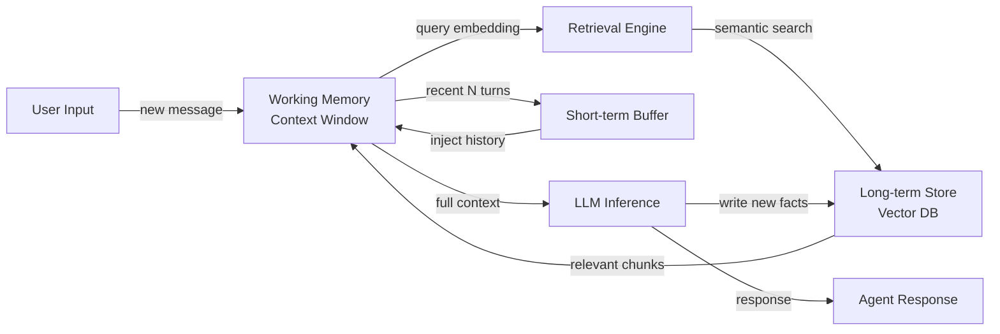

# Mémoire des agents

## Définition

La mémoire des agents désigne les mécanismes par lesquels un agent IA stocke, indexe et récupère des informations au cours de son fonctionnement. Sans mémoire, chaque interaction commence avec une ardoise vierge — l'agent ne peut pas apprendre des conversations passées, accumuler des faits ou suivre l'état d'une tâche de longue durée. La mémoire transforme un appel LLM sans état en un système persistant et orienté vers les objectifs.

En sciences cognitives, la mémoire est divisée en plusieurs types : la mémoire de travail (informations actives maintenues en tête en ce moment), la mémoire à court terme (événements récents retenus pendant une période limitée) et la mémoire à long terme (connaissances durables qui persistent indéfiniment). Les agents IA reflètent étroitement cette taxonomie. La fenêtre de contexte du LLM agit comme mémoire de travail ; un tampon glissant de messages récents sert de mémoire à court terme ; et un store externe — souvent une base de données vectorielle — sert de mémoire à long terme.

La mémoire est ce qui permet le raisonnement multi-tours. Quand un agent doit répondre à une question de suivi, exécuter un plan sur plusieurs étapes ou se souvenir des préférences d'un utilisateur d'une session précédente, il fait appel à une ou plusieurs de ces couches de mémoire. Concevoir correctement la mémoire détermine si un agent ressemble à un assistant compétent ou à un chatbot amnésique.

## Comment ça fonctionne

### Mémoire de travail et fenêtre de contexte

La fenêtre de contexte est la forme de mémoire la plus immédiate disponible pour tout agent alimenté par LLM. Tous les messages, résultats d'outils et pensées intermédiaires dans un seul appel d'inférence résident dans la mémoire de travail. Les fenêtres de contexte typiques vont de 8K à 200K tokens, établissant un plafond strict sur la quantité sur laquelle l'agent peut raisonner activement à la fois. Quand cette limite est approchée, les informations plus anciennes doivent être soit résumées, compressées ou évincées pour faire de la place. La mémoire de travail est rapide et sans latence mais entièrement volatile — elle disparaît quand l'appel se termine.

### Mémoire tampon à court terme

La mémoire à court terme est implémentée comme un tampon roulant qui contient les N derniers tours de conversation. Quand un nouveau tour arrive, le tour le plus ancien est supprimé si le tampon est plein. Cette approche est simple, peu coûteuse et suffisante pour la continuité conversationnelle dans une seule session. Le tampon est généralement sérialisé et renvoyé dans la fenêtre de contexte au début de chaque nouvel appel d'inférence. Sa principale limitation est qu'il ne se met pas à l'échelle pour les longues sessions ou le rappel inter-sessions.

### Mémoire sémantique à long terme

La mémoire à long terme utilise un store persistant externe — généralement une base de données vectorielle — pour contenir des embeddings d'événements passés, de faits et de résumés. Quand l'agent a besoin de se souvenir de quelque chose, il encode la requête actuelle et effectue une recherche approximative du plus proche voisin pour récupérer les souvenirs les plus sémantiquement pertinents. Les blocs récupérés sont injectés dans la fenêtre de contexte avant l'inférence. Ce modèle se met à l'échelle à des millions de faits stockés et prend en charge le rappel inter-sessions, mais ajoute de la latence de récupération et nécessite un modèle d'embedding.

### Mémoire épisodique vs sémantique

La mémoire épisodique stocke des événements passés spécifiques avec leur contexte : « Dans la session 23, l'utilisateur a demandé la politique de remboursement et était frustré. » La mémoire sémantique stocke des connaissances générales du monde ou des faits accumulés : « La fenêtre de remboursement est de 30 jours. » Les deux types peuvent coexister dans le même store vectoriel, distingués par des métadonnées. La mémoire épisodique est précieuse pour la personnalisation ; la mémoire sémantique est précieuse pour ancrer l'agent dans la connaissance du domaine.

### Boucle de récupération

La boucle de récupération connecte toutes les couches. À chaque tour, l'agent interroge la mémoire à long terme pour le contexte pertinent, le fusionne avec le tampon à court terme et alimente le contexte combiné dans la mémoire de travail du LLM. Après la génération, les faits importants du nouveau tour peuvent être réécrits dans le stockage à long terme, fermant la boucle.



## Quand utiliser / Quand NE PAS utiliser

| Utiliser quand | Éviter quand |
|---|---|
| L'agent doit rappeler des informations de sessions ou de tours précédents | La tâche est entièrement autonome dans un seul prompt sans suivi |
| Les utilisateurs s'attendent à une personnalisation basée sur les interactions passées | Le coût de stockage de la mémoire ou la latence est inacceptable pour le cas d'utilisation |
| L'agent suit des tâches de longue durée avec de nombreux résultats intermédiaires | La fenêtre de contexte est suffisamment grande pour contenir toutes les informations pertinentes |
| Les connaissances du domaine dépassent ce qui tient dans une seule fenêtre de contexte | Les exigences de confidentialité interdisent le stockage des données de conversation des utilisateurs |
| Vous avez besoin d'un comportement cohérent à travers plusieurs invocations d'agents | La complexité ajoutée l'emporte sur le bénéfice marginal de la persistance |

## Avantages et inconvénients

| Avantages | Inconvénients |
|---|---|
| Permet la continuité multi-tours et inter-sessions | Les stores à long terme ajoutent de la latence de récupération |
| Prend en charge la personnalisation et le contexte spécifique à l'utilisateur | Les bases de données vectorielles introduisent une complexité d'infrastructure |
| Se met à l'échelle au-delà des limites de fenêtre de contexte | La qualité de récupération dépend de la précision du modèle d'embedding |
| La mémoire épisodique améliore significativement l'expérience utilisateur | La stagnation de la mémoire nécessite des stratégies d'éviction ou de mise à jour |
| La mémoire sémantique ancre l'agent dans la connaissance du domaine | Les politiques de confidentialité et de rétention des données doivent être gérées explicitement |

## Exemples de code

```python
"""
Simple agent memory implementation combining a list-based short-term buffer
with a vector-based long-term store using sentence-transformers and numpy.
"""
from __future__ import annotations

import json
import numpy as np
from dataclasses import dataclass, field
from typing import Optional
from sentence_transformers import SentenceTransformer  # pip install sentence-transformers


# ---------------------------------------------------------------------------
# Short-term buffer memory (last N turns)
# ---------------------------------------------------------------------------

@dataclass
class ShortTermMemory:
    """Keeps the most recent `max_turns` conversation turns in a list."""
    max_turns: int = 10
    turns: list[dict] = field(default_factory=list)

    def add(self, role: str, content: str) -> None:
        self.turns.append({"role": role, "content": content})
        # Evict oldest turn when capacity is exceeded
        if len(self.turns) > self.max_turns:
            self.turns.pop(0)

    def get_history(self) -> list[dict]:
        """Return all buffered turns for injection into the context window."""
        return list(self.turns)


# ---------------------------------------------------------------------------
# Long-term vector memory (semantic retrieval)
# ---------------------------------------------------------------------------

@dataclass
class LongTermMemory:
    """
    Simple in-memory vector store backed by numpy.
    In production, replace with Chroma, Pinecone, or pgvector.
    """
    model_name: str = "all-MiniLM-L6-v2"
    _model: Optional[SentenceTransformer] = field(default=None, init=False, repr=False)
    _texts: list[str] = field(default_factory=list, init=False)
    _embeddings: Optional[np.ndarray] = field(default=None, init=False)

    @property
    def model(self) -> SentenceTransformer:
        if self._model is None:
            self._model = SentenceTransformer(self.model_name)
        return self._model

    def store(self, text: str) -> None:
        """Embed and store a piece of text in long-term memory."""
        embedding = self.model.encode([text])  # shape: (1, dim)
        self._texts.append(text)
        if self._embeddings is None:
            self._embeddings = embedding
        else:
            self._embeddings = np.vstack([self._embeddings, embedding])

    def retrieve(self, query: str, top_k: int = 3) -> list[str]:
        """Return the top_k most semantically similar stored memories."""
        if not self._texts:
            return []
        query_emb = self.model.encode([query])  # shape: (1, dim)
        # Cosine similarity
        norms = np.linalg.norm(self._embeddings, axis=1, keepdims=True)
        normed = self._embeddings / (norms + 1e-9)
        query_norm = query_emb / (np.linalg.norm(query_emb) + 1e-9)
        scores = (normed @ query_norm.T).flatten()
        top_indices = np.argsort(scores)[::-1][:top_k]
        return [self._texts[i] for i in top_indices]


# ---------------------------------------------------------------------------
# Agent with combined memory
# ---------------------------------------------------------------------------

class MemoryAgent:
    """
    A simple agent that combines short-term buffer and long-term vector memory.
    Uses a mock LLM call for illustration; replace with openai.chat.completions.create.
    """

    def __init__(self, max_short_term_turns: int = 6):
        self.short_term = ShortTermMemory(max_turns=max_short_term_turns)
        self.long_term = LongTermMemory()
        self.system_prompt = "You are a helpful assistant with access to past context."

    def _build_context(self, user_message: str) -> list[dict]:
        """Combine long-term retrieval + short-term buffer into a message list."""
        # Retrieve relevant memories from long-term store
        memories = self.long_term.retrieve(user_message, top_k=3)
        memory_block = "\n".join(f"- {m}" for m in memories) if memories else "None"

        messages = [
            {"role": "system", "content": self.system_prompt},
            {"role": "system", "content": f"Relevant past context:\n{memory_block}"},
        ]
        # Append recent conversation history
        messages.extend(self.short_term.get_history())
        # Append the current user message
        messages.append({"role": "user", "content": user_message})
        return messages

    def chat(self, user_message: str) -> str:
        """Process a user message and return the agent's response."""
        messages = self._build_context(user_message)

        # --- Replace this mock with a real LLM call ---
        # import openai
        # response = openai.chat.completions.create(model="gpt-4o", messages=messages)
        # reply = response.choices[0].message.content
        reply = f"[Mock LLM reply to: {user_message!r} with {len(messages)} context messages]"
        # ----------------------------------------------

        # Update short-term buffer
        self.short_term.add("user", user_message)
        self.short_term.add("assistant", reply)

        # Write important facts to long-term memory (in production, use LLM to decide)
        self.long_term.store(f"User said: {user_message}")
        self.long_term.store(f"Assistant replied: {reply}")

        return reply


# ---------------------------------------------------------------------------
# Example usage
# ---------------------------------------------------------------------------
if __name__ == "__main__":
    agent = MemoryAgent(max_short_term_turns=4)

    turns = [
        "My name is Alice and I prefer concise answers.",
        "What is the capital of France?",
        "What did I say my name was?",
    ]
    for turn in turns:
        print(f"User: {turn}")
        print(f"Agent: {agent.chat(turn)}\n")
```

## Ressources pratiques

- [Concepts de mémoire LangChain](https://python.langchain.com/docs/concepts/memory/) — Documentation officielle LangChain couvrant tous les types de mémoire intégrés et quand appliquer chacun.
- [MemGPT: Towards LLMs as Operating Systems](https://arxiv.org/abs/2310.08560) — Article de recherche introduisant la gestion virtuelle du contexte pour une mémoire d'agent illimitée, comparable à la mémoire virtuelle d'OS.
- [Chroma – Base de données d'embeddings open-source](https://docs.trychroma.com/) — Store vectoriel léger populaire utilisé dans de nombreuses implémentations de mémoire d'agents.
- [Threads des assistants OpenAI](https://platform.openai.com/docs/assistants/how-it-works/managing-threads) — Comment l'API d'agents gérée d'OpenAI gère les threads de conversation et la mémoire persistante.

## Voir aussi

- [Agents IA](/docs/agents)
- [Mémoire conversationnelle](/docs/agents/conversational-memory)
- [RAG](/docs/rag)
