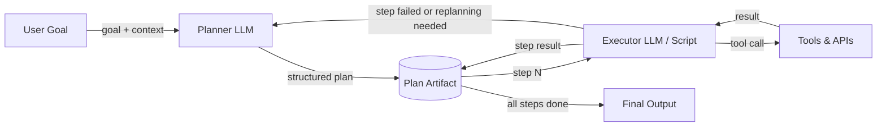

# Architecture Planner-Executor

## Définition

L'architecture Planner-Executor sépare la préoccupation de *décider quoi faire* de la préoccupation de *le faire*. Un LLM **Planner** reçoit un objectif de haut niveau et produit un plan structuré, étape par étape — une séquence de sous-tâches qui ensemble accomplissent l'objectif. Un LLM **Executor** (ou un programme déterministe) travaille ensuite à travers le plan une étape à la fois, invoquant des outils et produisant des résultats. Les deux composants communiquent via un artefact de plan partagé plutôt que via un seul prompt monolithique.

Cette séparation des préoccupations adresse une limitation fondamentale des boucles ReAct mono-agent : quand une tâche est complexe, demander à un seul LLM de raisonner simultanément sur la stratégie, de choisir la prochaine action et de gérer les détails d'outils de bas niveau conduit à des erreurs et des hallucinations. En déléguant la décomposition de haut niveau au Planner et l'exécution de bas niveau à l'Executor, chaque composant peut être optimisé, prompté et surveillé indépendamment. Le Planner peut utiliser un modèle plus capable ; l'Executor peut être un modèle plus rapide et moins coûteux ou même un programme non-LLM.

Le raffinement du plan et la replanification sont des extensions critiques de l'architecture de base. Les tâches du monde réel se déroulent rarement comme prévu : un appel d'outil peut échouer, une page web peut renvoyer des données inattendues, ou un résultat intermédiaire peut révéler que le plan original était erroné. Un système Planner-Executor robuste surveille les résultats d'exécution et ré-invoque le Planner quand une replanification est nécessaire. Cette boucle de rétroaction transforme un pipeline fragile en un agent adaptatif.

## Comment ça fonctionne

### Planner

Le Planner reçoit l'objectif de l'utilisateur avec les outils disponibles et tout contexte pertinent. Il produit un plan structuré — généralement une liste JSON d'objets d'étapes, chacun décrivant une sous-tâche, l'entrée/sortie attendue et optionnellement quel outil utiliser. Un bon prompt de planification inclut les schémas d'outils pour que le Planner puisse les référencer avec précision. Le Planner n'invoque aucun outil lui-même ; il raisonne uniquement sur la séquence d'opérations nécessaires. La température doit généralement être basse pour produire des plans déterministes et bien structurés.

### Artefact de plan

Le plan est le contrat entre le Planner et l'Executor. C'est un document lisible par machine (JSON ou texte structuré) qui encode la séquence d'étapes, leurs dépendances et leurs résultats attendus. Stocker le plan comme un artefact explicite — plutôt que de le garder implicite dans la chaîne de pensée du modèle — rend le système auditable, pausable et resumable. Une étape d'approbation de supervision humaine peut être insérée ici, permettant aux utilisateurs de réviser et modifier le plan avant que l'exécution commence.

### Executor

L'Executor lit le plan une étape à la fois, résout les références d'entrée aux sorties d'étapes précédentes, appelle les outils appropriés et enregistre le résultat. L'Executor peut être un second LLM (utile quand les étapes nécessitent un raisonnement en langage naturel), un script déterministe (utile pour les étapes structurées comme les appels API) ou un hybride. Après chaque étape, le résultat est réécrit dans l'artefact de plan pour que les étapes suivantes puissent le référencer. Si une étape échoue, l'Executor la marque et déclenche optionnellement une replanification.

### Boucle de replanification

Quand l'exécution diverge du plan — en raison d'échecs d'outils, de sorties inattendues ou de conditions changées — le contrôle revient au Planner avec l'enregistrement d'exécution partiel. Le Planner révise les étapes restantes compte tenu des nouvelles informations. La replanification peut être déclenchée automatiquement (par exemple, sur tout échec d'étape) ou après chaque étape pour une adaptabilité maximale. Limiter les itérations de replanification empêche les boucles infinies.



## Quand utiliser / Quand NE PAS utiliser

| Utiliser quand | Éviter quand |
|---|---|
| La tâche nécessite plusieurs étapes séquentielles difficiles à énumérer à l'avance | La tâche est suffisamment simple pour un seul appel LLM ou une boucle ReAct |
| Vous voulez une révision ou une approbation humaine avant que l'exécution commence | La latence est critique et l'appel planificateur supplémentaire est inacceptable |
| Les étapes d'exécution ont des dépendances claires et peuvent être validées individuellement | La structure du plan serait triviale et ajoute une complexité inutile |
| Vous devez auditer ce que l'agent a fait et pourquoi chaque étape a été prise | La tâche est exploratoire et ne peut pas être planifiée à l'avance du tout |
| La replanification en cas d'échec est importante pour la fiabilité | Les API d'outils sont si peu fiables qu'aucun plan ne survit au premier contact |

## Comparaisons

| Critère | Planner-Executor | Agent ReAct mono-agent | Agents DAG |
|---|---|---|---|
| Séparation des préoccupations | Élevée — la planification et l'exécution sont distinctes | Aucune — un agent fait les deux | Élevée — chaque nœud est une unité séparée |
| Adaptabilité / replanification | Modérée — la replanification ajoute un aller-retour | Élevée — l'agent s'ajuste à chaque étape | Faible — la structure du DAG est généralement fixe |
| Auditabilité | Élevée — l'artefact de plan est explicite | Faible — le raisonnement est uniquement en contexte | Élevée — la structure du graphe est explicite |
| Parallélisme | Aucun par défaut | Aucun | Natif — les branches indépendantes s'exécutent en parallèle |
| Complexité à implémenter | Moyenne | Faible | Élevée |
| Idéal pour | Tâches multi-étapes avec dépendances séquentielles | Tâches exploratoires et dynamiques | Tâches avec des sous-tâches parallélisables connues |

## Exemples de code

```python
"""
Planner-Executor implementation using the OpenAI API.

The Planner produces a JSON plan; the Executor steps through it,
calling mock tools and writing results back. Replanning is triggered
on step failure.
"""
from __future__ import annotations

import json
import os
from typing import Any

from openai import OpenAI  # pip install openai

client = OpenAI(api_key=os.environ.get("OPENAI_API_KEY", "sk-placeholder"))

# ---------------------------------------------------------------------------
# Mock tools
# ---------------------------------------------------------------------------

def web_search(query: str) -> str:
    """Mock web search tool."""
    return f"[Search result for '{query}': Found 5 relevant pages about {query}.]"

def summarize_text(text: str) -> str:
    """Mock summarizer tool."""
    return f"[Summary of: {text[:40]}...]"

def write_report(sections: list[str]) -> str:
    """Mock report writer tool."""
    return f"[Report written with {len(sections)} sections.]"

TOOLS: dict[str, Any] = {
    "web_search": web_search,
    "summarize_text": summarize_text,
    "write_report": write_report,
}

# ---------------------------------------------------------------------------
# Planner
# ---------------------------------------------------------------------------

PLANNER_SYSTEM = """
You are a planning assistant. Given a goal and available tools, produce a JSON plan.
The plan is a list of steps. Each step has:
  - "id": int (1-indexed)
  - "description": str (what this step does)
  - "tool": str (tool name from the available list, or "none")
  - "input": str (what to pass to the tool, may reference prior steps as {step_N_result})
  - "depends_on": list[int] (ids of steps that must complete first)

Return ONLY valid JSON — no markdown, no prose.
Available tools: web_search, summarize_text, write_report
"""

def create_plan(goal: str, context: str = "") -> list[dict]:
    """Call the Planner LLM to create a structured plan for the given goal."""
    user_msg = f"Goal: {goal}\n\nAdditional context: {context}" if context else f"Goal: {goal}"
    response = client.chat.completions.create(
        model="gpt-4o-mini",
        temperature=0,
        response_format={"type": "json_object"},
        messages=[
            {"role": "system", "content": PLANNER_SYSTEM},
            {"role": "user", "content": user_msg},
        ],
    )
    raw = response.choices[0].message.content
    parsed = json.loads(raw)
    # Handle both {"steps": [...]} and bare [...]
    return parsed.get("steps", parsed) if isinstance(parsed, dict) else parsed


# ---------------------------------------------------------------------------
# Executor
# ---------------------------------------------------------------------------

def resolve_input(template: str, results: dict[int, str]) -> str:
    """Replace {step_N_result} placeholders with actual results."""
    for step_id, result in results.items():
        template = template.replace(f"{{step_{step_id}_result}}", result)
    return template

def execute_plan(plan: list[dict]) -> dict[int, str]:
    """
    Execute each step sequentially, respecting dependencies.
    Returns a mapping of step_id -> result string.
    """
    results: dict[int, str] = {}

    for step in plan:
        step_id = step["id"]
        tool_name = step.get("tool", "none")
        raw_input = step.get("input", "")
        resolved_input = resolve_input(raw_input, results)

        print(f"  Step {step_id}: {step['description']}")

        if tool_name != "none" and tool_name in TOOLS:
            try:
                result = TOOLS[tool_name](resolved_input)
            except Exception as exc:
                # Signal failure for potential replanning
                result = f"ERROR: {exc}"
                print(f"    [FAILED] {result}")
        else:
            result = f"[No tool — step noted: {resolved_input}]"

        results[step_id] = result
        print(f"    Result: {result}\n")

    return results


# ---------------------------------------------------------------------------
# Planner-Executor orchestration with simple replanning
# ---------------------------------------------------------------------------

def run_planner_executor(goal: str, max_replan_attempts: int = 2) -> str:
    """
    Full Planner-Executor loop with replanning on failure.
    Returns the result of the last step as the final output.
    """
    attempt = 0
    context = ""

    while attempt <= max_replan_attempts:
        print(f"\n--- Planning (attempt {attempt + 1}) ---")
        plan = create_plan(goal, context=context)
        print(f"Plan has {len(plan)} steps.")

        print("\n--- Executing ---")
        results = execute_plan(plan)

        # Check for failures
        failures = {sid: r for sid, r in results.items() if r.startswith("ERROR")}
        if not failures:
            # Return the result of the last step
            last_id = max(results.keys())
            return results[last_id]

        # Build replanning context
        context = (
            f"Previous plan failed at steps: {list(failures.keys())}. "
            f"Errors: {failures}. Please revise the plan to avoid these failures."
        )
        attempt += 1

    return "Max replanning attempts reached. Could not complete goal."


if __name__ == "__main__":
    goal = "Research the latest trends in renewable energy and write a brief report."
    final = run_planner_executor(goal)
    print(f"\nFinal output:\n{final}")
```

## Ressources pratiques

- [Plan-and-Solve Prompting (Wang et al., 2023)](https://arxiv.org/abs/2305.04091) — Article montrant que la séparation de la planification de la résolution améliore la précision du raisonnement par rapport à la chaîne de pensée standard.
- [LangGraph — Agent Plan-and-Execute](https://langchain-ai.github.io/langgraph/tutorials/plan-and-execute/plan-and-execute/) — Tutoriel LangGraph officiel implémentant une boucle Planner-Executor avec replanification.
- [LLM Compiler (Kim et al., 2023)](https://arxiv.org/abs/2312.04511) — Étend Planner-Executor avec l'exécution parallèle des étapes de plan indépendantes.
- [Anthropic — Building Effective Agents](https://www.anthropic.com/research/building-effective-agents) — Conseils pratiques sur les architectures d'agents incluant les modèles orchestrateur-sous-agent.

## Voir aussi

- [Agents IA](/docs/agents)
- [Agents basés sur les DAG](/docs/agents/dag-agents)
- [Raisonnement par chaîne de pensée](/docs/reasoning-patterns/cot)
