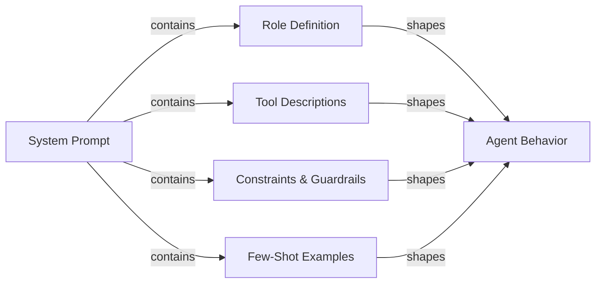

# Prompt engineering pour les agents

## Définition

Le prompt engineering pour les agents est l'art d'écrire des prompts système et des définitions d'outils qui produisent de manière fiable le comportement souhaité d'un agent IA. Contrairement au prompt engineering pour un chatbot à tour unique — où vous vous préoccupez principalement du format et du ton — les prompts d'agents doivent gouverner le raisonnement multi-étapes, la discipline de sélection d'outils, l'adhérence aux contraintes, la récupération des erreurs et les conditions de terminaison sur une séquence illimitée d'étapes. Un prompt d'agent mal écrit produit des agents qui bouclent indéfiniment, appellent des outils avec de mauvais arguments, ignorent les contraintes des utilisateurs ou confabulent des résultats quand les outils échouent.

Le prompt système est la constitution de l'agent. Il définit ce qu'est l'agent, ce qu'il peut faire, ce qu'il ne doit jamais faire, comment il doit raisonner et à quoi doit ressembler sa sortie. Parce que les LLM sont très sensibles à la formulation, à la structure et à l'ordre, de petits changements dans le prompt système peuvent avoir de grands effets comportementaux. Le prompt engineering pour les agents est donc une discipline itérative et empirique : vous écrivez un prompt, l'évaluez contre un jeu de données de tâches, identifiez les modes d'échec et affinez. Des outils comme LangSmith et DeepEval (voir [évaluation](/docs/agents/evaluation)) rendent cette boucle de rétroaction plus rapide.

Les bons prompts d'agents sont modulaires et explicites. Ils séparent la définition du rôle, la déclaration des capacités, la spécification des contraintes, les règles de format de sortie et les exemples few-shot en sections clairement délimitées. Cette structure rend les prompts plus faciles à maintenir, auditer et étendre à mesure que les capacités de l'agent évoluent. Elle aide également le LLM à activer le bon « mode » pour chaque section plutôt que de mélanger les préoccupations.

## Comment ça fonctionne



### Définition du rôle

La définition du rôle indique à l'agent qui il est, quel est son but principal et quelle persona adopter. Une bonne définition de rôle est spécifique : « Vous êtes un ingénieur logiciel senior spécialisé en Python et PostgreSQL, aidant les développeurs à déboguer des problèmes de production » est plus utile que « Vous êtes un assistant utile. » La spécificité active les connaissances pertinentes et établit un ton de réponse approprié. Le rôle doit également établir la relation de l'agent avec l'utilisateur (pair, assistant, expert), ce qui influence la façon dont l'agent gère l'incertitude et le désaccord. Gardez la définition du rôle concise (3 à 5 phrases) et placez-la en premier dans le prompt système pour qu'elle encadre toutes les instructions suivantes.

### Descriptions d'outils et sélection des outils

Chaque outil auquel l'agent a accès doit être décrit avec précision. Le nom de l'outil, la description, les noms des paramètres, les types de paramètres et le format de retour doivent tous être explicités. Les descriptions d'outils ambiguës sont l'une des causes les plus courantes de sélection d'outils incorrecte et d'arguments malformés. Incluez : ce que fait l'outil, quand l'utiliser (et surtout quand ne pas l'utiliser), quelles entrées il attend et quel format de sortie attendre. Pour les outils à des fins similaires, ajoutez une désambiguïsation explicite : « Utilisez `search_web` pour les événements actuels et les nouvelles ; utilisez `search_documents` pour les requêtes de la base de connaissances interne de l'entreprise. » Des exemples few-shot d'invocations d'outils correctes (dans le prompt système ou comme historique de conversation) réduisent significativement les erreurs de sélection d'outils.

### Chain-of-thought pour les agents

Le prompting chain-of-thought (CoT) demande à l'agent de raisonner explicitement avant d'agir. Pour les agents, cela signifie réfléchir à : que demande l'utilisateur, quelles informations ai-je, quelles informations me manquent, quel outil devrais-je appeler ensuite, et à quoi le résultat devrait-il ressembler. Demander à l'agent de raisonner avant d'agir (« Avant d'appeler un outil, énoncez brièvement votre plan ») améliore la précision sur les tâches multi-étapes complexes et rend les traces plus interprétables. Certains frameworks (ReAct, voir [ReAct](/docs/reasoning-patterns/react)) formalisent cela comme des cycles Thought / Action / Observation. Soyez explicite dans le prompt sur le fait que le raisonnement doit être dans la sortie ou uniquement dans le scratchpad.

### Contraintes et guardrails dans les prompts

Les contraintes définissent ce que l'agent ne doit pas faire. Elles doivent être énoncées positivement autant que possible (« demandez toujours une confirmation avant de supprimer des données ») plutôt que seulement négativement (« ne supprimez jamais de données sans demander »). Incluez : les contraintes de portée (répondez uniquement aux questions sur X), les contraintes de sortie (répondez toujours en français, utilisez toujours du JSON valide), les contraintes comportementales (ne fabriquez jamais d'URL ou de chemins de fichiers), et les contraintes de sécurité (ne générez jamais de contenu nuisible). Les guardrails dans les prompts sont une première ligne de défense, pas un remplacement des contrôles techniques (voir [sécurité](/docs/agents/security)) ; ils sont les plus efficaces quand ils spécifient le comportement exact attendu dans les cas limites.

### Spécification du format de sortie

Les agents qui produisent des sorties structurées (JSON, markdown, appels de fonctions) ont besoin d'instructions de format explicites. Spécifiez le schéma exact, les noms des champs, les types et les champs obligatoires vs optionnels. Incluez un exemple valide dans le prompt. Pour les agents d'appel d'outils, clarifiez quand retourner une réponse finale par rapport à continuer à appeler des outils, et à quoi ressemble la condition de terminaison. Si l'agent interagit avec des systèmes en aval, le format de sortie est un contrat ; l'ambiguïté ici se propage dans des intégrations cassées.

## Quand utiliser / Quand NE PAS utiliser

| Utiliser quand | Éviter quand |
|---|---|
| L'agent appelle plusieurs outils et la sélection des outils est incohérente | Traiter le prompt système comme une configuration unique à ne jamais réviser |
| L'agent boucle ou se termine prématurément sans accomplir la tâche | Écrire un prompt en mur de texte énorme sans structure ni sections |
| L'agent ignore les contraintes des utilisateurs ou viole les politiques de sécurité | Se fier uniquement aux valeurs par défaut du modèle sans spécification de rôle ou de contrainte |
| Intégration d'un nouveau LLM et besoin de transférer le comportement du modèle précédent | Ajouter de nouvelles instructions de manière ad hoc sans évaluer les régressions |
| Construction d'un flux de travail multi-étapes avec des exigences de format de sortie déterministes | S'attendre à ce que le prompt seul gère les menaces de sécurité (utilisez également des contrôles techniques) |

## Comparaisons

| Élément de prompt | Objectif | Erreurs courantes |
|---|---|---|
| Définition du rôle | Définit la persona, l'expertise et le ton | Trop vague (« assistant utile ») ou trop long ; placé après d'autres sections |
| Descriptions d'outils | Guide la sélection correcte des outils et la formation des arguments | Absence de conseils quand/quand-ne-pas-utiliser ; pas d'exemples d'invocations |
| Contraintes | Applique les limites de portée, de sécurité et de format | Uniquement des contraintes négatives (« ne jamais faire X ») sans spécifier l'alternative correcte |
| Instruction chain-of-thought | Améliore la précision du raisonnement sur les tâches complexes | Mélanger le raisonnement dans la sortie d'appel d'outil quand il devrait rester dans le scratchpad |
| Exemples few-shot | Démontre le comportement attendu pour l'utilisation des outils et le format de sortie | Exemples trop simples pour représenter de vrais cas limites |

## Avantages et inconvénients

| Avantages | Inconvénients |
|---|---|
| Effet immédiat : pas de fine-tuning ni de réentraînement requis | La sensibilité aux prompts signifie que de petits changements de formulation peuvent casser le comportement |
| La structure modulaire facilite la maintenance et l'audit | Les prompts longs consomment des tokens à chaque appel, augmentant le coût |
| Les exemples few-shot réduisent significativement les erreurs de sélection d'outils | Les instructions peuvent entrer en conflit ; les LLM peuvent prioriser les instructions ultérieures |
| Les contraintes fournissent une première ligne de défense contre les abus | Les prompts sont visibles par le modèle mais ne sont pas protégés cryptographiquement |
| Le chain-of-thought améliore la précision et l'interprétabilité des traces | Sur-spécifier le comportement peut rendre l'agent fragile sur les cas limites |

## Exemples de code

```python
# Well-structured agent system prompt with tool definitions
# pip install anthropic

import os
import json
import anthropic

# ---------------------------------------------------------------------------
# Tool definitions with precise descriptions
# ---------------------------------------------------------------------------

TOOLS = [
    {
        "name": "search_documents",
        "description": (
            "Search the internal company knowledge base for documents, policies, and procedures. "
            "Use this tool when the user asks about internal processes, company policies, or "
            "historical project information. Do NOT use this for current news or external information."
        ),
        "input_schema": {
            "type": "object",
            "properties": {
                "query": {
                    "type": "string",
                    "description": "The search query. Use specific keywords; avoid vague terms.",
                },
                "max_results": {
                    "type": "integer",
                    "description": "Maximum number of results to return. Default 5. Max 20.",
                    "default": 5,
                },
            },
            "required": ["query"],
        },
    },
    {
        "name": "create_ticket",
        "description": (
            "Create a support ticket in the project management system. "
            "Use this ONLY after confirming the details with the user. "
            "Never call this tool without explicit user confirmation of the ticket content."
        ),
        "input_schema": {
            "type": "object",
            "properties": {
                "title": {
                    "type": "string",
                    "description": "Short, descriptive title (under 80 characters).",
                },
                "description": {
                    "type": "string",
                    "description": "Full description of the issue or request.",
                },
                "priority": {
                    "type": "string",
                    "enum": ["low", "medium", "high", "critical"],
                    "description": "Ticket priority. Ask the user if unclear.",
                },
                "assignee": {
                    "type": "string",
                    "description": "Email address of the assignee. Optional.",
                },
            },
            "required": ["title", "description", "priority"],
        },
    },
]

# ---------------------------------------------------------------------------
# System prompt with all sections
# ---------------------------------------------------------------------------

SYSTEM_PROMPT = """
## Role
You are a senior IT support specialist for Acme Corp, helping internal employees resolve
technical issues and navigate company processes. You are thorough, patient, and always
confirm destructive actions before proceeding. You do not have access to external systems
or the public internet.

## Capabilities
You have access to two tools:
- `search_documents`: Search the internal knowledge base. Use this to find policies,
  procedures, troubleshooting guides, and historical decisions.
- `create_ticket`: Create a support ticket. ALWAYS confirm ticket details with the user
  before calling this tool.

## Reasoning approach
Before calling any tool, briefly state your plan in one sentence (e.g., "I'll search for
the VPN setup guide first."). After receiving tool results, summarize what you found and
what you'll do next. If a tool returns no results, say so and ask the user for more
details rather than guessing.

## Constraints
- Only answer questions about Acme Corp's internal systems and processes.
- If asked about external topics (competitor products, news, general knowledge),
  politely decline and redirect to your area of expertise.
- Never make up document names, ticket IDs, or employee contact information.
- If you do not know the answer and cannot find it in the knowledge base, say so clearly.
- Never create a ticket without explicit user confirmation of the title, description,
  and priority.
- Always respond in clear, professional English, regardless of the user's language.

## Output format
- For search results: summarize the key points in 2-4 bullet points, then offer to help
  with a follow-up action.
- For ticket creation: confirm the ticket details in a structured block before calling
  the tool, wait for user approval, then report the created ticket ID.
- Keep responses concise: under 300 words unless the user asks for more detail.

## Examples of correct tool use

Example 1 — searching the knowledge base:
User: "How do I request VPN access?"
Plan: I'll search the knowledge base for VPN access request procedures.
[call search_documents with query="VPN access request procedure"]
Response: summarize results in bullet points.

Example 2 — creating a ticket with confirmation:
User: "Can you create a ticket to fix my broken monitor?"
Response: "I'll create a ticket with these details — please confirm:
- Title: Broken monitor replacement request
- Description: User's monitor is not functioning; replacement needed.
- Priority: medium
Shall I proceed?"
[wait for user confirmation before calling create_ticket]
"""

# ---------------------------------------------------------------------------
# Simulated tool implementations
# ---------------------------------------------------------------------------

def search_documents(query: str, max_results: int = 5) -> list[dict]:
    """Simulated knowledge base search."""
    # In production, this calls a vector database or search API
    return [
        {
            "title": "VPN Access Request Process",
            "summary": "Submit an IT request form via the portal. Approval takes 1-2 business days.",
            "url": "internal://kb/vpn-access",
        }
    ][:max_results]


def create_ticket(title: str, description: str, priority: str, assignee: str = "") -> dict:
    """Simulated ticket creation."""
    return {
        "ticket_id": "TICK-4821",
        "title": title,
        "priority": priority,
        "status": "open",
        "assignee": assignee or "unassigned",
    }


def dispatch_tool(tool_name: str, tool_input: dict) -> str:
    """Route tool calls to their implementations."""
    if tool_name == "search_documents":
        results = search_documents(**tool_input)
        return json.dumps(results, indent=2)
    elif tool_name == "create_ticket":
        result = create_ticket(**tool_input)
        return json.dumps(result, indent=2)
    else:
        return json.dumps({"error": f"Unknown tool: {tool_name}"})


# ---------------------------------------------------------------------------
# Agent loop
# ---------------------------------------------------------------------------

def run_support_agent(user_message: str) -> str:
    """Run the support agent with the structured system prompt."""
    client = anthropic.Anthropic(api_key=os.environ["ANTHROPIC_API_KEY"])
    messages = [{"role": "user", "content": user_message}]

    while True:
        response = client.messages.create(
            model="claude-opus-4-5",
            max_tokens=1024,
            system=SYSTEM_PROMPT,
            tools=TOOLS,
            messages=messages,
        )

        # Append assistant response to conversation history
        messages.append({"role": "assistant", "content": response.content})

        if response.stop_reason == "end_turn":
            # Extract text response
            for block in response.content:
                if hasattr(block, "text"):
                    return block.text
            return ""

        elif response.stop_reason == "tool_use":
            # Process all tool calls in this response
            tool_results = []
            for block in response.content:
                if block.type == "tool_use":
                    print(f"  [Tool call] {block.name}({json.dumps(block.input)})")
                    result = dispatch_tool(block.name, block.input)
                    tool_results.append({
                        "type": "tool_result",
                        "tool_use_id": block.id,
                        "content": result,
                    })

            messages.append({"role": "user", "content": tool_results})

        else:
            # Unexpected stop reason
            return f"Agent stopped unexpectedly: {response.stop_reason}"


# ---------------------------------------------------------------------------
# Example run
# ---------------------------------------------------------------------------
if __name__ == "__main__":
    queries = [
        "How do I request VPN access for a new employee?",
        "What's the weather like in São Paulo today?",  # Out of scope — should be declined
    ]
    for query in queries:
        print(f"\nUser: {query}")
        answer = run_support_agent(query)
        print(f"Agent: {answer}")
```

## Ressources pratiques

- [Anthropic - Vue d'ensemble du prompt engineering](https://docs.anthropic.com/en/docs/build-with-claude/prompt-engineering/overview) — Conseils officiels d'Anthropic sur la structure du prompt système, la définition du rôle et le chain-of-thought pour les modèles Claude.
- [Anthropic - Documentation Tool use](https://docs.anthropic.com/en/docs/build-with-claude/tool-use) — Référence complète pour écrire des définitions d'outils, gérer les appels d'outils et structurer les conversations d'utilisation d'outils avec Claude.
- [OpenAI - Guide de prompt engineering](https://platform.openai.com/docs/guides/prompt-engineering) — Techniques fondamentales pour le prompting structuré, incluant les exemples few-shot, les instructions de format explicites et la spécification des contraintes.
- [ReAct: Synergizing Reasoning and Acting in Language Models](https://arxiv.org/abs/2210.03629) — Article original décrivant le modèle de prompting Thought/Action/Observation fondateur de la plupart des frameworks d'agents.

## Voir aussi

- [Agents](/docs/agents)
- [Prompt engineering](/docs/prompt-engineering)
- [Outils et actions des agents](/docs/agents/tools-actions)
- [Anthropic tool use](/docs/agents/anthropic-tool-use)
