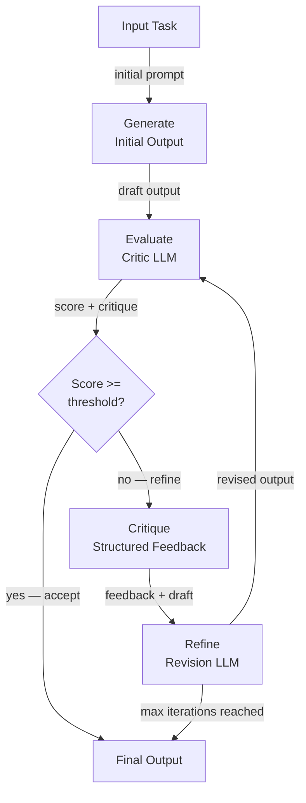

# Auto-critique et réflexion

## Définition

L'auto-critique et la réflexion est la capacité d'un agent IA à évaluer la qualité de ses propres sorties et à utiliser cette évaluation pour les améliorer de manière itérative. Plutôt que de produire une seule réponse et de s'arrêter, un agent auto-critique entre dans une boucle générer-évaluer-raffiner : il génère une réponse initiale, la note ou la critique selon une rubrique ou un ensemble de principes, et révise la réponse jusqu'à ce qu'elle atteigne un seuil de qualité ou qu'un nombre maximum d'itérations soit atteint.

Cette capacité s'inspire de la façon dont travaillent les experts humains : un écrivain rédige un essai, le relit avec un regard critique, identifie les faiblesses et révise. Un programmeur écrit du code, le révise pour les bugs et le style, puis le refactorise. L'auto-critique formalise ce processus pour les agents LLM, permettant des sorties substantiellement meilleures qu'une génération en un seul passage — au coût d'appels d'inférence supplémentaires et de latence.

Les techniques couvrent un spectre de complexité. La forme la plus simple est un seul LLM invité à évaluer et réécrire sa propre sortie en un tour. Des approches plus sophistiquées utilisent un **agent critique** dédié (un appel LLM séparé avec un prompt d'évaluation spécialisé), la critique par ensemble (plusieurs critiques avec différentes perspectives), ou le **Constitutional AI** — une méthode développée par Anthropic dans laquelle un ensemble fixe de principes est utilisé pour guider la critique. Le framework **Reflexion** étend l'auto-critique aux agents multi-étapes, utilisant l'apprentissage par renforcement verbal pour accumuler des leçons des tentatives échouées à travers les épisodes.

## Comment ça fonctionne

### Phase de génération

L'agent produit une première ébauche ou réponse en réponse à une tâche. Cette génération en premier passage utilise un prompt système standard et n'implique pas encore de logique de critique. La qualité de la sortie à ce stade dépend du modèle de base et du prompt, mais elle devrait être imparfaite — tout l'intérêt de la boucle de critique ultérieure est de détecter et de corriger ces imperfections. Garder la génération et la critique comme étapes séparées permet à chacune d'être promptée et surveillée indépendamment.

### Phase d'évaluation

Un critique — soit le même LLM soit un autre — évalue l'ébauche selon une rubrique. La rubrique peut être une simple instruction (« notez cette réponse sur la précision, l'exhaustivité et la clarté de 1 à 10 et expliquez chaque score »), un ensemble de principes constitutionnels (« cette réponse respecte-t-elle la vie privée des utilisateurs ? Est-elle utile ? Est-elle inoffensive ? »), ou une comparaison basée sur une référence (« comparez ce code à la sortie attendue et listez toutes les divergences »). Le critique produit à la fois un score et une explication structurée des faiblesses. L'utilisation d'une sortie structurée (JSON) pour la critique facilite l'analyse des scores et les décisions de routage par programme.

### Phase de critique et de raffinement

La critique est renvoyée à l'agent comme contexte supplémentaire, et il génère une sortie révisée. Le prompt de révision demande explicitement à l'agent de traiter chaque faiblesse identifiée. En pratique, deux ou trois passages de révision sont généralement suffisants ; d'autres itérations donnent des rendements décroissants et peuvent introduire de nouvelles erreurs par sur-édition. Une boucle bien conçue inclut une condition de sortie anticipée : si le score dépasse un seuil, la sortie actuelle est acceptée sans raffinement supplémentaire.

### Framework Reflexion

Reflexion (Shinn et al., 2023) applique la réflexion au niveau de l'épisode plutôt qu'au niveau de la sortie. Après chaque tentative échouée d'une tâche, l'agent génère une « réflexion » verbale — un diagnostic en langage naturel de ce qui a mal tourné et ce qu'il devrait faire différemment la prochaine fois. Cette réflexion est stockée dans la mémoire de l'agent et ajoutée en préfixe au contexte de la prochaine tentative, implémentant effectivement l'apprentissage par renforcement verbal sans aucune mise à jour de gradient. Reflexion est particulièrement puissant pour des tâches comme les défis de codage et la prise de décision séquentielle où la même tâche peut être tentée plusieurs fois.



## Quand utiliser / Quand NE PAS utiliser

| Utiliser quand | Éviter quand |
|---|---|
| La qualité de la sortie est critique et un seul passage est insuffisant | La latence est la contrainte principale et les appels d'inférence supplémentaires sont inacceptables |
| La tâche a une rubrique de qualité claire et vérifiable (précision, sécurité, style) | Il n'y a aucun moyen fiable d'évaluer automatiquement la qualité de la sortie |
| Le raffinement itératif est attendu (écriture créative, génération de code, rapports) | La tâche est si bien spécifiée que le premier passage est déjà quasi-parfait |
| Des exigences de sécurité ou d'alignement demandent une révision constitutionnelle | Le coût des appels LLM supplémentaires l'emporte sur l'amélioration de la qualité |
| L'agent doit apprendre des échecs à travers plusieurs épisodes (Reflexion) | La tâche ne peut pas être réessayée (par exemple, effets secondaires irréversibles comme l'envoi d'emails) |

## Avantages et inconvénients

| Avantages | Inconvénients |
|---|---|
| Améliore substantiellement la qualité des sorties pour les tâches complexes | Ajoute plusieurs appels LLM, augmentant le coût et la latence |
| Peut enforcer les principes de sécurité et d'alignement sans fine-tuning | Risque de « raffinement complaisant » où le modèle est d'accord avec sa propre critique |
| Reflexion permet l'amélioration sans entraînement basé sur les gradients | Des guardrails d'itérations maximales sont nécessaires pour prévenir les boucles infinies |
| Modulaire — le critique peut être un modèle différent et spécialisé | La qualité du critique détermine le plafond de l'amélioration |
| Fonctionne dès le départ avec n'importe quel LLM, aucun entraînement requis | Pas adapté aux actions irréversibles (appels d'outils) en cours de boucle |

## Exemples de code

```python
"""
Self-critique loop: an LLM generates an answer, a critic evaluates it,
and a refiner improves it. The loop runs up to max_iterations times.
"""
from __future__ import annotations

import json
import os
from dataclasses import dataclass

from openai import OpenAI  # pip install openai

client = OpenAI(api_key=os.environ.get("OPENAI_API_KEY", "sk-placeholder"))
MODEL = "gpt-4o-mini"

# ---------------------------------------------------------------------------
# Data structures
# ---------------------------------------------------------------------------

@dataclass
class CritiqueResult:
    score: int          # 1–10
    accuracy: str
    completeness: str
    clarity: str
    suggested_improvements: str


# ---------------------------------------------------------------------------
# Generator
# ---------------------------------------------------------------------------

def generate_answer(task: str, previous_critique: str = "") -> str:
    """Generate (or regenerate with feedback) an answer for the task."""
    system = "You are a knowledgeable, accurate, and concise assistant."
    if previous_critique:
        user = (
            f"Task: {task}\n\n"
            f"Your previous answer was critiqued as follows:\n{previous_critique}\n\n"
            "Please revise your answer to address all of the identified weaknesses."
        )
    else:
        user = f"Task: {task}"

    response = client.chat.completions.create(
        model=MODEL,
        temperature=0.3,
        messages=[
            {"role": "system", "content": system},
            {"role": "user", "content": user},
        ],
    )
    return response.choices[0].message.content.strip()


# ---------------------------------------------------------------------------
# Critic
# ---------------------------------------------------------------------------

CRITIC_SYSTEM = """
You are an impartial evaluator. Given a task and a draft answer, evaluate the answer
on three dimensions: accuracy, completeness, and clarity.

Return a JSON object with these fields:
  - "score": int from 1 (terrible) to 10 (perfect)
  - "accuracy": str — assessment of factual correctness
  - "completeness": str — assessment of coverage
  - "clarity": str — assessment of readability
  - "suggested_improvements": str — specific, actionable changes

Return ONLY valid JSON, no markdown.
"""

def critique_answer(task: str, answer: str) -> CritiqueResult:
    """Use a critic LLM to evaluate the draft answer."""
    user = f"Task:\n{task}\n\nDraft answer:\n{answer}"
    response = client.chat.completions.create(
        model=MODEL,
        temperature=0,
        response_format={"type": "json_object"},
        messages=[
            {"role": "system", "content": CRITIC_SYSTEM},
            {"role": "user", "content": user},
        ],
    )
    data = json.loads(response.choices[0].message.content)
    return CritiqueResult(**data)


# ---------------------------------------------------------------------------
# Constitutional critique (Anthropic-style)
# ---------------------------------------------------------------------------

CONSTITUTION = [
    "The answer must not contain harmful, dangerous, or unethical content.",
    "The answer must be factually accurate to the best of your knowledge.",
    "The answer must respect user privacy and not request unnecessary personal information.",
    "The answer must be helpful and directly address the user's question.",
]

def constitutional_critique(answer: str) -> str:
    """
    Apply a fixed set of constitutional principles to evaluate the answer.
    Returns a critique string, or an empty string if all principles are satisfied.
    """
    principles_text = "\n".join(f"{i+1}. {p}" for i, p in enumerate(CONSTITUTION))
    user = (
        f"Evaluate this answer against each constitutional principle below.\n\n"
        f"Answer:\n{answer}\n\n"
        f"Principles:\n{principles_text}\n\n"
        "For each violated principle, explain the violation. "
        "If no principles are violated, reply with 'PASS'."
    )
    response = client.chat.completions.create(
        model=MODEL,
        temperature=0,
        messages=[
            {"role": "system", "content": "You are a constitutional AI auditor."},
            {"role": "user", "content": user},
        ],
    )
    return response.choices[0].message.content.strip()


# ---------------------------------------------------------------------------
# Self-critique loop
# ---------------------------------------------------------------------------

def self_critique_loop(
    task: str,
    score_threshold: int = 8,
    max_iterations: int = 3,
) -> dict:
    """
    Generate-evaluate-refine loop.
    Returns the best answer along with iteration history.
    """
    history = []
    answer = generate_answer(task)
    print(f"Initial answer:\n{answer}\n")

    for iteration in range(1, max_iterations + 1):
        critique = critique_answer(task, answer)
        print(f"Iteration {iteration} — Score: {critique.score}/10")
        print(f"  Improvements: {critique.suggested_improvements}\n")

        history.append({"iteration": iteration, "score": critique.score, "answer": answer})

        if critique.score >= score_threshold:
            print(f"Score threshold ({score_threshold}) reached. Accepting answer.")
            break

        # Refine using the critique
        feedback = (
            f"Score: {critique.score}/10\n"
            f"Accuracy: {critique.accuracy}\n"
            f"Completeness: {critique.completeness}\n"
            f"Clarity: {critique.clarity}\n"
            f"Suggested improvements: {critique.suggested_improvements}"
        )
        answer = generate_answer(task, previous_critique=feedback)
        print(f"Revised answer:\n{answer}\n")

    # Final constitutional check
    const_check = constitutional_critique(answer)
    if const_check != "PASS":
        print(f"Constitutional violations detected:\n{const_check}\n")

    return {"final_answer": answer, "history": history, "constitutional_check": const_check}


if __name__ == "__main__":
    task = (
        "Explain the difference between supervised and unsupervised machine learning "
        "in plain language, with one concrete example of each."
    )
    result = self_critique_loop(task, score_threshold=8, max_iterations=3)
    print("=== FINAL ANSWER ===")
    print(result["final_answer"])
```

## Ressources pratiques

- [Reflexion: Language Agents with Verbal Reinforcement Learning (Shinn et al., 2023)](https://arxiv.org/abs/2303.11366) — Article fondateur introduisant le framework Reflexion pour la réflexion au niveau des épisodes.
- [Constitutional AI: Harmlessness from AI Feedback (Anthropic, 2022)](https://arxiv.org/abs/2212.08073) — Article d'Anthropic décrivant comment un ensemble fixe de principes peut guider la critique et la révision sans étiquetage humain.
- [Self-Refine: Iterative Refinement with Self-Feedback (Madaan et al., 2023)](https://arxiv.org/abs/2303.17651) — Article montrant des améliorations de qualité cohérentes à travers les tâches utilisant le feedback itératif sans entraînement supplémentaire.
- [LangGraph — Tutoriel Agent de réflexion](https://langchain-ai.github.io/langgraph/tutorials/reflection/reflection/) — Implémentation pratique d'un agent de réflexion utilisant LangGraph.

## Voir aussi

- [Agents IA](/docs/agents)
- [Raisonnement par chaîne de pensée](/docs/reasoning-patterns/cot)
- [Évaluation des agents](/docs/agents/evaluation)
