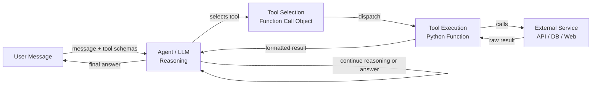

# Outils et actions des agents

## Définition

Les outils et les actions sont les mains d'un agent IA. Tandis que le LLM fournit le raisonnement et la compréhension du langage, les outils donnent à l'agent la capacité d'affecter le monde : rechercher sur le web, exécuter du code, interroger une base de données, envoyer des messages ou appeler n'importe quelle API externe. Sans outils, un agent est limité à ce qu'il sait de ses données d'entraînement ; avec des outils, il peut accéder à des informations en temps réel, effectuer des calculs et prendre des actions avec des effets secondaires.

Dans les écosystèmes OpenAI et Anthropic, le mécanisme d'utilisation d'outils s'appelle **function calling** (OpenAI) ou **tool use** (Anthropic). Le développeur définit un ensemble de schémas d'outils — des descriptions JSON structurées du nom, de l'objectif et des paramètres de chaque outil — et les inclut dans la requête API. Quand le LLM décide qu'un outil est nécessaire, il retourne un objet d'appel d'outil structuré plutôt que du texte brut. Le code appelant exécute l'outil et renvoie le résultat dans la conversation. Cette boucle se répète jusqu'à ce que l'agent produise une réponse finale.

La variété des outils disponibles est essentiellement illimitée : si quelque chose peut être exprimé comme une fonction Python, ça peut être un outil. Les catégories courantes incluent la recherche web, les sandboxes d'exécution de code, les requêtes de bases de données SQL ou NoSQL, l'accès au système de fichiers, les appels d'API REST, les intégrations d'email et de messagerie, et les outils d'utilisation d'ordinateur qui interagissent avec des interfaces graphiques. Concevoir de bons outils — avec des schémas clairs, un comportement prévisible et des messages d'erreur utiles — est l'une des choses les plus impactantes qu'un développeur peut faire pour améliorer la fiabilité des agents.

## Comment ça fonctionne

### Définition du schéma d'outil

Chaque outil est décrit par un schéma que le LLM utilise pour comprendre quand et comment l'appeler. Un schéma inclut : un nom (identifiant court en snake_case), une description (explication claire en langage naturel de ce que fait l'outil et quand l'utiliser), et un objet de paramètres (JSON Schema décrivant chaque argument : nom, type, description et s'il est obligatoire). La qualité de la description affecte directement la fiabilité avec laquelle l'agent sélectionne et invoque correctement l'outil. Les descriptions vagues conduisent à des mauvais usages ; les descriptions précises avec des exemples conduisent à des appels d'outils précis.

### Sélection des outils

Quand le LLM reçoit un message utilisateur avec un ensemble de schémas d'outils, il décide à chaque étape s'il doit répondre directement ou invoquer un outil. Cette décision est apprise implicitement pendant le fine-tuning sur des données d'appel de fonctions. En pratique, la sélection des outils est influencée par le prompt système (qui peut instruire l'agent sur quand préférer certains outils), la spécificité des descriptions d'outils et la confiance du modèle à pouvoir répondre à partir des données d'entraînement seules. Fournir un paramètre `tool_choice` peut forcer ou restreindre la sélection des outils par programme.

### Exécution des outils et injection du résultat

Quand le LLM produit un appel d'outil, le code appelant l'intercepte, valide les arguments contre le schéma, exécute la fonction correspondante et reçoit un résultat. Ce résultat — qu'il s'agisse d'une chaîne, d'un objet JSON ou d'un message d'erreur — est formaté comme un message de rôle `tool` et ajouté à l'historique de conversation. Le LLM génère ensuite l'étape suivante avec une connaissance complète de la sortie de l'outil. Les messages d'erreur des appels d'outils échoués sont importants : l'agent doit savoir qu'un outil a échoué pour pouvoir réessayer, essayer une alternative ou demander des éclaircissements à l'utilisateur.

### Appels d'outils multiples et parallèles

Les API LLM modernes prennent en charge les appels d'outils parallèles : le modèle peut demander plusieurs invocations d'outils dans une seule réponse quand il identifie qu'elles sont indépendantes. Par exemple, un agent pourrait appeler web_search pour trois requêtes différentes simultanément plutôt que séquentiellement, réduisant la latence des deux tiers. Le code appelant exécute tous les outils en parallèle, collecte les résultats et les renvoie ensemble dans le prochain tour. Concevoir les outils pour qu'ils soient sans état et idempotents autant que possible maximise le bénéfice de l'exécution parallèle.



## Quand utiliser / Quand NE PAS utiliser

| Utiliser quand | Éviter quand |
|---|---|
| L'agent a besoin d'informations en temps réel ou externes non présentes dans les données d'entraînement | La tâche peut être entièrement répondue à partir des connaissances du modèle |
| Des actions avec des effets secondaires sont requises (envoyer un email, écrire un fichier, mettre à jour une BD) | Les outils introduisent des risques de sécurité sans sandboxing ou limitation de débit appropriés |
| Un calcul au-delà des capacités du LLM est nécessaire (arithmétique, exécution de code) | Chaque appel d'outil ajoute de la latence et la tâche est sensible au temps |
| La récupération de données structurées (requêtes SQL, réponses API) est essentielle | Le schéma d'outil est si complexe que le modèle l'utilise fréquemment de manière incorrecte |
| Plusieurs outils spécialisés peuvent être composés pour résoudre des tâches complexes | Les modes d'échec de l'outil sont irrécupérables et pourraient causer des dommages |

## Avantages et inconvénients

| Avantages | Inconvénients |
|---|---|
| Étend l'agent au-delà des données d'entraînement statiques | Chaque appel d'outil ajoute de la latence et du coût API |
| Permet les effets secondaires réels et l'automatisation | Le mauvais usage des outils peut causer des actions irréversibles |
| Prend en charge les E/S structurées et validées via JSON Schema | Concevoir des schémas clairs nécessite un prompt engineering soigneux |
| Les appels d'outils parallèles réduisent le temps de réponse global | Plus d'outils augmentent la charge cognitive du modèle pour la sélection |
| Entièrement extensible — n'importe quelle fonction Python peut devenir un outil | La gestion des erreurs et les nouvelles tentatives doivent être implémentées explicitement |

## Exemples de code

```python
"""
OpenAI function calling example with multiple tools:
- web_search: retrieve current information from the web
- safe_math: evaluate arithmetic using operator-based parsing (no eval)
- get_weather: fetch weather data for a city

The agent loop continues until the LLM produces a final text response
with no tool calls.
"""
from __future__ import annotations

import json
import math
import operator
import os
from typing import Any

from openai import OpenAI  # pip install openai

client = OpenAI(api_key=os.environ.get("OPENAI_API_KEY", "sk-placeholder"))
MODEL = "gpt-4o-mini"

# ---------------------------------------------------------------------------
# Tool implementations
# ---------------------------------------------------------------------------

def web_search(query: str, num_results: int = 3) -> str:
    """
    Mock web search. Replace with a real search API such as
    Tavily (https://tavily.com) or Serper (https://serper.dev).
    """
    return json.dumps({
        "query": query,
        "results": [
            {
                "title": f"Result {i + 1} for '{query}'",
                "snippet": f"Relevant information about {query}.",
            }
            for i in range(min(num_results, 10))
        ],
    })


def safe_math(operation: str, a: float, b: float) -> str:
    """
    Perform basic arithmetic safely using an explicit operator table.
    Supports: add, subtract, multiply, divide, power, sqrt (b unused), log.
    This avoids arbitrary code execution entirely.
    """
    ops: dict[str, Any] = {
        "add": operator.add,
        "subtract": operator.sub,
        "multiply": operator.mul,
        "divide": operator.truediv,
        "power": operator.pow,
        "sqrt": lambda x, _: math.sqrt(x),
        "log": lambda x, base: math.log(x, base) if base else math.log(x),
    }
    if operation not in ops:
        return f"Unknown operation '{operation}'. Supported: {', '.join(ops)}"
    try:
        result = ops[operation](a, b)
        return json.dumps({"operation": operation, "a": a, "b": b, "result": result})
    except (ValueError, ZeroDivisionError, OverflowError) as exc:
        return json.dumps({"error": str(exc)})


def get_weather(city: str, units: str = "celsius") -> str:
    """
    Mock weather API. Replace with OpenWeatherMap or similar.
    """
    mock_data = {
        "city": city,
        "temperature": 22,
        "units": units,
        "condition": "Partly cloudy",
        "humidity_percent": 65,
    }
    return json.dumps(mock_data)


# Map tool names to Python functions
TOOL_FUNCTIONS: dict[str, Any] = {
    "web_search": web_search,
    "safe_math": safe_math,
    "get_weather": get_weather,
}

# ---------------------------------------------------------------------------
# Tool schemas (sent to the LLM with every request)
# ---------------------------------------------------------------------------

TOOLS = [
    {
        "type": "function",
        "function": {
            "name": "web_search",
            "description": (
                "Search the web for current information. Use this tool when the user asks "
                "about recent events, facts that may have changed, or anything that requires "
                "up-to-date information."
            ),
            "parameters": {
                "type": "object",
                "properties": {
                    "query": {
                        "type": "string",
                        "description": "The search query to execute.",
                    },
                    "num_results": {
                        "type": "integer",
                        "description": "Number of results to return (default 3, max 10).",
                        "default": 3,
                    },
                },
                "required": ["query"],
            },
        },
    },
    {
        "type": "function",
        "function": {
            "name": "safe_math",
            "description": (
                "Perform a mathematical operation on two numbers. "
                "Supported operations: add, subtract, multiply, divide, power, sqrt, log. "
                "Use this instead of trying to compute arithmetic mentally."
            ),
            "parameters": {
                "type": "object",
                "properties": {
                    "operation": {
                        "type": "string",
                        "enum": ["add", "subtract", "multiply", "divide", "power", "sqrt", "log"],
                        "description": "The arithmetic operation to perform.",
                    },
                    "a": {
                        "type": "number",
                        "description": "The first operand (or the only operand for sqrt).",
                    },
                    "b": {
                        "type": "number",
                        "description": "The second operand (base for log, ignored for sqrt).",
                    },
                },
                "required": ["operation", "a", "b"],
            },
        },
    },
    {
        "type": "function",
        "function": {
            "name": "get_weather",
            "description": (
                "Get the current weather for a city. Use this tool when the user asks "
                "about weather conditions, temperature, or humidity in a specific location."
            ),
            "parameters": {
                "type": "object",
                "properties": {
                    "city": {
                        "type": "string",
                        "description": "The city name, e.g. 'Tokyo' or 'New York'.",
                    },
                    "units": {
                        "type": "string",
                        "enum": ["celsius", "fahrenheit"],
                        "description": "Temperature units (default: celsius).",
                        "default": "celsius",
                    },
                },
                "required": ["city"],
            },
        },
    },
]

# ---------------------------------------------------------------------------
# Agent loop
# ---------------------------------------------------------------------------

def dispatch_tool_call(tool_call) -> str:
    """Execute a single tool call and return the result as a string."""
    name = tool_call.function.name
    args = json.loads(tool_call.function.arguments)
    print(f"  [Tool call] {name}({args})")

    if name not in TOOL_FUNCTIONS:
        return f"Error: unknown tool '{name}'"

    result = TOOL_FUNCTIONS[name](**args)
    preview = result[:120] + ("..." if len(result) > 120 else "")
    print(f"  [Tool result] {preview}")
    return result


def run_agent(user_message: str, system_prompt: str = "You are a helpful assistant.") -> str:
    """
    Agent loop: send message, handle tool calls, repeat until a final answer is produced.
    """
    messages = [
        {"role": "system", "content": system_prompt},
        {"role": "user", "content": user_message},
    ]

    print(f"User: {user_message}\n")

    max_turns = 10  # Safety limit to prevent infinite loops
    for _ in range(max_turns):
        response = client.chat.completions.create(
            model=MODEL,
            messages=messages,
            tools=TOOLS,
            tool_choice="auto",  # Let the model decide; "none" disables tools
        )
        msg = response.choices[0].message

        # If no tool calls, we have the final answer
        if not msg.tool_calls:
            print(f"\nAssistant: {msg.content}")
            return msg.content

        # Append the assistant message with tool calls to history
        messages.append(msg)

        # Execute all tool calls (for parallel execution use asyncio + concurrent.futures)
        for tool_call in msg.tool_calls:
            result = dispatch_tool_call(tool_call)
            messages.append({
                "role": "tool",
                "tool_call_id": tool_call.id,
                "content": result,
            })

    return "Max turns reached without a final answer."


if __name__ == "__main__":
    # Example 1: requires web search
    run_agent("What are the main differences between GPT-4 and Claude 3?")

    print("\n" + "=" * 60 + "\n")

    # Example 2: requires safe_math tool
    run_agent("What is 2 raised to the power of 16, and what is the square root of that?")

    print("\n" + "=" * 60 + "\n")

    # Example 3: requires weather tool
    run_agent("What's the weather like in London right now?")
```

## Ressources pratiques

- [Guide OpenAI Function Calling](https://platform.openai.com/docs/guides/function-calling) — Documentation officielle couvrant les schémas d'outils, les appels parallèles et les bonnes pratiques pour les définitions de fonctions.
- [Documentation Anthropic Tool Use](https://docs.anthropic.com/en/docs/tool-use) — Guide d'Anthropic pour l'utilisation d'outils avec Claude, incluant le streaming, l'utilisation d'ordinateur et les modèles multi-outils.
- [Tavily AI Search API](https://tavily.com/) — API de recherche spécialement conçue pour les agents LLM, fournissant des résultats structurés propres idéaux pour l'utilisation d'outils.
- [Concepts des outils LangChain](https://python.langchain.com/docs/concepts/tools/) — Vue d'ensemble de haut niveau des modèles de conception d'outils dans LangChain, incluant les outils personnalisés et les intégrations intégrées.
- [Gorilla: Large Language Model Connected with Massive APIs (Patil et al., 2023)](https://arxiv.org/abs/2305.15334) — Recherche sur le fine-tuning des LLM pour une sélection précise d'API/outils à travers des milliers d'outils.

## Voir aussi

- [Agents IA](/docs/agents)
- [Anthropic tool use](/docs/agents/anthropic-tool-use)
- [Vue d'ensemble des frameworks d'agents](/docs/agents/frameworks-overview)
