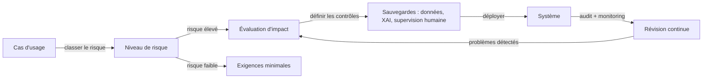

# Éthique de l'IA

## Définition

L'éthique de l'IA est le domaine qui s'intéresse aux principes moraux, aux structures de gouvernance et aux normes pratiques qui guident la conception, le déploiement et la supervision des systèmes d'IA. Les principes fondamentaux comprennent l'équité (éviter la discrimination), la transparence (rendre les systèmes compréhensibles pour les personnes concernées), la responsabilité (attribuer une responsabilité claire pour les résultats) et la vie privée (respecter les droits des individus sur leurs données). Ces principes sont mis en œuvre par des codes de conduite, des évaluations d'impact, des processus d'audit et, de plus en plus, par une réglementation contraignante.

L'IA éthique ne consiste pas seulement à prévenir les préjudices — il s'agit également de promouvoir activement des résultats bénéfiques pour diverses parties prenantes. Cela comprend la garantie que les avantages de l'IA sont équitablement distribués, que les communautés affectées disposent de recours significatifs en cas de problème, et que le développement de l'IA ne concentre pas le pouvoir d'une manière qui compromet les institutions démocratiques ou l'autonomie individuelle. L'éthique fournit le cadre normatif dans lequel s'effectue le travail technique de sécurité et d'équité.

En pratique, l'éthique de l'IA se connecte directement à la [sécurité de l'IA](/docs/ai-safety) sur les risques et l'alignement, aux [biais dans l'IA](/docs/bias-in-ai) sur les résultats d'équité, et à l'[IA explicable](/docs/xai) sur les exigences de transparence. La réglementation opérationnalise rapidement l'éthique en droit : la loi européenne sur l'IA introduit une classification des risques par niveaux, des obligations de transparence obligatoires et des pratiques interdites, rendant les évaluations d'éthique et d'impact légalement requises pour les applications à haut risque. Les organisations doivent maintenant traduire les principes abstraits en décisions de conception concrètes, [pratiques d'évaluation](/docs/evaluation-metrics) et contrôles de déploiement.

## Comment ça fonctionne

### Traduction du principe à la pratique

Les principes éthiques deviennent actionnables grâce à des processus structurés. Une évaluation d'impact identifie qui est affecté par un système, ce qui pourrait mal tourner, la gravité du préjudice et les atténuations disponibles. Les comités d'éthique (internes ou externes) évaluent les systèmes proposés par rapport aux normes organisationnelles et réglementaires avant le déploiement.

### Conformité réglementaire



### Structures de gouvernance

Les organisations mettent en œuvre la gouvernance par des politiques d'IA responsable, des cartes de modèles, des fiches de données pour les jeux de données et la documentation des décisions de conception et des chaînes de responsabilité. Les mécanismes human-in-the-loop préservent une supervision significative pour les décisions conséquentes. L'implication des parties prenantes garantit que les communautés affectées ont leur mot à dire dans les systèmes qui les concernent.

## Quand utiliser / Quand NE PAS utiliser

| Utiliser quand | Éviter quand |
|----------------|--------------|
| Conception ou déploiement de l'IA dans des domaines réglementés ou à enjeux élevés (santé, recrutement, crédit) | Le système ne prend pas de décisions conséquentes et n'affecte pas directement les personnes |
| Conformité réglementaire requise (loi IA UE, RGPD, règles sectorielles) | L'application est un prototype de recherche pur sans chemin vers le déploiement |
| Lancement d'un produit ou service IA destiné au public | Toutes les sorties sont examinées par des humains qualifiés avant toute action |
| Gestion d'outils IA tiers affectant les clients ou les employés | L'outil est purement interne et les résultats sont entièrement réversibles |

## Comparaisons

| Concept | Portée | Résultat principal |
|---------|--------|-------------------|
| Éthique de l'IA | Principes, gouvernance, valeurs | Politiques, évaluations d'impact, cadres de responsabilité |
| Sécurité de l'IA | Alignement technique et risque | Techniques de robustesse, garde-fous, systèmes de monitoring |
| Biais dans l'IA | Équité entre les groupes | Audits d'équité, méthodes de débiaisage, rapports de métriques |
| IA explicable | Interprétabilité | Explications, attribution des caractéristiques, outils d'audit |

## Avantages et inconvénients

| Avantages | Inconvénients |
|-----------|---------------|
| Réduit le risque juridique et réputationnel | Les revues éthiques peuvent ralentir les cycles de développement |
| Renforce la confiance des utilisateurs et du public | Les principes sont souvent vagues et difficiles à opérationnaliser |
| Crée la responsabilité et les pistes d'audit | Les métriques d'équité peuvent entrer en conflit entre elles et avec la précision |
| Encourage la prévention proactive des préjudices | La fragmentation réglementaire mondiale augmente la complexité de la conformité |

## Exemples de code

### Génération d'une carte de modèle simple (Python)

```python
from dataclasses import dataclass, asdict
import json

@dataclass
class ModelCard:
    model_name: str
    version: str
    intended_use: str
    out_of_scope_use: str
    training_data: str
    evaluation_metrics: list[str]
    known_limitations: str
    ethical_considerations: str
    contact: str

card = ModelCard(
    model_name="loan-approval-classifier",
    version="1.2.0",
    intended_use="Assist loan officers in reviewing consumer loan applications.",
    out_of_scope_use="Fully automated loan decisions without human review.",
    training_data="Internal loan data 2015-2023; balanced by income bracket and region.",
    evaluation_metrics=["accuracy", "F1", "demographic_parity", "equalized_odds"],
    known_limitations="Underperforms for applicants with non-traditional credit histories.",
    ethical_considerations="Reviewed by ethics board Q1 2024. Fairness audited across gender and race.",
    contact="ai-governance@example.com",
)

print(json.dumps(asdict(card), indent=2))
```

## Ressources pratiques

- [Loi européenne sur l'IA](https://digital-strategy.ec.europa.eu/en/policies/regulatory-framework-artificial-intelligence) — Cadre réglementaire de l'UE avec niveaux de risque et exigences de conformité
- [OCDE – Principes d'IA](https://oecd.ai/en/ai-principles) — Principes internationaux sur l'IA digne de confiance
- [Google – Pratiques d'IA responsable](https://ai.google/responsibility/responsible-ai-practices/) — Conseils pratiques pour appliquer l'éthique dans le développement de l'IA
- [Model Cards for Model Reporting (Mitchell et al.)](https://arxiv.org/abs/1810.03993) — Article fondateur sur la documentation de transparence
- [AI Now Institute](https://ainowinstitute.org/) — Recherche sur les implications sociales de l'IA

## Voir aussi

- [Sécurité de l'IA](/docs/ai-safety)
- [Biais dans l'IA](/docs/bias-in-ai)
- [IA explicable](/docs/xai)
