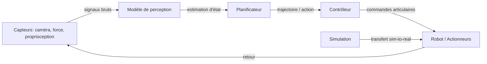

# IA et robotique

## Définition

L'IA en robotique est le domaine qui applique l'apprentissage automatique et les techniques d'IA aux agents physiques agissant dans le monde réel. Il couvre trois problèmes fondamentaux : la perception (comprendre l'état du monde à partir des données de capteurs), la planification (décider quoi faire ensuite) et le contrôle (exécuter des actions via des actionneurs). Contrairement aux applications d'IA purement numériques, les systèmes robotiques doivent gérer l'incertitude physique, la latence et les contraintes de sécurité en temps réel.

La robotique IA moderne utilise l'[apprentissage par renforcement](/docs/rl), l'apprentissage par imitation et la [vision par ordinateur](/docs/cv) pour entraîner des politiques qui mappent directement les entrées de capteurs aux actions. Un paradigme important est le sim-to-real : entraîner des politiques en simulation (où les données sont bon marché et les échecs sont sans danger), puis les transférer sur du matériel réel. Cela nécessite la randomisation de domaine, l'identification de système et parfois l'adaptation en ligne pour combler l'écart entre la dynamique simulée et réelle.

En pratique, la robotique se connecte à l'[apprentissage par renforcement profond](/docs/drl) pour le contrôle basé sur les politiques, à l'[IA multimodale](/docs/multimodal-ai) pour la perception sensorielle riche et à l'[inférence en périphérie](/docs/local-inference) pour le traitement embarqué en temps réel. La gamme s'étend de la manipulation industrielle et de la logistique aux robots chirurgicaux et à la navigation autonome — chaque cas d'utilisation apporte différents compromis entre vitesse, précision et contraintes de sécurité.

## Comment ça fonctionne

### Pipeline perception-planification-contrôle

Les capteurs (caméras, force/couple, proprioception) alimentent des modèles de **perception** qui estiment l'état (par ex. poses d'objets, disposition de la scène). Les **planificateurs** (classiques ou appris) produisent des trajectoires ou des actions de haut niveau (par ex. "saisir le bloc A"). Les **contrôleurs** (par ex. PID, politique apprise) exécutent des commandes de bas niveau (couples articulaires, vitesses) pour suivre le plan.

L'apprentissage **de bout en bout** mappe les entrées brutes de capteurs aux actions dans un seul réseau ; les pipelines **modulaires** séparent perception, planification et contrôle pour l'interprétabilité et la réutilisation. L'entraînement est souvent en simulation ([DRL](/docs/drl)) ; le sim-to-real (randomisation de domaine, identification de système) et les contraintes de sécurité sont critiques pour le déploiement.



### Transfert sim-to-real

La simulation permet des données d'entraînement illimitées et une exploration sûre. Les techniques sim-to-real comblent l'écart : la randomisation de domaine fait varier les paramètres physiques et les textures visuelles pour que les politiques généralisent aux variations réelles. L'identification de système calibre les paramètres de simulation contre le matériel réel. Les politiques résiduelles apprennent de petites corrections en complément de la simulation.

## Quand utiliser / Quand NE PAS utiliser

| Utiliser quand | Éviter quand |
|----------------|--------------|
| La tâche nécessite une interaction physique avec des environnements non structurés | La tâche est entièrement basée sur des règles et déterministe (robotique classique suffisante) |
| Le transfert sim-to-real est faisable et les contraintes de sécurité sont gérables | Applications critiques pour la sécurité sans tolérance aux pannes et tests suffisants |
| Suffisamment de données de démonstration ou de simulation disponibles | La latence du matériel en temps réel n'est pas compatible avec les exigences d'inférence |
| Des politiques adaptatives en temps réel pour des environnements changeants sont nécessaires | Les données d'étiquetage ou de démonstration sont trop rares ou coûteuses |

## Comparaisons

| Approche | Source d'entraînement | Points forts | Limitations |
|----------|-----------------------|-------------|-------------|
| Apprentissage par renforcement | Déroulements de simulation | Explore des stratégies nouvelles | Nécessite beaucoup d'échantillons, écart de simulation |
| Apprentissage par imitation | Démonstrations humaines | Apprend rapidement des démonstrations | Ne généralise pas bien au-delà des démos |
| Contrôle classique | Modèle + règles | Interprétable, déterministe | Ne s'adapte pas à la perception complexe |
| Apprentissage bout en bout | Capteurs → actions | Entraînement unifié | Plus difficile à déboguer et déployer |

## Avantages et inconvénients

| Avantages | Inconvénients |
|-----------|---------------|
| Adaptable aux environnements non structurés | L'écart sim-to-real peut nécessiter un calibrage coûteux |
| Apprend des politiques à partir de données, sans programmation explicite | Les contraintes de sécurité sont difficiles à coder dans les politiques apprises |
| La simulation permet un entraînement peu coûteux | Nécessite une intégration minutieuse des capteurs et du matériel |
| Les modèles peuvent être transférés dans des scénarios multi-tâches | Les exigences d'inférence en temps réel limitent la taille du modèle |

## Exemples de code

### Boucle de politique simple (Python / style OpenAI Gym)

```python
import gymnasium as gym

env = gym.make("FetchReach-v2", render_mode="human")
obs, info = env.reset()

for step in range(200):
    # Remplacer par une politique apprise ; ici action aléatoire
    action = env.action_space.sample()
    obs, reward, terminated, truncated, info = env.step(action)
    if terminated or truncated:
        obs, info = env.reset()

env.close()
```

### Randomisation de domaine (conceptuel)

```python
import numpy as np

def randomize_env_params(base_mass: float, base_friction: float) -> dict:
    """Randomiser les propriétés physiques pour améliorer le sim-to-real."""
    return {
        "mass": base_mass * np.random.uniform(0.8, 1.2),
        "friction": base_friction * np.random.uniform(0.5, 1.5),
        "joint_damping": np.random.uniform(0.01, 0.1),
    }

# Pendant l'entraînement : re-échantillonner les paramètres d'environnement à chaque reset
params = randomize_env_params(base_mass=1.0, base_friction=0.5)
```

## Ressources pratiques

- [Spinning Up in Deep RL (OpenAI)](https://spinningup.openai.com/) — Fondamentaux du RL pour le contrôle robotique
- [Google Robotics Research](https://research.google/pubs/robotics/) — Vue d'ensemble de la recherche en robotique apprenante
- [Gymnasium Robotics](https://robotics.farama.org/) — Environnements standards pour la recherche RL en robotique apprenante
- [Isaac Gym / Isaac Lab (NVIDIA)](https://developer.nvidia.com/isaac-gym) — Framework de simulation physique accéléré GPU pour le RL robotique

## Voir aussi

- [Apprentissage par renforcement](/docs/rl)
- [Apprentissage par renforcement profond](/docs/drl)
- [Vision par ordinateur](/docs/cv)
- [IA multimodale](/docs/multimodal-ai)
- [Inférence en périphérie](/docs/local-inference)
