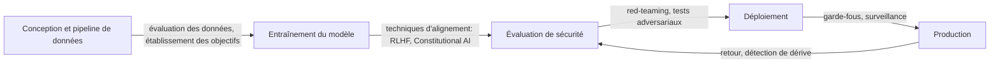

# Sécurité de l'IA

## Définition

La sécurité de l'IA est le domaine de recherche et d'ingénierie qui veille à ce que les systèmes d'IA fassent ce que nous avons l'intention de faire et restent sûrs dans un large éventail de conditions. Elle couvre trois problèmes fondamentaux : l'alignement (les systèmes représentent et poursuivent correctement les valeurs et les intentions humaines), la robustesse (comportement cohérent sous dérive de distribution, entrées adversariales et cas limites) et l'interprétabilité (comprendre pourquoi un système a produit une sortie particulière). Ces problèmes se renforcent mutuellement : la robustesse est plus difficile à atteindre sans interprétabilité, et l'interprétabilité soutient la vérification des garanties d'alignement.

La sécurité de l'IA se recoupe avec l'[éthique de l'IA](/docs/ai-ethics) — l'éthique fournit le cadre normatif (quelles valeurs les systèmes devraient poursuivre), tandis que la sécurité aborde le problème technique (comment s'assurer qu'ils le font). Le [biais dans l'IA](/docs/bias-in-ai) est un point d'intersection : les sorties biaisées peuvent être à la fois un problème d'alignement et d'équité. Pour les [LLMs](/docs/llms) et les [agents](/docs/agents), RLHF (apprentissage par renforcement à partir de retours humains), l'IA constitutionnelle et la supervision évolutive offrent les principaux outils ; l'[IA explicable](/docs/xai) soutient l'audit et le débogage.

En pratique, la sécurité s'étend tout au long du cycle de vie du modèle. Pendant l'entraînement, cela inclut la qualité des données, les objectifs et la régularisation. Pendant l'évaluation, cela inclut le red-teaming, les entrées adversariales et l'évaluation du comportement aux limites. Lors du déploiement, cela inclut les garde-fous, la surveillance et les mécanismes d'intervention. Pour les systèmes d'agents, l'autonomie croissante ajoute des couches supplémentaires de sécurité : si l'agent comprend correctement ses propres limites, s'il reste corrigible et s'il évite l'accumulation de pouvoir ou les actions irréversibles.

## Comment ça fonctionne

### Composantes centrales de la sécurité

**L'alignement** garantit qu'un modèle poursuit l'objectif prévu — pas une erreur de proxy ou une optimisation incorrecte. RLHF entraîne les modèles à préférer les préférences humaines ; Constitutional AI utilise des principes explicites ; la supervision évolutive propose d'utiliser des assistants IA fiables pour mettre à l'échelle les reviewers humains.

**La robustesse** teste le comportement du système dans des conditions altérées. Les tests adversariaux cherchent des entrées qui forcent des défaillances. Les tests d'empoisonnement vérifient si les données d'entraînement ont été compromises. Les évaluations de dérive de distribution mesurent la dégradation lorsque les entrées divergent des données d'entraînement.



### Red-teaming et surveillance

Le red-teaming simule une utilisation adversariale en tentant activement de faire échouer le modèle. Le red-teaming automatisé utilise d'autres modèles comme adversaires pour mettre à l'échelle la couverture. La surveillance de production détecte les comportements inattendus, les schémas de sortie inhabituels et les abus.

## Quand utiliser / Quand NE PAS utiliser

| Utiliser quand | Éviter quand |
|----------------|--------------|
| L'IA est déployée dans des domaines de décision à enjeux élevés (crédit, santé, justice) | Le système ne produit que des recommandations internes sans action directe |
| Les modèles ou agents interagissent avec des entrées non fiables ou des utilisateurs publics | Une révision humaine complète de toutes les sorties est garantie |
| Les systèmes exécutent des actions irréversibles ou contrôlent une infrastructure critique | L'application est un prototype à faible enjeu avec un déploiement limité |
| La conformité réglementaire ou les audits externes sont requis | Le profil de risque est très faible et entièrement couvert par les tests existants |

## Comparaisons

| Technique | Cible | Résultats typiques |
|-----------|-------|-------------------|
| RLHF | Alignement | Modèles suivant les préférences humaines |
| Constitutional AI | Alignement | Modèles suivant des principes |
| Tests adversariaux | Robustesse | Cas limites et modes de défaillance identifiés |
| Red-teaming | Révision de sécurité | Scénarios d'abus et garde-fous |
| Surveillance | Sécurité à l'exécution | Alertes pour dérive et abus |

## Avantages et inconvénients

| Avantages | Inconvénients |
|-----------|---------------|
| Réduit le risque d'utilisation catastrophique ou malveillante | L'ingénierie de sécurité ajoute du temps et des coûts de développement |
| Crée des garanties démontrables pour les régulateurs et auditeurs | Les garanties formelles d'alignement restent un problème de recherche ouvert |
| Les garde-fous améliorent l'expérience utilisateur en rejetant les abus | Les filtres trop stricts peuvent rejeter des sorties utiles |
| La surveillance détecte les problèmes tôt avant qu'ils n'escaladent | Les systèmes distribués ou à base d'agents sont plus difficiles à surveiller |

## Exemples de code

### Vérification de sortie simple avec garde-fou basé sur des règles (Python)

```python
import re

BLOCKED_PATTERNS = [
    r"\b(ssn|social security)\b",
    r"\b\d{3}-\d{2}-\d{4}\b",  # SSN format
    r"\bcredit.?card\b",
]

def check_output_safety(text: str) -> tuple[bool, str]:
    """Retourne (is_safe, reason)."""
    lower = text.lower()
    for pattern in BLOCKED_PATTERNS:
        if re.search(pattern, lower):
            return False, f"Motif bloqué détecté : {pattern}"
    return True, "OK"

response = "Votre SSN est 123-45-6789."
safe, reason = check_output_safety(response)
print(f"Sûr : {safe}, Raison : {reason}")
# Sûr : False, Raison : Motif bloqué détecté : \b\d{3}-\d{2}-\d{4}\b
```

### Enveloppe simple de modération de prompt

```python
from anthropic import Anthropic

client = Anthropic()

SYSTEM_PROMPT = """Tu es un assistant utile. Tu dois :
- Ne pas générer de contenu nuisible, illégal ou trompeur
- Clarifier quand une demande dépasse tes capacités
- Ne jamais prétendre être humain quand on te le demande directement
"""

def safe_chat(user_message: str) -> str:
    response = client.messages.create(
        model="claude-opus-4-5",
        max_tokens=1024,
        system=SYSTEM_PROMPT,
        messages=[{"role": "user", "content": user_message}],
    )
    return response.content[0].text

print(safe_chat("Aide-moi à comprendre cette erreur."))
```

## Ressources pratiques

- [Anthropic – Recherche en sécurité IA](https://www.anthropic.com/research) — Recherche sur l'alignement, Constitutional AI et la supervision évolutive
- [OpenAI – Sécurité et responsabilité](https://openai.com/safety) — Pratiques de sécurité et engagements
- [NIST AI Risk Management Framework](https://www.nist.gov/system/files/documents/2023/01/26/AI%20RMF%201.0.pdf) — Cadre gouvernemental pour la gestion des risques IA
- [Alignment Forum](https://www.alignmentforum.org/) — Communauté pour la recherche technique en alignement

## Voir aussi

- [Éthique de l'IA](/docs/ai-ethics)
- [IA explicable](/docs/xai)
- [Biais dans l'IA](/docs/bias-in-ai)
- [Agents autonomes](/docs/autonomous-agents)
