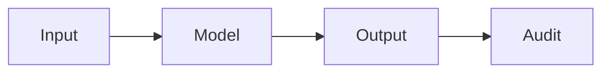

# Sécurité de l'IA

## Définition

La sécurité de l'IA traite des risques de l'IA avancée : mauvaise utilisation, comportement non intentionnel et alignement (systems doing what we intend). It includes robustness, interpretability, and value alignment.

Il chevauche [AI ethics](/docs/ai-ethics) (governance, fairness) and [bias in AI](/docs/bias-in-ai) (unfair outcomes). For [LLMs](/docs/llms) and [agents](/docs/agents), alignment (par ex. RLHF, constitutional AI) and guardrails are the main levers; [explainable AI](/docs/xai) supports auditing and debugging.

## Comment ça fonctionne

**L'entrée** est traitée par le **modèle** pour produire une **sortie**. **L'audit** (tests, surveillance, red-teaming) vérifie que les sorties sont sûres, alignées et robust. Research and practice focus on: **alignment** (RLHF, constitutional AI, scalable oversight) so models follow intent; **robustness** (adversarial testing, distribution shift) so they behave under edge cases; **monitoring** in production to detect misuse or drift. Safety is considered across the lifecycle from conception and data to training, evaluation, and deployment. Formal methods and interpretability ([XAI](/docs/xai)) support the audit step.

## Cas d'utilisation

La sécurité de l'IA est pertinente pour tout système à enjeux élevés ou destiné au public : alignement, robustesse et surveillance de la conception au déploiement.

- Auditing and red-teaming high-stakes or public-facing models
- Alignment and guardrails for LLMs and agents (par ex. RLHF, constitutional AI)
- Robustness testing and monitoring in production

## Documentation externe

- [Anthropic – Safety](https://www.anthropic.com/research) — Research on AI safety and alignment
- [OpenAI – Safety and responsibility](https://openai.com/safety)

## Voir aussi

- [AI ethics](/docs/ai-ethics)
- [Explainable AI](/docs/xai)
- [Bias in AI](/docs/bias-in-ai)
