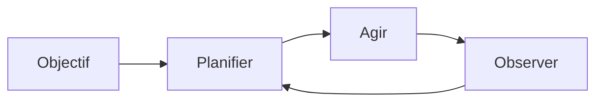

# Agents autonomes

## Définition

Les agents autonomes poursuivent des objectifs sur de longs horizons avec une intervention humaine limitée. Ils planifient, utilisent des outils et s'adaptent lorsque l'environnement ou la tâche change (par exemple, agents de codage, assistants de recherche).

Ils se situent à l'extrémité "haute autonomie" du spectre des [agents](/docs/agents) : au lieu d'un tour utilisateur et d'une réponse, ils exécutent de longues boucles (planifier → agir → observer → replanifier) jusqu'à ce que l'objectif soit atteint ou qu'une limite soit atteinte. Les [sous-agents](/docs/subagents) et les [schémas de raisonnement](/docs/reasoning-patterns) (comme ReAct, ToT) sont souvent utilisés dans les agents autonomes pour structurer la planification et l'action.

## Comment ça fonctionne

L'agent part d'un **objectif** (par exemple "implémenter la fonctionnalité X"). Il **planifie** (en décomposant éventuellement en étapes ou sous-tâches), puis **agit** (appels d'outils, modifications de code, recherche). L'étape **observer** capture les résultats (sorties d'outils, erreurs, état) et les renvoie dans **planifier** pour l'itération suivante. La boucle combine planification, mémoire (ce qui a été essayé, ce qui a fonctionné), utilisation d'outils et souvent réflexion (comme l'autocritique). Elle s'exécute jusqu'à une condition d'arrêt : tâche accomplie, limite d'étapes/budget, ou vérification humaine dans la boucle. La sécurité et la surveillance (comme les portes d'approbation, la restauration) sont importantes quand l'autonomie est élevée.

## Cas d'utilisation

Les agents autonomes conviennent au travail à long horizon et en plusieurs étapes où le système doit planifier, agir et s'adapter sans intervention humaine étape par étape.

- Agents de codage à long horizon qui planifient, éditent et testent
- Assistants de recherche qui collectent des sources, résument et itèrent
- Pipelines de données qui s'adaptent lorsque les entrées ou les schémas changent

## Ressources pratiques

- [From Prototypes to Agents with ADK – Google Codelabs](https://codelabs.developers.google.com/your-first-agent-with-adk#0)
- [LangChain – Agents autonomes](https://python.langchain.com/docs/concepts/agents/)

## Voir aussi

- [Agents](/docs/agents)
- [Sous-agents](/docs/subagents)
- [Schémas de raisonnement](/docs/reasoning-patterns)
